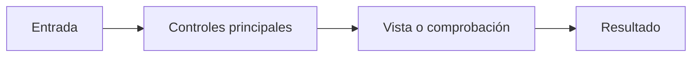

# Nombre visible en la aplicación

> Resumir en una oración para qué sirve esta pestaña o sección.

## Objetivo

Explicar qué tarea resuelve y cuándo conviene utilizarla.

## Antes de empezar

- Información, archivos o estado previo necesario.

## Mapa de la pantalla

Adaptar el esquema a los bloques visibles y al flujo real de esta pantalla.

## Elementos de la pantalla

| Elemento | Para qué sirve | Qué cambia o produce |
|---|---|---|
| Control visible | Función concreta | Efecto observable |

Cada fila nombra un control, panel, tabla o indicador que se ve en pantalla, con el texto que la aplicación usa. Dos filas de esta tabla no pueden decir lo mismo: si la descripción sirve igual para cualquier fila, no describe un elemento sino la pantalla entera.

## Cómo interpretar lo que ves

Explicar cómo leer los indicadores, conteos, estados o resultados antes de tomar una decisión. Distinguir claramente una señal informativa, una advertencia y un bloqueo.

## Cómo se usa

1. Primer paso real del usuario y qué debe comprobar.
2. Decisión o acción principal, con el criterio para elegir.
3. Revisión del efecto producido.
4. Comprobación final antes de continuar.

## Ejemplo guiado

Describir una situación concreta y realista. Indicar el estado inicial, las acciones del usuario, lo que debe observar después de cada acción y el resultado esperado. El ejemplo debe ser propio de esta pantalla, no un texto reutilizable.

Prueba de suficiencia: si el ejemplo puede copiarse a otra pantalla cambiando sólo los nombres propios, no es un ejemplo. Nombrar controles que existen y decir qué se observa tras usarlos es lo que lo vuelve verificable. No escribir «ejemplo hipotético»: si no se puede describir un caso concreto, dejar la nota en `parcial`.

## Resultado y siguiente paso

- Resultado guardado, archivo generado o estado alcanzado.
- Siguiente pestaña o sección natural, escrita como texto sin crear un enlace lateral.

## Estados, alertas y límites

- Estados que puede ver el usuario.
- Bloqueos, advertencias o funciones que todavía no existen.

## Si algo no coincide

- Qué revisar primero cuando la pantalla no muestra el resultado esperado.
- Qué condición previa suele explicar la diferencia.
- Cuándo conviene detenerse y corregir el origen antes de continuar.

## Ubicación en la jerarquía

- Enlazar únicamente el padre estructural directo.

<!--
Jerarquía permitida: Prosecnur > Módulo > Modo (cuando exista) > Sección > Pestaña.
Tipos permitidos: indice, modulo, modo, seccion y pestana.
Asignar exactamente un tag estructural a notas reales: `Módulo`, `Modo`, `Seccion` o `Pestaña`, según el tipo. No añadir tags temáticos a esas notas.
La plantilla conserva `tags: []` para no aparecer como un nodo falso en el grafo.
Una eventual nota conceptual usa tags temáticos con namespace propio y nunca los cuatro tags estructurales; la opción preferida es explicar el concepto dentro de la hoja natural.
Carpeta de pestaña: `Pestañas/NN Nombre/Nombre.md`, en el orden real de la interfaz.
Si una sección no tiene pestañas, documentarla con esta plantilla como página final.
Los conceptos técnicos se explican dentro de la pestaña o sección correspondiente; no crean ramas propias.
Cada página final incluye un esquema visual breve y una tabla de elementos de la pantalla.
Cada página final funciona como guía autónoma: explica cómo leer la pantalla, ofrece un ejemplo guiado y orienta qué revisar si el resultado no coincide. Evitar instrucciones genéricas intercambiables entre notas.
Cuando la nota tenga hijos directos, usarla como guía de navegación: propósito del nivel, contexto común, Mermaid y una tabla `Destino | Cuándo entrar | Qué hacer allí | Qué deja listo`, seguida de recorrido recomendado, lectura del avance y resultado del conjunto. Cada hijo debe explicarse una sola vez y sólo mediante su vínculo estructural directo.
Regla del grafo: Prosecnur enlaza sólo módulos; un módulo sólo su padre y modos/secciones directos; un modo sólo su módulo y secciones; una sección sólo su padre y pestañas; una pestaña sólo su sección. No enlazar hermanos, primos ni saltos entre módulos.
Documentación: `completa` cuando la tabla de elementos nombra controles que existen y el ejemplo no podría copiarse a otra pantalla; `parcial` cuando ubicación, dirección y fuentes son correctas pero la explicación es genérica; `pendiente` cuando no hay contenido propio. Marcar `completa` una nota genérica convierte una laguna conocida en una laguna invisible: ante la duda, dejarla en `parcial`.
Dirección: `ruta_app` reproduce la dirección real de la aplicación con los parámetros canónicos `modo`, `seccion`, `pestana`, `panel` y `foco`; nunca los alias antiguos (`tab`, `stage`, `mesa`, `desk`, `step`). En un módulo con modos, la dirección debe incluir `modo=`: sin él, cuatro pantallas distintas comparten el mismo enlace. Si la aplicación todavía no publica una dirección suficientemente profunda, conservar la URL real y declarar en `nodo:` la clave canónica `modulo/modo/seccion/pestana`; `nodo:` desambigua la documentación, pero no sustituye la deuda de hacer enlazable la vista.
Vigencia: `verificado_contra:` recibe el sello vigente únicamente después de revisar que identificadores, nombre visible, ruta y descendientes siguen describiendo esa nota. Toda nota `completa` debe llevarlo. Una nota `parcial` o `pendiente` lo deja vacío; nunca se copia un sello para silenciar el verificador.
Retiro sin borrado: si una pantalla deja de existir pero su prosa debe conservarse como registro, usar `padres: []`, `tags: [Archivo/Historica]`, quitar `tipo` y declarar `historica: true`. Una nota activa sin `tipo` es deriva; `historica` no sirve para ocultar una brecha vigente.
Usar nombres visibles o tareas concretas; evitar nombres meta o abstractos.
-->
