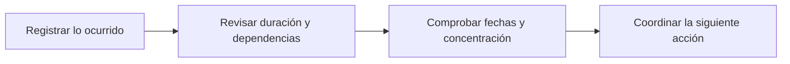

# Bitácora

> Registra la memoria operativa y organiza el tiempo del estudio.

## Propósito del módulo

Bitácora reúne tres lecturas complementarias del trabajo: qué ocurrió, cómo se distribuye el plan y en qué fechas debe actuar el equipo. No es sólo un archivo histórico. Sirve para que una decisión operativa tenga responsable y contexto, para comprobar si el calendario sigue siendo viable y para evitar que un cambio conocido por una persona quede desconectado del resto del estudio.

## Antes de recorrerlo

Conviene acordar quién registra decisiones, qué nivel de detalle necesita el equipo y qué fechas se consideran compromisos. Una actividad prevista pertenece al cronograma; un hito situado en una fecha se consulta en el calendario; una decisión, incidencia o acuerdo se conserva en la bitácora operativa. Si un retraso cambia el plan, deben actualizarse tanto la entrada que explica el motivo como la planificación afectada.

## Mapa del módulo

## Guía de destinos

| Destino | Cuándo entrar | Qué hacer allí | Qué deja listo |
|---|---|---|---|
| [[Bitácora operativa]] | Cuando exista una decisión, incidencia, acuerdo o cambio que deba explicarse | Registrar fecha, responsable, contexto y consecuencia | Una memoria consultable del trabajo y sus motivos |
| [[Cronograma del estudio]] | Al planificar actividades o cuando cambian duraciones y dependencias | Ordenar fases, fechas de inicio y fin, y relaciones entre tareas | Un plan temporal coherente con el alcance actual |
| [[Calendario del estudio]] | Para revisar hitos y carga de trabajo por día o semana | Confirmar eventos, coincidencias y espacios disponibles | Una agenda compartida para coordinar la ejecución |

## Recorrido recomendado

Al iniciar el estudio, construye el cronograma y revisa en el calendario dónde caen sus hitos principales. Durante la ejecución, registra en Bitácora operativa las decisiones que expliquen desviaciones. Si una entrada cambia fechas, vuelve al cronograma y después comprueba el calendario. Esa vuelta evita tener una explicación correcta junto a un plan desactualizado.

## Cómo interpretar el avance

Una lista abundante de entradas no significa que el estudio esté controlado. El avance es consistente cuando los acuerdos recientes explican el plan vigente y los próximos hitos son realizables. Fechas vencidas, actividades superpuestas o decisiones sin responsable indican que la coordinación necesita revisión, aunque la información esté guardada.

## Resultado

El equipo obtiene una historia operativa trazable, una secuencia de trabajo y una vista temporal común. Los tres destinos se leen juntos, pero cada uno conserva una función concreta.

## Ubicación en la jerarquía

- Padre: [[Prosecnur]].
