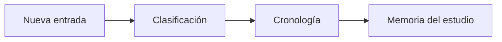

# Bitácora operativa

> Conserva una cronología narrativa de avances, decisiones, riesgos, bloqueos y notas del estudio.

**Etiqueta visible en la aplicación:** Bitácora

## Objetivo

Dejar trazabilidad suficiente para comprender qué ocurrió, por qué ocurrió y qué módulo estuvo implicado.

## Antes de empezar

Abre un proyecto y reúne la fecha, el contexto y la decisión o novedad que necesitas registrar.

## Mapa de la pantalla

## Elementos de la pantalla

| Elemento | Para qué sirve | Qué cambia o produce |
|---|---|---|
| Nueva entrada | Captura fecha, tipo, módulo, título y detalle. | Crea una entrada fechada dentro de la memoria del proyecto. |
| Clasificación | Distingue avance, decisión, riesgo, bloqueo o nota. | Permite separar hechos y recuperar después el tipo de registro correcto. |
| Cronología | Ordena y permite filtrar o buscar el historial. | Muestra la secuencia persistida y reduce el conjunto por búsqueda o filtros. |
| Memoria del estudio | Deja un registro consultable y editable. | Conserva el contexto para reconstruir por qué se tomó una decisión. |

## Cómo se usa

1. Crea una entrada y selecciona su fecha, tipo y módulo relacionado.
2. Escribe un título breve y un detalle que explique contexto, decisión y efecto.
3. Guarda la entrada; después usa búsqueda y filtros para localizarla, editarla o eliminarla.

## Resultado y siguiente paso

La novedad queda integrada en la memoria del proyecto. Continúa con el cronograma si implica trabajo futuro.

## Estados, alertas y límites

- Los tipos significan avance, decisión, riesgo, bloqueo y nota; elige el que describe el hecho, no su urgencia.
- La bitácora explica lo sucedido, pero no sustituye fechas, dependencias ni responsables del cronograma.
- Eliminar una entrada retira esa evidencia narrativa del historial.

## Cómo interpretar lo que ves

Lee cada tarjeta como evidencia de una acción, no como una tarea pendiente. La fecha sitúa el hecho; el tipo indica si fue avance, decisión, riesgo, bloqueo o nota; el módulo acota dónde tuvo efecto. El título ayuda a localizarla, pero el detalle debe explicar causa, decisión y consecuencia. Si dos entradas se contradicen, la más reciente no borra la anterior: debe explicar qué cambió.

## Ejemplo guiado

**Situación inicial.** La versión final del formulario llegará dos días tarde y esto desplaza el piloto.

**Acciones.** Crea una entrada de tipo **riesgo** con la fecha prometida, la nueva fecha y el impacto. Cuando coordinación confirme el ajuste, registra otra de tipo **decisión** con responsable y actividades reprogramadas.

**Resultado observable.** Al filtrar por el módulo aparecen el riesgo y la decisión en orden. Una persona que no estuvo en la reunión puede reconstruir el cambio sin consultar mensajes externos.

## Si algo no coincide

Si la entrada no aparece, limpia filtros y comprueba que se guardó en el proyecto activo. Si tiene fecha o clasificación incorrecta, edítala en lugar de duplicarla. Si la decisión cambia el calendario, actualiza también la planificación: la bitácora explica el motivo, pero no mueve fechas por sí sola.

## Ubicación en la jerarquía

- Padre: [[Bitácora]].
