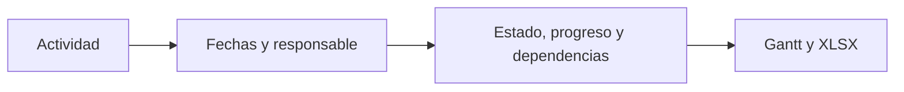

# Cronograma del estudio

> Planifica actividades, fechas, responsables, dependencias, estados y avance del estudio.

**Etiqueta visible en la aplicación:** Cronograma

## Objetivo

Convertir el trabajo pendiente en una secuencia temporal verificable y exportable.

## Antes de empezar

Define las actividades, sus responsables y las restricciones de orden o fecha.

## Mapa de la pantalla

## Elementos de la pantalla

| Elemento | Para qué sirve | Qué cambia o produce |
|---|---|---|
| Actividad | Representa una unidad de trabajo. | Añade una fila planificable con duración, dependencias y estado propios. |
| Fechas y responsable | Sitúa la actividad y asigna su conducción. | Coloca la tarea en el tiempo y deja visible quién debe conducirla. |
| Estado, progreso y dependencias | Describe situación, porcentaje y precedencias. | Permite detectar atrasos, bloqueos y secuencias imposibles. |
| Gantt y XLSX | Permite revisar o compartir el plan. | Produce una vista temporal y un archivo del plan vigente. |

## Cómo se usa

1. Crea cada actividad con inicio, fin y responsable.
2. Asigna su estado, porcentaje de progreso y dependencias cuando correspondan.
3. Revisa el Gantt, corrige solapamientos y exporta a XLSX si necesitas compartir el plan.

## Resultado y siguiente paso

Obtienes un plan temporal coherente. El calendario presenta esas mismas fechas como hitos y ventanas.

## Estados, alertas y límites

- Estado y progreso son distintos: una actividad puede estar en curso sin que su porcentaje sea completo.
- Una dependencia expresa orden lógico; no reemplaza las fechas de inicio y fin.
- Las inconsistencias deben resolverse en el cronograma antes de confiar en el calendario.

## Cómo interpretar lo que ves

Inicio y fin muestran la ventana acordada; responsable señala quién debe actualizarla; estado y porcentaje describen avance, pero no sustituyen la evidencia de entrega. En el Gantt, una dependencia que termina después de que comience su sucesora revela una incoherencia. El proyecto se interpreta por su cadena de actividades, no promediando porcentajes aislados.

## Ejemplo guiado

**Situación inicial.** Diseño, piloto y campo deben completarse en seis semanas; piloto depende del formulario y campo depende del piloto.

**Acciones.** Crea las tres actividades con responsables. Sitúa diseño primero, enlaza piloto como dependiente y coloca campo después de su cierre. Marca diseño al 100 % sólo cuando el instrumento esté publicado.

**Resultado observable.** Las tres barras quedan ordenadas, ninguna tarea dependiente empieza antes de su predecesora y la última fecha coincide con el cierre de campo.

## Si algo no coincide

Si el Gantt no refleja una edición, comprueba que inicio no sea posterior al fin y vuelve a guardar. Si una tarea aparece atrasada, contrasta fecha actual, estado y porcentaje: cambiar sólo el porcentaje no corrige el plazo. Cuando una decisión modifique el plan, deja su motivo en la bitácora.

## Ubicación en la jerarquía

- Padre: [[Bitácora]].
