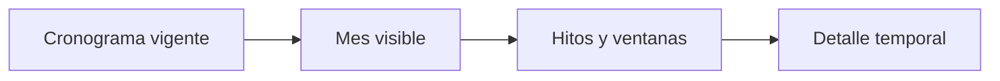

# Calendario del estudio

> Ofrece una lectura mensual de las actividades definidas en el cronograma.

**Etiqueta visible en la aplicación:** Calendario

## Objetivo

Reconocer rápidamente hitos puntuales, ventanas de campo y concentraciones de trabajo.

## Antes de empezar

Completa y valida las fechas en el cronograma; el calendario no mantiene una agenda independiente.

## Mapa de la pantalla

## Elementos de la pantalla

| Elemento | Para qué sirve | Qué cambia o produce |
|---|---|---|
| Cronograma vigente | Aporta las actividades y sus fechas. | Alimenta automáticamente la vista sin crear una agenda paralela. |
| Mes visible | Organiza los eventos por día. | Cambia el intervalo observado sin modificar fechas almacenadas. |
| Hitos y ventanas | Distingue fechas puntuales e intervalos. | Hace visibles eventos de un día y actividades de varios días. |
| Detalle temporal | Permite revisar una actividad desde el calendario. | Abre la actividad de origen para comprobar su planificación. |

## Cómo se usa

1. Selecciona el mes que deseas revisar.
2. Identifica hitos de una fecha y ventanas que abarcan varios días.
3. Abre el detalle de una actividad y vuelve al cronograma si necesitas corregirla.

## Resultado y siguiente paso

Obtienes una lectura operativa del mes. Las correcciones se realizan en el cronograma, que sigue siendo la fuente temporal.

## Estados, alertas y límites

- Un hito ocupa una fecha; una ventana de campo abarca un intervalo.
- El calendario es una proyección del cronograma y no duplica su edición.
- Una fecha ausente o incorrecta debe corregirse en la actividad de origen.

## Cómo interpretar lo que ves

El calendario proyecta el cronograma; no lo duplica. Un evento de un día se lee como hito y una actividad con inicio y fin como ventana. Varias marcas en la misma fecha indican concentración, pero sólo son conflicto si comparten responsables o recursos. Cambiar de mes modifica la vista, no las actividades.

## Ejemplo guiado

**Situación inicial.** La misma semana contiene capacitación el lunes, inicio de campo el miércoles y control el viernes.

**Acciones.** Abre el mes, localiza los tres eventos y selecciona la capacitación para comprobar responsable y duración. Revisa que campo no comience antes de terminarla.

**Resultado observable.** Los tres hitos aparecen en sus días, el detalle coincide con el cronograma y la secuencia semanal no contiene un solapamiento incompatible.

## Si algo no coincide

Si falta un evento, vuelve al cronograma y confirma que tenga fechas válidas; no lo recrees en el calendario. Si aparece en otro día, revisa inicio, fin y zona horaria antes de duplicarlo. Si hay demasiadas marcas juntas, abre sus detalles: la densidad alerta, pero la incompatibilidad depende de responsables y precedencias.

## Ubicación en la jerarquía

- Padre: [[Bitácora]].
