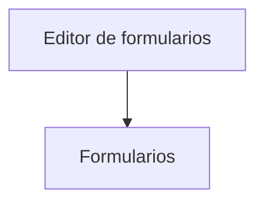

# Editor de formularios

> Administra, construye, prueba, publica y exporta instrumentos XLSForm.

## Propósito del módulo

Editor de formularios convierte una especificación de encuesta en un XLSForm legible, comprueba su lógica y publica una revisión que otros módulos pueden consumir. La meta no es completar una tabla: tipos, nombres, opciones, restricciones, saltos y grupos deben describir el cuestionario que realmente se aplicará.

## Antes de entrar

Define objetivo, población y variables necesarias al procesar respuestas. Reúne listas de opciones y acuerda nombres estables. Si editas una revisión ya usada por una base, prepara otra revisión; una modificación visual no puede reemplazar silenciosamente al instrumento publicado.

## Mapa del módulo

## Guía de destinos

| Destino | Cuándo entrar | Qué hacer allí | Qué deja listo |
|---|---|---|---|
| [[Formularios]] | Al crear, corregir o preparar una revisión | Editar hojas XLSForm, resolver incidencias, simular rutas y publicar | Una revisión identificable para carga y operación |

## Recorrido recomendado

Empieza por survey, choices y settings; incorpora validaciones y saltos en bloques pequeños. Revisa diagnósticos tras cada cambio importante y simula rutas distintas. Publica cuando no queden errores bloqueantes y la revisión probada corresponda con la que se entregará.

## Cómo interpretar el avance

Que la vista previa abra no demuestra que esté listo. Comprueba nombres duplicados, listas inexistentes, referencias incorrectas y grupos mal cerrados. El estado útil es una revisión publicada con identidad propia; el borrador todavía puede cambiar.

## Resultado

Queda un instrumento versionado y verificable que puede vincularse a respuestas sin confundirse con ediciones posteriores.

## Ubicación en la jerarquía

- Padre: [[Prosecnur]].
