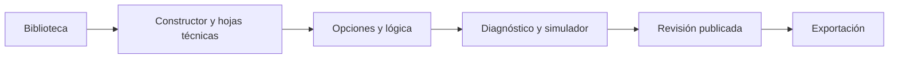

# Formularios

> Reúne el ciclo completo del instrumento: biblioteca, edición visual y técnica, lógica, diagnóstico, simulación, revisiones y exportación.

## Objetivo

Producir un XLSForm consistente, trazable y listo para el destino operativo elegido.

## Antes de empezar

Ten claro el propósito del instrumento, sus preguntas, listas de respuesta, saltos y plataforma de destino.

## Mapa de la pantalla

## Elementos de la pantalla

| Elemento | Para qué sirve | Qué cambia o produce |
|---|---|---|
| Biblioteca | Crea, abre, renombra, duplica o elimina formularios. | Cambia el instrumento activo o crea una copia independiente para editar. |
| Constructor y hojas técnicas | Edita visualmente y en survey, choices, settings y paper. | Modifica las filas y columnas reales que definen el XLSForm. |
| Opciones y lógica | Gestiona catálogos y expresiones relevant con el asistente. | Actualiza listas, visibilidad, saltos y validaciones del recorrido. |
| Diagnóstico y simulador | Detecta problemas y prueba la experiencia sin desplegar. | Localiza incidencias y permite recorrer casos distintos antes de publicar. |
| Revisión publicada | Fija una versión inmutable con número y hash. | Crea una identidad estable para vincular instrumento y respuestas. |
| Exportación | Genera XLSForm para Kobo/ODK o con extensiones de Prosecnur. | Descarga el archivo compatible y conserva extensiones sólo cuando se solicitan. |

## Cómo se usa

1. Crea o importa un formulario desde la biblioteca; la conversión de SurveyMonkey avisa cuando una semántica no tiene equivalente directo.
2. Construye preguntas y grupos, completa las hojas técnicas y conecta listas de opciones y reglas condicionales.
3. Ejecuta el diagnóstico local y remoto, corrige errores y recorre el instrumento en el simulador.
4. Publica una revisión cuando el contenido esté aprobado y exporta el archivo para Kobo/ODK o Prosecnur.

## Resultado y siguiente paso

Obtienes un instrumento validado y una revisión reproducible. El borrador puede seguir evolucionando sin alterar lo ya publicado.

## Estados, alertas y límites

- Los formularios publicados tienen protecciones frente a operaciones destructivas; revisa el estado antes de renombrar o eliminar.
- El simulador no despliega el formulario ni guarda respuestas reales de campo.
- Una revisión publicada es inmutable y se identifica por número y hash de contenido.
- La exportación Kobo/ODK omite hojas y columnas privadas; la de Prosecnur conserva paper, diagnostico y campos paper_* cuando existen.
- La conversión desde SurveyMonkey puede requerir ajustes manuales ante lógicas o tipos sin equivalencia exacta.

## Cómo interpretar lo que ves

Distingue borrador, diagnóstico y revisión publicada. La biblioteca indica qué formulario está activo; las hojas técnicas contienen la estructura real, aunque se use el constructor; el diagnóstico señala referencias o tipos que rompen el contrato. El simulador sólo aporta evidencia si se prueban saltos, restricciones y listas. Una revisión con número y hash es fija y no debe confundirse con el borrador que continúa evolucionando.

## Ejemplo guiado

**Situación inicial.** El instrumento pregunta edad, exige respuesta y muestra distritos sólo a personas de 18 años o más.

**Acciones.** Crea la pregunta numérica y su restricción, añade la lista en choices y configura la expresión relevant. Ejecuta el diagnóstico; después simula una respuesta de 17 años y otra de 20.

**Resultado observable.** Para 17 años la lista no aparece; para 20 aparece con los distritos esperados. No quedan errores bloqueantes y publicar genera una revisión identificable.

## Si algo no coincide

Si el simulador ignora el salto, revisa el nombre exacto de la pregunta y la expresión relevant. Si faltan opciones, confirma que list_name coincide entre survey y choices. No publiques para probar: resuelve primero errores bloqueantes. Si una base usa la revisión anterior, crea una nueva; no alteres la identidad ya vinculada.

## Ubicación en la jerarquía

- Padre: [[Editor de formularios]].
