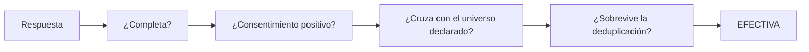
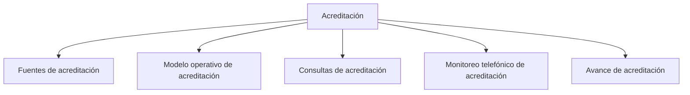

# Acreditación

> Sigue un operativo institucional con varios actores, cada uno con su universo, sus canales y su propio criterio de cierre.

## Propósito de esta guía

Acreditación es el modo que se usa cuando el estudio no persigue un total, sino un **expediente por actor**. Un comité acreditador no pregunta cuánto se avanzó: pregunta por qué entró este caso y por qué no entró aquel. Todo el modo está organizado alrededor de esa exigencia, y esta guía explica en qué orden recorrerlo para poder responderla.

## El contrato que hay que entender antes de leer cualquier cifra

Cuatro reglas gobiernan este modo. Sin ellas, las pantallas se malinterpretan con facilidad.

**1. Una respuesta es efectiva sólo si pasa cuatro compuertas.** En este orden, y todas eliminatorias:

Cuando hay más de una respuesta del mismo caso, gana la de **mayor duración**. Una respuesta impecable que no cruza con el universo no cuenta; una duplicada, tampoco. Lo que no cumple, no suma.

**2. La meta es un mínimo interno, no el objetivo del cliente.** El mínimo es el punto en que el equipo se cubre. Pero lo habitual es que el cliente quiera **barrer todo el universo**, sobre todo si es pequeño. Un actor con el mínimo cubierto puede seguir teniendo trabajo pendiente: cubierto y terminado no son lo mismo, y cuál de los dos aplica depende de lo acordado con el cliente y del actor concreto.

**3. Censo y muestra no se reportan igual.** En operativos institucionales es normal que dos o tres actores sean censo o casi —se contactó a casi todo el universo— y sólo uno sea muestra real. A un censo no se le reporta margen de error. La aplicación no marca esta distinción por ti: la decides al redactar el informe, mirando el tamaño del universo frente a las efectivas.

**4. El universo no es la población.** Lo que el modo llama universo es la **base de contactos trabajada**: la lista que se consiguió y se trabajó. La población real del actor —la matrícula, el padrón completo— es otra cosa, vive fuera de la aplicación, y es contra ella que un comité juzga la cobertura.

## Antes de recorrer este nivel

Confirma que el estudio tiene declarados sus actores, que cada uno tiene encuesta y base de universo, y que sabes con qué criterio cierra cada actor: mínimo acordado o barrido completo. Ese criterio no es un detalle de redacción; cambia qué pantallas leerás como logro y cuáles como deuda.

## Mapa de navegación

## Guía de destinos

| Destino | Cuándo entrar | Qué hacer allí | Qué deja listo |
|---|---|---|---|
| [[Fuentes de acreditación]] | Al montar el estudio, y cada vez que una cifra no cuadre | Declarar encuestas, universos por actor y recopiladores que cuentan | El paquete de entrada del que dependen todas las demás secciones |
| [[Modelo operativo de acreditación]] | Cuando hay que fijar qué se espera de cada actor | Declarar metas y modalidades, el cronograma de campo y revisar la lectura de fuentes | El criterio contra el cual se juzga el avance |
| [[Consultas de acreditación]] | Cuando hay que responder por un caso concreto | Revisar registro por registro el cruce con la base, los cruces efectivos y las subsanaciones | La evidencia caso a caso que sostiene la cifra |
| [[Monitoreo telefónico de acreditación]] | Cuando parte del operativo se resuelve por llamada | Seguir el barrido, el ritmo diario, los responsables y la supervisión | El control de la operación telefónica |
| [[Avance de acreditación]] | Para leer el estado del estudio y producir salidas | Revisar el resumen, las brechas por actor, los canales y exportar | El reporte del corte con su procedencia |

## Recorrido recomendado

1. **Fuentes de acreditación**, siempre primero al configurar: sin universo declarado, ninguna cifra posterior tiene denominador.
2. **Modelo operativo de acreditación**, para fijar qué se espera de cada actor antes de medir si se cumplió.
3. **Consultas de acreditación**, que es la sección crítica del modo: aquí ocurre el cruce caso por caso y es donde se establece el avance real. No es una consulta ocasional, es lo que sostiene la cifra.
4. **Monitoreo telefónico de acreditación** si hay llamadas, para controlar la operación que alimenta parte de esas efectivas.
5. **Avance de acreditación** al final, para leer y exportar. Sus salidas son las que conservan la procedencia del corte.

En uso diario el orden se invierte: se entra por Avance, y se baja a la sección que explique la anomalía.

## Cómo interpretar avance y estados

Tres cifras conviven en este modo y no significan lo mismo: cuántos registros trajo el corte, cuántos son procesables y cuántos son efectivos. La distancia entre ellas son las mermas —casos fuera del universo declarado, respuestas sin encuesta efectiva—, y esa distancia es información, no ruido: es la que un comité pide explicar.

Un cero significa que el control se ejecutó y no encontró casos. **S/D** significa que no pudo evaluarse. No son lo mismo y no deben leerse igual.

Vigila el vocabulario: *efectiva*, *universo* y *población* son los tres términos con significado fijo. Cuando encuentres una pantalla que hable de válidas, base reportada o casos, comprueba a cuál de los tres se refiere antes de comparar.

## Cómo se llega a cada pantalla

Este modo sí publica su ubicación en la dirección: `/monitoreo?modo=acreditacion&seccion=<sección>&pestana=<pestaña>`. El modo aparece escrito, pero no se elige con un click: lo determina el estudio del proyecto.

## Resultado de este nivel

Al completar Acreditación queda un corte con procedencia trazable: qué fuentes lo alimentaron, qué universo tenía cada actor, qué casos entraron y por qué los demás no. Ese conjunto —no el porcentaje— es el entregable defendible, y es también lo que Procesamiento necesita para recibir la base.

## Ubicación en la jerarquía

- Padre: [[Monitoreo]].
