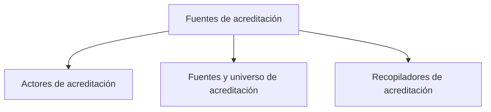

# Fuentes de acreditación

> Declara de dónde sale cada dato del corte: qué encuestas responden, qué hoja define el universo de cada actor y qué recopiladores cuentan.

## Propósito de esta guía

Todo lo que el modo Acreditación afirma después —cuántas efectivas hay, qué actor va corto, qué caso quedó fuera— descansa en lo que se declara aquí. Una fuente sin actor explícito deja ambigua la atribución; una hoja de universo equivocada altera los indicadores que usan ese universo. La aplicación comprueba estructura, vínculos y estado de sincronización, pero no puede decidir si el universo declarado es sustantivamente correcto. Por eso esta sección se configura primero y se revisa cada vez que una cifra no cuadra.

## Antes de recorrer este nivel

Ten a mano tres cosas: la lista de actores del estudio (carreras, segmentos o grupos institucionales), el inventario de encuestas creadas en SurveyMonkey o Kobo, y las hojas de cálculo que contienen el universo de contactos y, si el operativo lo usa, el barrido telefónico.

Distingue desde el principio dos familias de fuente que no son intercambiables:

- Las **encuestas en plataforma** aportan *respuestas*.
- Las **bases en Sheets** aportan el *universo* contra el cual esas respuestas se cruzan.

Una respuesta completa no se vuelve efectiva por sí sola. El corte reconciliado también considera el cruce vigente con el universo o la base, la decisión de avance y la deduplicación. Esa separación entre respuesta recibida y efectiva reconciliada es la razón de ser de esta sección.

Declara actor y canal de forma explícita en cada fuente. Los proyectos antiguos todavía pueden mostrar inferencias de compatibilidad a partir de nombres, títulos o recopiladores; trátalas como una señal de migración, no como autoridad. El contrato aceptado es la declaración explícita y reproducible.

## Mapa de navegación

## Guía de destinos

| Destino | Cuándo entrar | Qué hacer allí | Qué deja listo |
|---|---|---|---|
| [[Actores de acreditación]] | Al iniciar el estudio o cuando una respuesta no se atribuye a ningún grupo | Declarar quiénes responden y conservar una identidad única por actor | Los grupos a los que se asignarán fuentes, metas y avance |
| [[Fuentes y universo de acreditación]] | Al conectar encuestas, definir denominadores o revisar el estado del paquete | Vincular respuestas, universo y barrido con su actor y comprobar su sincronización | Cada actor con fuentes y denominador verificables |
| [[Recopiladores de acreditación]] | Cuando una encuesta se aplicó por varias vías y no todas cuentan | Revisar los recopiladores de cada encuesta e incluir o excluir cada uno | Un corte sin recopiladores de prueba ni canales ajenos al operativo |

## Recorrido recomendado

1. **Actores de acreditación** primero: sin actores declarados las respuestas no se pueden repartir.
2. **Fuentes y universo de acreditación** después: vincula las respuestas y fija el denominador de cada actor.
3. **Recopiladores de acreditación** cuando una encuesta de SurveyMonkey se difundió por correo, enlace y QR, o cuando el equipo dejó recopiladores de prueba: decidir cuáles entran es lo que separa un conteo limpio de uno inflado. Kobo no expone todavía el mismo editor de inclusión y exclusión en esta superficie.

En uso diario entra por Fuentes y universo para comprobar el estado del paquete, y vuelve a Actores o Recopiladores solo si algo aparece incompleto o desactualizado.

## Cómo interpretar avance y estados

Esta sección no mide avance de campo; muestra señales para revisar la **integridad de la configuración**. Una fuente activa significa que está habilitada y puede participar en la lectura; no garantiza que sus datos sean correctos, que la sincronización haya terminado sin errores ni que estén frescos. Revisa `last_sync_at` y los errores por fuente: el corte global puede construirse con las fuentes que sí respondieron y no implica una fecha común para todas.

Una fuente debe llevar actor y canal explícitos. Mientras subsista la compatibilidad con proyectos antiguos, la aplicación puede inferirlos desde nombres u otros metadatos; si eso ocurre, corrige la declaración antes de confiar en Avance o Teléfono. Cero actores telefónicos es un estado válido. Un actor solo debería participar en Teléfono cuando al menos una fuente activa declara de forma explícita el canal `Telefonico`.

Cuidado con la palabra **base**: en esta sección puede referirse al número de fuentes vinculadas o al número de registros del universo. Antes de comparar dos cifras que se llaman igual, confirma cuál de las dos estás leyendo.

## Resultado de este nivel

Antes de salir, usa esta lista de comprobación; la pantalla informa brechas, pero no impide continuar:

- cada fuente tiene actor y canal explícitos;
- cada actor que necesita denominador tiene su universo declarado;
- existe al menos una fuente de respuestas para los actores que participan;
- los recopiladores de SurveyMonkey fueron revisados y los de prueba quedaron fuera;
- no quedan errores de sincronización sin explicar;
- la frescura se inspeccionó fuente por fuente, además de revisar el corte global.

Modelo operativo, Consultas, Monitoreo telefónico y Avance consumen esta configuración. Si una inferencia de compatibilidad o una sincronización parcial sigue presente, esas secciones pueden mostrar resultados provisionales: vuelve aquí y corrige la fuente explícita antes de cerrar el corte.

## Ubicación en la jerarquía

- Padre: [[Acreditación]].
