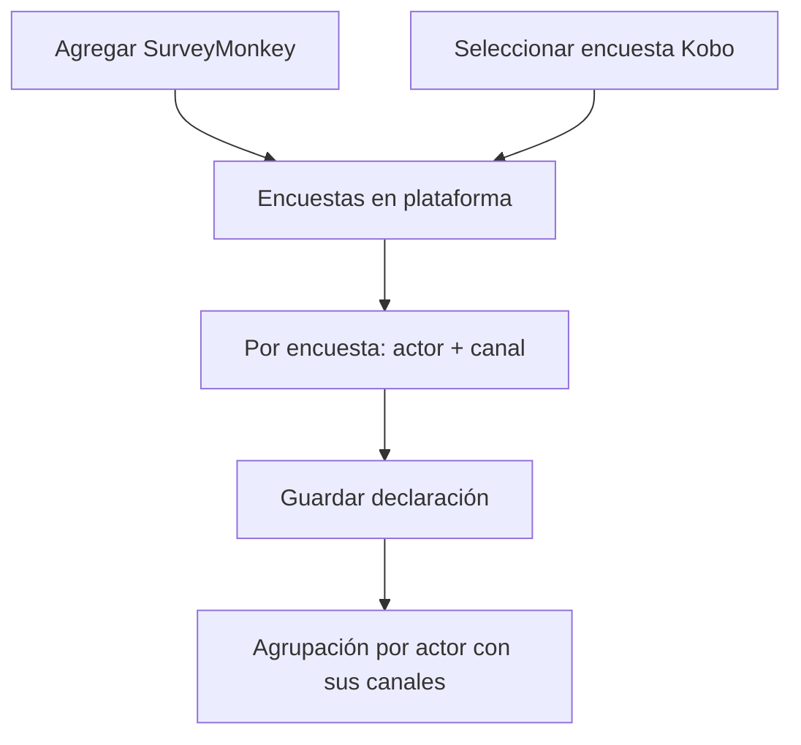

# Plataforma de acreditación

> Enlaza las encuestas de SurveyMonkey y Kobo, y declara a qué actor y por qué canal pertenece cada una.

## Objetivo

Una encuesta enlazada aporta respuestas; una encuesta **declarada** aporta respuestas atribuibles. La diferencia importa porque en acreditación el resultado no es un total, es un reparto por actor: si dos encuestas llegan sin actor, sus respuestas existen en el corte pero no suman a nadie en Avance, y la brecha aparece donde no está.

## Antes de empezar

- Las encuestas deben existir ya en SurveyMonkey o Kobo. Esta pantalla las vincula, no las crea; el instrumento se trabaja en el Editor de formularios.
- Ten decidida la lista de actores del estudio. Puedes escribirlos aquí, pero conviene que coincidan con los que usan las bases de universo: el cruce se apoya en ese nombre.
- Conoce por qué vía se aplicó cada encuesta. Es lo que vas a declarar como canal.

## Mapa de la pantalla

## Elementos de la pantalla

| Elemento | Para qué sirve | Qué cambia o produce |
|---|---|---|
| **Agregar SurveyMonkey** | Despliega el catálogo de encuestas de la cuenta conectada para vincular una | Añade una fuente de respuestas de SurveyMonkey al proyecto |
| **Seleccionar encuesta Kobo** | Despliega los formularios Kobo disponibles | Añade una fuente de respuestas Kobo |
| **Encuestas en plataforma** | Lista las fuentes ya vinculadas y cuenta cuántos actores se detectaron | Es el inventario que el resto del modo consume |
| Selector de actor, por encuesta | Declara a qué actor pertenecen las respuestas de esa encuesta | Reparte sus respuestas en Avance y en Consultas |
| Selector de canal, por encuesta | Declara la vía de aplicación: Correo, Ficha QR, Enlace, Kobo o Telefónico | Alimenta la lectura por canal de Avance y del modelo operativo |
| Guardado por encuesta | Persiste actor y canal en la fuente | Confirma la declaración; hasta pulsarlo el cambio es un borrador |
| Agrupación por actor | Reúne las encuestas de un mismo actor y muestra qué canales aporta | Deja ver si a un actor le falta una vía declarada |

## Cómo interpretar lo que ves

El catálogo se cierra por defecto cuando ya hay encuestas vinculadas: que no veas la lista de SurveyMonkey no significa que falte conexión, significa que el trabajo de vincular ya está hecho.

**Actores detectados** cuenta los actores declarados en las fuentes, no los actores del estudio. Si el estudio tiene cuatro y aquí ves dos, faltan declaraciones; no es que hayan desaparecido dos grupos.

Una encuesta marcada **Sin actor** no está rota: está pendiente de declarar. Sus respuestas se sincronizan igual, pero no se atribuyen a nadie.

## Cómo se usa

1. Abre **Agregar SurveyMonkey** o **Seleccionar encuesta Kobo** y vincula las encuestas del operativo. Vincula sólo las que pertenecen a este estudio.
2. Para cada encuesta de la lista, elige el **actor**. Usa exactamente el mismo nombre que llevará su base de universo.
3. Elige el **canal**. Si una encuesta se difundió por más de una vía, declara aquí la principal y resuelve el desglose fino en Recopiladores de acreditación.
4. Guarda cada encuesta y comprueba que la agrupación inferior muestre a cada actor con los canales que esperabas.
5. Vuelve cuando añadas una encuesta nueva: llega sin actor y sin canal.

## Ejemplo guiado

**Situación inicial.** El estudio tiene cuatro actores —administrativos, docentes, estudiantes y egresados— y seis encuestas vinculadas. Avance muestra a egresados con menos respuestas de las que el equipo reportó haber recibido por correo.

**Acciones.** Al abrir esta pestaña, el encabezado dice *4 actores detectados*, pero dos encuestas de la lista aparecen como **Sin actor**: son las que el equipo usó para el envío por correo a egresados. Se les asigna el actor *Egresados* y el canal *Correo*, y se guarda cada una.

**Resultado observable.** La agrupación inferior pasa a mostrar *Egresados* con el canal Correo añadido a los que ya tenía. En Avance, las respuestas que antes no sumaban a ningún actor aparecen en la fila de egresados y la brecha reportada se reduce, sin que haya entrado ni una respuesta nueva.

## Resultado y siguiente paso

- Cada encuesta del operativo queda con actor y canal persistidos en el proyecto.
- Continúa en Bases de acreditación: declarado quién responde, falta declarar contra qué universo se cruzan esas respuestas.

## Estados, alertas y límites

- **Sin actor**: la fuente está vinculada pero sus respuestas no se atribuyen. No es un fallo de sincronización.
- Declarar el actor no reprocesa el pasado por sí solo: el reparto se recalcula con el corte, así que regenera antes de juzgar la cifra.
- El canal declarado aquí describe la vía principal de la encuesta. Cuando una misma encuesta se difundió por varias vías, la unidad real de inclusión es el recopilador, no la encuesta.
- Esta pantalla no comprueba que el actor escrito exista en las bases de universo. Un nombre mal escrito produce un actor propio, con universo cero.

## Si algo no coincide

Si un actor muestra menos respuestas de las esperadas, revisa primero si alguna encuesta quedó **Sin actor**, y después si el nombre del actor está escrito igual aquí y en la base de universo. Si el total general también es menor de lo esperado, la causa no está en esta pantalla sino en qué recopiladores están incluidos o en la última sincronización.

## Ubicación en la jerarquía

- Padre: [[Fuentes de acreditación]].
