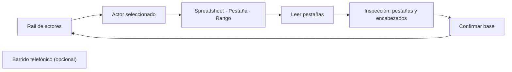

# Bases de acreditación

> Vincula, para cada actor, la hoja de Google Sheets que define su universo, y opcionalmente la hoja del barrido telefónico.

## Objetivo

Aquí se fija el **denominador**. El universo de un actor es la lista de personas que ese actor debía cubrir; contra ella se cruza cada respuesta para decidir si cuenta. Cambiar esta hoja cambia silenciosamente todos los porcentajes del modo, así que es la declaración más consecuente de la sección: una respuesta impecable que no aparece en el universo declarado no es efectiva.

## Antes de empezar

- La conexión con Google Sheets debe estar configurada; esta pantalla lee hojas, no las crea.
- Necesitas la URL del spreadsheet y saber qué pestaña corresponde a cada actor. El diseño esperado es **una pestaña por actor**.
- Los actores salen de lo declarado en Plataforma de acreditación. Si un actor todavía no existe allí, puedes añadirlo aquí a mano.
- El barrido telefónico sólo hace falta si el operativo incluye llamadas.

## Mapa de la pantalla

## Elementos de la pantalla

| Elemento | Para qué sirve | Qué cambia o produce |
|---|---|---|
| Encabezado *Bases en Sheets* | Cuenta cuántos actores tienen base vinculada sobre el total de actores | Es el marcador de completitud de la pestaña |
| Rail de actores | Lista los actores; cada tarjeta muestra un check si ya tiene base, o una alerta si está pendiente, y debajo el nombre de la pestaña vinculada | Selecciona sobre qué actor trabaja el formulario de la derecha |
| **Agregar actor manual** | Añade un actor que aún no fue declarado en las encuestas | Crea la fila para vincularle una base |
| **Spreadsheet** | Recibe la URL o el identificador del libro de cálculo | Indica dónde buscar |
| **Pestaña del actor** | Nombra la hoja concreta dentro de ese libro | Indica qué lista es el universo de este actor |
| **Rango** | Acota el área leída de la pestaña; es opcional | Evita arrastrar filas de encabezado o notas al pie |
| **Leer pestañas** | Consulta el libro y devuelve sus pestañas y encabezados | Permite elegir la pestaña de una lista en vez de escribirla |
| **Confirmar base** | Persiste la vinculación para ese actor | El actor pasa a tener universo, y su tarjeta a estado listo |
| **Barrido telefónico** | Desplegable para vincular la hoja de intentos de contacto | Alimenta la sección Monitoreo telefónico |

## Cómo interpretar lo que ves

El contador del encabezado, del tipo *3/4 actores vinculados*, mide **cuántos actores tienen hoja declarada**, no cuántos registros hay ni si esos registros son correctos. Un actor sin base no aparece con universo cero por error: aparece sin denominador, y cualquier porcentaje suyo carece de sentido hasta vincularlo.

Después de **Leer pestañas**, la inspección informa cuántas pestañas y cuántos encabezados tiene el libro. Sirve para confirmar que apuntas al libro correcto antes de confirmar: un libro con una sola pestaña cuando esperabas cuatro suele indicar que la URL es de otro archivo.

Universo y barrido son **roles distintos**, no dos nombres del mismo dato: el universo dice a quién había que encuestar; el barrido, a quién se intentó llamar y con qué resultado.

## Cómo se usa

1. Selecciona un actor en el rail. Empieza por los que muestran alerta.
2. Pega la URL del spreadsheet en **Spreadsheet**.
3. Pulsa **Leer pestañas** y elige la pestaña del actor de la lista devuelta, en lugar de escribir el nombre a mano: evita errores de tildes y mayúsculas.
4. Acota el **Rango** sólo si la pestaña trae filas que no son datos.
5. Pulsa **Confirmar base**. La tarjeta del actor pasa a estado listo y muestra el nombre de la pestaña.
6. Repite hasta que el contador del encabezado iguale el total de actores.
7. Si el operativo incluye llamadas, abre **Barrido telefónico** y vincula su hoja.

## Ejemplo guiado

**Situación inicial.** El rail muestra cuatro actores; tres con check y uno —*Egresados*— con alerta y el texto *Base pendiente*. En Avance, egresados aparece con porcentajes vacíos mientras los otros tres avanzan.

**Acciones.** Se selecciona *Egresados*, se pega la URL del libro del estudio y se pulsa **Leer pestañas**. La inspección devuelve cinco pestañas; entre ellas *Egresados*, que se elige con un click. Se deja el rango vacío porque la hoja empieza directamente en los encabezados. Se pulsa **Confirmar base**.

**Resultado observable.** La tarjeta de *Egresados* pasa a check y muestra *Egresados* como pestaña vinculada; el encabezado pasa de *3/4* a *4/4 actores vinculados*. Tras regenerar el corte, egresados deja de tener porcentajes vacíos en Avance y aparece con su universo y su brecha.

## Resultado y siguiente paso

- Cada actor queda con su universo declarado, y el operativo telefónico con su base de barrido si corresponde.
- Continúa en Recopiladores de acreditación para decidir qué vías de aplicación cuentan dentro de cada encuesta.

## Estados, alertas y límites

- **Base pendiente**: el actor no tiene universo. No es un cero, es una ausencia de denominador.
- El nombre del actor debe coincidir con el declarado en las encuestas; el cruce se apoya en ese texto y no se corrige solo.
- Vincular la base no la lee al instante: los registros entran con la siguiente sincronización.
- Lo que esta pestaña llama universo es la **base de contactos trabajada**, no la población real del actor. Si necesitas reportar cobertura sobre la matrícula o el padrón completo, ese dato es externo y no vive aquí.
- Cambiar la hoja de un actor con campo en curso reescribe su denominador. Las cifras anteriores dejan de ser comparables aunque la etiqueta siga igual.

## Si algo no coincide

Si el universo de un actor es mayor o menor de lo esperado, revisa el **Rango** —suele arrastrar filas vacías o de encabezado— y confirma que la pestaña vinculada es la del actor y no la de otro. Si un actor tiene respuestas pero ninguna cuenta como efectiva, casi siempre es que su universo apunta a la pestaña equivocada: las respuestas llegan, pero no cruzan con nadie.

## Ubicación en la jerarquía

- Padre: [[Fuentes de acreditación]].
