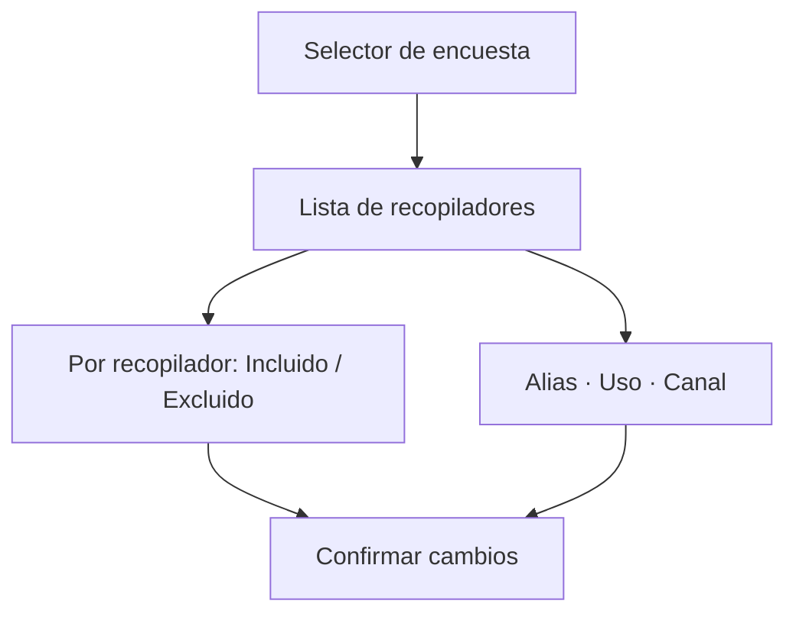

# Recopiladores de acreditación

> Decide, recopilador por recopilador, cuál de las vías de difusión de cada encuesta cuenta en el corte y con qué nombre y canal aparece.

## Objetivo

Una encuesta de SurveyMonkey se difunde por varios **recopiladores**: un envío por correo, un enlace abierto, un QR impreso, una prueba interna. Todos vierten respuestas al mismo formulario, pero no todos pertenecen al operativo. Esta pestaña es donde se separa lo que cuenta de lo que no, y donde cada vía recibe un nombre entendible en vez de un identificador de plataforma.

Es la diferencia entre un total limpio y un total inflado por respuestas de prueba.

## Antes de empezar

- Debe haber encuestas de SurveyMonkey activas y sincronizadas. Esta pantalla trabaja sobre lo que la plataforma reporta.
- Ten claro qué vías usó el equipo de campo realmente y cuáles fueron ensayos.
- Si nunca ejecutaste una sincronización completa, hazlo antes: sin ella no hay nombres reales de recopilador.

## Mapa de la pantalla

## Elementos de la pantalla

| Elemento | Para qué sirve | Qué cambia o produce |
|---|---|---|
| Selector de encuesta | Lista las encuestas SurveyMonkey activas con su canal, su actor y cuántos recopiladores tiene cada una | Elige sobre qué encuesta trabaja la lista inferior |
| Aviso *Falta metadata real de recopiladores* | Advierte que la encuesta seleccionada aún no tiene los nombres de plataforma guardados | Indica que hay que sincronizar antes de clasificar |
| Tarjeta de recopilador | Muestra el nombre real de plataforma, su alias operativo si lo tiene y su tipo | Es la unidad que se incluye o se excluye |
| Métricas de la tarjeta | Respuestas recibidas, si está en uso, si tiene alias y si exige barrido | Permiten detectar de un vistazo un recopilador con cero respuestas o sin clasificar |
| Interruptor **Incluido / Excluido** | Decide si ese recopilador cuenta en el canal | Un excluido deja de aportar respuestas al corte |
| **Alias** | Da un nombre operativo legible al recopilador | Reemplaza el nombre de plataforma en las lecturas del módulo |
| **Uso** | Declara el uso operativo: correo autoaplicado, teléfono asistido, ficha QR, enlace, SMS, refuerzo operativo o sin clasificar | Alimenta la lectura por mecanismo del modelo operativo |
| Selector de canal | Ajusta el canal de ese recopilador en concreto | Permite que una misma encuesta reparta respuestas entre varios canales |
| **Confirmar cambios** | Persiste toda la clasificación de la encuesta seleccionada | Hasta pulsarlo, los cambios son un borrador |

## Cómo interpretar lo que ves

Los nombres que aparecen son los **reales de la plataforma**. La aplicación no inventa nombres a partir de identificadores ni recupera alias antiguos: si falta la metadata, lo dice y no rellena. Por eso el aviso de metadata faltante es informativo y no un error: significa que aún no se ha guardado lo que la plataforma reporta.

Un recopilador con **cero respuestas** no sobra necesariamente: puede ser una vía preparada que todavía no se usó. Lo que sí sobra es el recopilador de prueba, y se reconoce por el nombre, no por el conteo.

El canal se declara en dos niveles y no son redundantes: en Plataforma de acreditación describe la encuesta completa; aquí, cada vía por separado. Cuando difieren, manda el del recopilador, porque es la unidad real por la que llegó la respuesta.

## Cómo se usa

1. Elige una encuesta en el selector superior. Empieza por las que muestren *Sin metadata*.
2. Si aparece el aviso de metadata faltante, ejecuta una sincronización completa y vuelve.
3. Recorre la lista y **excluye** los recopiladores que no pertenecen al operativo: pruebas, ensayos, envíos internos.
4. Pon un **Alias** a los que se quedan. Un nombre como *Correo egresados — 2ª ola* vale mucho más que el nombre por defecto de la plataforma.
5. Declara el **Uso** y ajusta el **canal** cuando esa vía no coincida con la de la encuesta.
6. Pulsa **Confirmar cambios** y repite con la siguiente encuesta.

## Ejemplo guiado

**Situación inicial.** El total de respuestas del estudio es mayor de lo que el equipo reconoce haber recogido. La encuesta de estudiantes muestra veinte recopiladores; entre ellos, uno llamado *Prueba*, con respuestas.

**Acciones.** Se selecciona esa encuesta, se localiza *Prueba* en la lista y se mueve su interruptor a **Excluido**. A los tres recopiladores que sí pertenecen al operativo se les pone alias por ola de envío y se les declara el uso *correo autoaplicado*. Se pulsa **Confirmar cambios**.

**Resultado observable.** La tarjeta de *Prueba* queda atenuada con la etiqueta *No participa*. Tras regenerar el corte, el total de estudiantes baja exactamente en las respuestas que aportaba ese recopilador, y las lecturas por canal dejan de mezclar el ensayo con el envío real.

## Resultado y siguiente paso

- Cada encuesta queda con sus vías clasificadas, nombradas y con la decisión de inclusión persistida.
- Continúa en Estado de fuentes de acreditación para comprobar que el paquete completo está activo y fresco antes de leer avance.

## Estados, alertas y límites

- **Sin metadata**: la encuesta no tiene guardados los nombres de plataforma. Sincroniza; la clasificación previa que hubiera se conserva y se seguirá usando.
- **Excluido**: el recopilador existe y sus respuestas siguen en la plataforma, pero no cuentan en el corte. No es un borrado.
- Excluir no reprocesa el pasado por sí solo: el efecto se ve al regenerar el corte.
- La lista corresponde sólo a encuestas de SurveyMonkey activas. Kobo no expone recopiladores del mismo modo, y su clasificación se resuelve al nivel de la encuesta.

## Si algo no coincide

Si el total del estudio supera lo que el equipo reconoce, busca aquí un recopilador de prueba incluido. Si una vía que sí se usó no aparece en las lecturas por canal, comprueba que esté **Incluida** y que su canal sea el correcto. Si la lista está vacía pese a haber respuestas, la encuesta no tiene recopiladores persistidos todavía: sincroniza antes de concluir nada.

## Ubicación en la jerarquía

- Padre: [[Fuentes de acreditación]].
