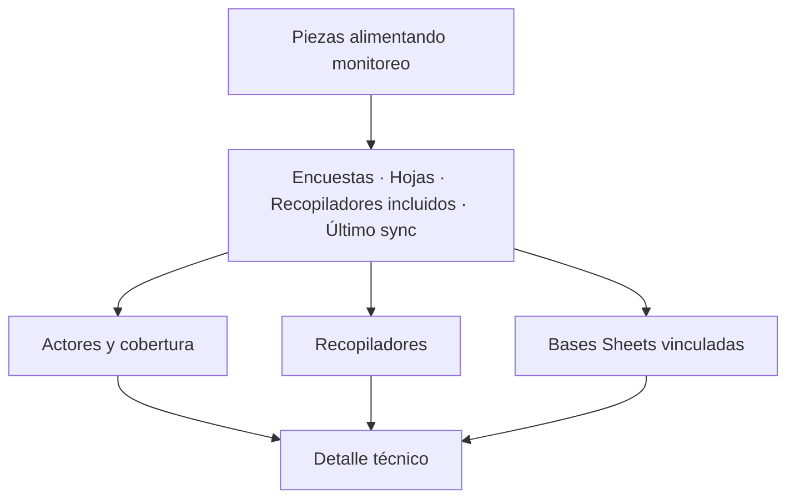

# Estado de fuentes de acreditación

> Comprueba de un vistazo si el paquete de fuentes está completo, alineado por actor y actualizado antes de leer cualquier cifra.

## Objetivo

Las tres pestañas anteriores configuran; ésta **audita lo configurado**. Responde tres preguntas antes de que cualquier número del modo sea creíble: ¿todos los actores tienen encuesta y base?, ¿los recopiladores están clasificados con nombres reales?, ¿cuándo se actualizó esto por última vez?

Es la pestaña por la que conviene entrar cada día, antes que por Avance.

## Antes de empezar

- Haber pasado al menos una vez por las tres pestañas anteriores.
- Conocer cuántos actores tiene el estudio: el juicio de completitud es contra ese número, que la aplicación no conoce por sí sola.

## Mapa de la pantalla

## Elementos de la pantalla

| Elemento | Para qué sirve | Qué cambia o produce |
|---|---|---|
| Titular *piezas alimentando monitoreo* | Suma encuestas activas y hojas activas: el tamaño del paquete que nutre el corte | Es la cifra de completitud global |
| **Encuestas** | Cuenta las encuestas de plataforma activas | Sin encuestas no hay respuestas |
| **Hojas** | Cuenta las bases de Sheets activas, y avisa si algún actor se quedó sin base | Sin hoja, ese actor no tiene denominador |
| **Recop. incluidos** | Cuenta los recopiladores que sí cuentan en el corte | Refleja la decisión tomada en Recopiladores |
| **Último sync** | Fecha de la última sincronización | Dice si lo que ves es de hoy o de la semana pasada |
| **Actores y cobertura** | Un renglón por actor con encuesta, indicando cuántas encuestas tiene y si su base de Sheets está vinculada | Localiza el actor incompleto sin recorrer las otras pestañas |
| **Recopiladores** | Por encuesta: cuántos incluidos y si tiene nombres reales guardados | Señala qué encuesta necesita sincronizarse |
| **Bases Sheets vinculadas** | Lista cada hoja activa con su pestaña, su actor y cuándo se sincronizó | Permite ver la frescura hoja por hoja |
| **Detalle técnico** | Desplegable con dos tablas: fuentes activas y fuentes que el corte declaró | Sirve para comparar lo configurado contra lo que el corte realmente usó |

## Cómo interpretar lo que ves

Distingue **activa** de **actualizada**. Una fuente activa es la que la aplicación leerá; la fecha de sincronización dice si lo que leyó es reciente. Las dos cosas se muestran por separado a propósito, y una fuente activa con sync antiguo es la causa más común de un avance que "no se mueve".

*Bases alineadas* significa que todo actor con encuesta tiene también hoja. Es una comprobación de correspondencia, no de contenido: no dice que la hoja sea la correcta, sólo que existe.

Las dos tablas del detalle técnico —**Fuentes activas** y **Fuentes del corte**— responden a preguntas distintas: la primera es lo que está configurado ahora; la segunda, lo que el corte usó cuando se generó. Si difieren, es que hay cambios de configuración sin regenerar.

Cuando el estudio es telefónico, esta pestaña cambia de forma y muestra el **paquete telefónico**: tres piezas —base telefónica, barrido y Kobo— con su propio marcador. La regla que aparece escrita allí es la del dominio: base, barrido y Kobo se mantienen separados, Kobo manda las efectivas y el barrido aporta los estados telefónicos.

## Cómo se usa

1. Lee el titular y las cuatro cifras superiores. Compara **Encuestas** y **Hojas** con lo que el estudio debería tener.
2. Comprueba **Último sync**. Si es antiguo, sincroniza antes de seguir: todo lo demás describirá un corte viejo.
3. Recorre **Actores y cobertura** y localiza cualquier actor marcado *Falta base Sheets*.
4. En **Recopiladores**, busca encuestas que digan *Falta Actualizar todo*: sus recopiladores no tienen nombres reales guardados.
5. Abre **Detalle técnico** sólo si una cifra no cuadra, y compara fuentes activas contra fuentes del corte.

## Ejemplo guiado

**Situación inicial.** El equipo reporta que ayer se sumaron respuestas de docentes, pero Avance sigue mostrando el mismo número que anteayer.

**Acciones.** Se abre esta pestaña. El titular y los actores están completos, y *Actores y cobertura* muestra a los cuatro en verde. Pero **Último sync** marca la fecha de anteayer. Se ejecuta la sincronización y se vuelve a esta pestaña.

**Resultado observable.** **Último sync** pasa a la fecha de hoy y las hojas de *Bases Sheets vinculadas* actualizan su marca de sincronización. Avance ya refleja las respuestas de docentes. El paquete no estaba incompleto: estaba viejo, que es un problema distinto y se diagnostica aquí.

## Resultado y siguiente paso

- Queda establecido si el corte se apoya en un paquete completo y fresco, y qué pieza falta si no es así.
- Con el paquete en orden, continúa en Modelo operativo de acreditación para declarar metas y mecanismos.

## Estados, alertas y límites

- **Falta base Sheets**: ese actor tiene encuesta pero no universo. Sus respuestas llegan y no cruzan con nadie.
- **Falta Actualizar todo**: la encuesta no tiene nombres reales de recopilador guardados. Las relaciones ya guardadas se siguen usando en Avance.
- **Sin snapshot**: no hay copia local de las bases; el corte no puede recalcularse sin conexión.
- Esta pantalla comprueba **correspondencia y frescura**, no exactitud. Que un actor tenga hoja no garantiza que sea la hoja correcta.
- El titular cuenta encuestas y hojas activas. No es el número de registros ni el número de respuestas: no lo compares con las cifras de Avance.

## Si algo no coincide

Si el avance parece congelado, mira **Último sync** antes que ninguna otra cosa. Si un actor no aparece en Avance, búscalo en *Actores y cobertura*: o le falta la base, o no tiene ninguna encuesta declarada. Si una cifra de esta pantalla no coincide con la misma cifra en otra sección, abre **Detalle técnico** y compara fuentes activas contra fuentes del corte: la diferencia habitual es configuración cambiada sin regenerar.

## Ubicación en la jerarquía

- Padre: [[Fuentes de acreditación]].
