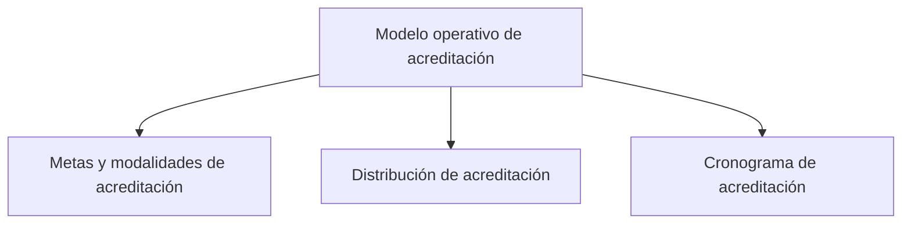

# Modelo operativo de acreditación

> Declara qué se espera de cada actor, con qué mecanismos y en qué periodo, para que el avance pueda juzgarse contra algo.

## Propósito de esta guía

Un porcentaje sin objetivo declarado no dice nada. Esta sección es donde se fija el criterio: cuánto es suficiente para cada actor, si ese actor se cierra alcanzando un mínimo o barriendo todo su universo, por qué vías se le va a llegar y en qué ventana de campo.

Es corta pero decisiva: todo lo que Avance presenta como logro o como brecha se mide contra lo declarado aquí.

## Antes de recorrer este nivel

- Haber completado Fuentes de acreditación: sin universo por actor no hay contra qué declarar una meta.
- Saber qué se acordó con el cliente para cada actor. No es un dato técnico: es lo que decide si un actor con el mínimo cubierto está terminado o todavía tiene trabajo.
- Tener el cronograma real del operativo, aunque sea aproximado. El periodo de campo va en la ficha técnica del expediente.

## Mapa de navegación

## Guía de destinos

| Destino | Cuándo entrar | Qué hacer allí | Qué deja listo |
|---|---|---|---|
| [[Metas y modalidades de acreditación]] | Al iniciar el estudio y cada vez que se renegocie un objetivo | Declarar por actor el objetivo —mínimo o barrido—, su mínimo y los mecanismos de contacto | El criterio contra el que Avance juzga a cada actor |
| [[Distribución de acreditación]] | Cuando la variable de interés debe compararse entre actores | Revisar categorías, ausencias y concentración por actor | Una lectura desagregada que acompaña a las metas |
| [[Cronograma de acreditación]] | Al planificar el campo, y al cerrar para contrastar plan contra ejecutado | Declarar semanas, fechas de campo y día de reporte | El periodo que irá en la ficha técnica |

## Recorrido recomendado

1. **Metas y modalidades** primero: es la declaración que da sentido a todo lo demás.
2. **Distribución** después, para comprobar cómo se reparte la variable de interés entre actores.
3. **Cronograma** al cerrar, para situar esas metas en el tiempo y poder confrontar lo planeado con lo ejecutado.

## Cómo interpretar avance y estados

La distinción que gobierna esta sección es **mínimo** frente a **barrido**. El mínimo es el punto en que el equipo se cubre; el barrido es cubrir todo el universo. Un actor puede tener el mínimo cumplido y seguir con universo pendiente, y ésas son dos lecturas legítimas que no se anulan: cuál manda depende de lo acordado.

Cuando nadie declara el objetivo de un actor, la aplicación **sugiere** uno según el tamaño de su universo, y lo marca como sugerido. Una sugerencia no es una decisión: sirve para no dejar la pantalla muda, pero el acuerdo con el cliente la reemplaza en cuanto se declara.

## Resultado de este nivel

Al terminar, cada actor tiene objetivo declarado y mecanismos previstos, y el estudio tiene una ventana de campo con la que comparar lo ejecutado. Avance de acreditación deja de mostrar porcentajes sueltos y pasa a mostrar cumplimiento contra un criterio explícito.

## Ubicación en la jerarquía

- Padre: [[Acreditación]].
