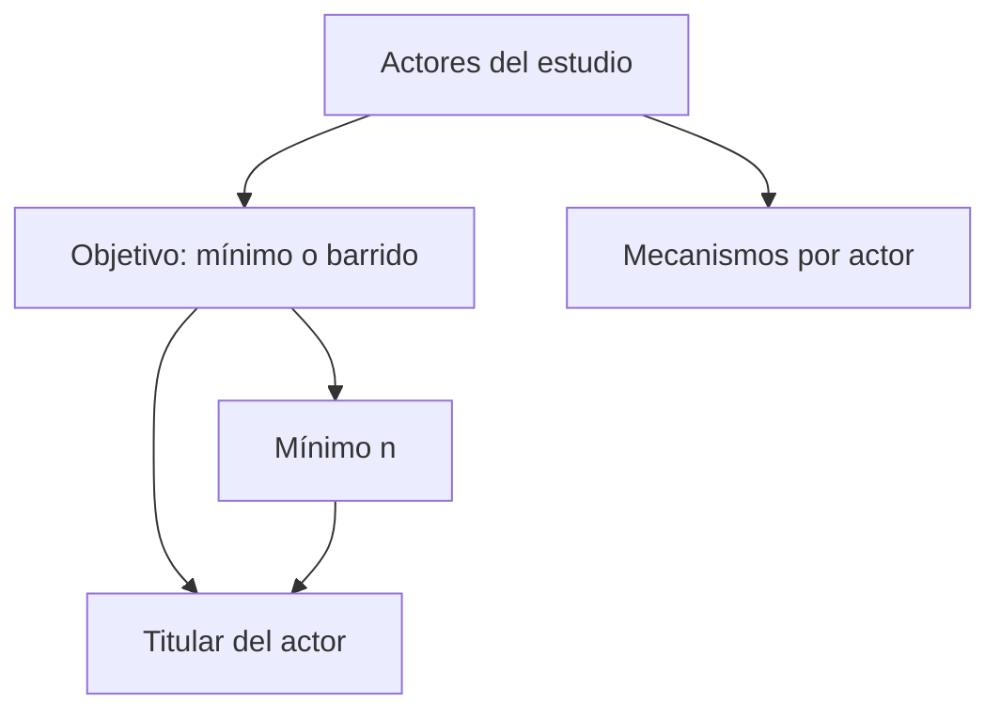

# Metas y modalidades de acreditación

> Declara, actor por actor, si el cierre es alcanzar un mínimo o barrer todo el universo, y por qué mecanismos se le llega.

## Objetivo

Ésta es la pestaña que decide cómo se lee todo el estudio. Aquí se declara el **objetivo** de cada actor, y esa palabra tiene dos valores posibles que no significan lo mismo:

- **Mínimo**: el actor se cierra al alcanzar un número acordado. Es el instrumento interno con el que el equipo se cubre.
- **Barrido**: el actor se cierra al cubrir todo su universo. Es lo que el cliente suele querer cuando el universo es pequeño.

Elegir mal esta declaración produce el error más caro del modo: dar por terminado a un actor que está a pocas respuestas de barrer su universo, o presentar como deuda un actor que ya cumplió lo acordado.

## Antes de empezar

- Cada actor debe tener su universo vinculado en Bases de acreditación; sin él, el barrido no es calculable.
- Ten presente lo acordado con el cliente para cada actor por separado. La regla rara vez es la misma para todos.
- Si el operativo usa varias vías de contacto, conoce cuáles aplican a cada actor.

## Mapa de la pantalla

## Elementos de la pantalla

| Elemento | Para qué sirve | Qué cambia o produce |
|---|---|---|
| Lista de actores | Presenta cada actor del estudio con su universo y sus efectivas | Es la unidad sobre la que se declara todo lo demás |
| Selector de **objetivo** | Declara si ese actor cierra por mínimo o por barrido | Cambia el denominador con el que se mide su avance |
| **Mínimo n** | Fija el número acordado cuando el objetivo es mínimo | Es la referencia contra la que se calcula lo que falta |
| Marca de objetivo sugerido | Indica que nadie declaró el objetivo y se está infiriendo por el tamaño del universo | Avisa de que esa lectura es un supuesto, no un acuerdo |
| Titular del actor | Resume el estado en una frase: cuánto falta y para qué objetivo | Es la lectura que se propaga a Avance |
| Mecanismos y modalidades | Declara las vías previstas de contacto para ese actor | Alimenta la lectura por canal y el calendario |

## Cómo interpretar lo que ves

Cuando nadie ha declarado el objetivo, la aplicación lo **sugiere** por el tamaño del universo: universos pequeños se leen como barrido, universos grandes como mínimo, porque un universo grande normalmente no se puede barrer. Esa sugerencia se marca como tal y existe sólo para que la pantalla no quede muda. **La declaración manda siempre**, y en cuanto declares el acuerdo real la sugerencia deja de aplicarse.

El titular cambia de forma según el objetivo. Con barrido lee *faltan N de universo* o *universo cubierto*; con mínimo lee *faltan N para el mínimo* o *mínimo alcanzado con el porcentaje logrado*. Que un actor supere el 100 % de su mínimo no significa que haya terminado: si su acuerdo real era barrer, el trabajo pendiente es el universo, no el exceso sobre el mínimo.

La aplicación calcula siempre las dos lecturas —si el mínimo está cubierto y cuánto universo queda pendiente— aunque sólo muestre como titular la del objetivo vigente. Ninguna de las dos se esconde.

## Cómo se usa

1. Recorre los actores y, para cada uno, declara su **objetivo** según lo acordado. No dejes ninguno en sugerido si hay acuerdo conocido.
2. Cuando el objetivo sea mínimo, escribe el **mínimo n** acordado. Un mínimo sin declarar deja al actor sin referencia.
3. Declara los mecanismos previstos para ese actor.
4. Lee el titular de cada actor y comprueba que la frase corresponde a lo que el equipo entiende por terminado.
5. Vuelve aquí si se renegocia un objetivo a mitad de campo, en lugar de reinterpretar las cifras a mano.

## Ejemplo guiado

**Situación inicial.** Cuatro actores. Tres tienen universos pequeños —del orden de decenas— y uno tiene un universo de varios cientos. Nadie declaró objetivos, y el equipo cree que los cuatro están cerrados porque las barras se ven llenas.

**Acciones.** Al abrir esta pestaña, los cuatro aparecen con objetivo **sugerido**: barrido para los tres pequeños, mínimo para el grande. Se contrasta con el acuerdo real: el cliente pidió barrer los tres pequeños y aceptó un mínimo para el grande. Se declaran los cuatro objetivos, confirmando lo sugerido, y se escribe el mínimo acordado del actor grande.

**Resultado observable.** Los tres actores pequeños dejan de leerse como cerrados: sus titulares pasan a *faltan 1*, *faltan 1* y *faltan 7* sobre sus universos. El actor grande muestra su mínimo superado con el porcentaje logrado, y en paralelo el universo que le queda pendiente. La marca de sugerido desaparece de los cuatro, y Avance pasa a medir contra un acuerdo en vez de contra un supuesto.

## Resultado y siguiente paso

- Cada actor queda con objetivo declarado, mínimo cuando corresponde y mecanismos previstos.
- Continúa en Cronograma de acreditación para situar esas metas en la ventana de campo.

## Estados, alertas y límites

- **Objetivo sugerido**: nadie lo declaró; la lectura se está infiriendo por el tamaño del universo. Trátalo como pendiente, no como decidido.
- **Mínimo sin definir**: el actor tiene objetivo mínimo pero no hay número. No se puede calcular cuánto falta.
- **Sin universo declarado**: no se puede leer como barrido aunque se declare, porque no hay denominador.
- Declarar barrido no crea trabajo nuevo ni declarar mínimo lo elimina: sólo cambia contra qué se mide. El universo pendiente se calcula igual en ambos casos.
- El mínimo es un acuerdo, no un cálculo de precisión. Esta pestaña no deriva tamaños muestrales; para eso está Calculador de muestras.

## Si algo no coincide

Si un actor se ve terminado y el equipo sabe que no lo está, mira su objetivo: casi siempre está en mínimo cuando el acuerdo era barrer. Si el titular dice *sin universo declarado*, la causa está en Bases de acreditación, no aquí. Si el porcentaje de un actor supera el 100 %, no es un error: está midiendo contra un mínimo que ya superó, y el universo pendiente es la otra cifra que debes mirar.

## Ubicación en la jerarquía

- Padre: [[Modelo operativo de acreditación]].
