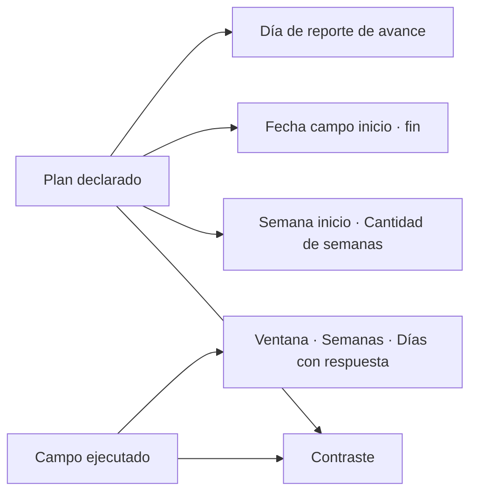

# Cronograma de acreditación

> Declara el periodo de campo planificado y contrástalo con la ventana que las respuestas revelan que se ejecutó de verdad.

## Objetivo

El periodo de campo no es un adorno del cronograma: va en la **ficha técnica del expediente**. Un comité pregunta cuándo se levantó la información, y la respuesta tiene que ser defendible.

Esta pestaña sirve para dos cosas. Al planificar, declara la ventana prevista y el día de reporte. Al cerrar, permite lo que hace útil un cronograma: comparar lo que se planeó con lo que las respuestas demuestran que ocurrió.

## Antes de empezar

- Ten el cronograma acordado del operativo: semana de inicio, duración prevista y fechas de campo.
- Para el contraste con lo ejecutado hacen falta respuestas fechadas en el corte; sin ellas sólo verás el plan.
- Define con el equipo el día de reporte de avance: es el que fija el ritmo de las entregas al cliente.

## Mapa de la pantalla

## Elementos de la pantalla

| Elemento | Para qué sirve | Qué cambia o produce |
|---|---|---|
| **Semana inicio** | Declara en qué semana arranca el campo | Sitúa el plan en el calendario del estudio |
| **Cantidad de semanas** | Declara la duración prevista | Es la referencia contra la que se juzga la extensión real |
| **Fecha campo inicio** y **Fecha campo fin** | Declaran el periodo planificado con fechas concretas | Alimentan la ficha técnica del expediente |
| **Día de reporte de avance** | Fija el día de la semana en que se entrega el avance | Ordena la cadencia de reportes |
| **Campo ejecutado** | Muestra la ventana derivada de las respuestas fechadas: inicio, fin, semanas, días de calendario y días con respuesta | Es el dato observado, no declarado |
| Contraste plan / ejecutado | Enfrenta lo declarado con lo ocurrido | Convierte el cronograma en una comprobación, no en una decoración |

## Cómo interpretar lo que ves

Aquí conviven un dato **declarado** y un dato **observado**, y no deben confundirse. El plan es lo que alguien escribió; el campo ejecutado se deriva de las fechas de las propias respuestas y no depende de que nadie lo actualice.

Dos cifras del campo ejecutado se parecen y no son lo mismo: los **días de calendario** cuentan todo el periodo de extremo a extremo, y los **días con respuesta** cuentan sólo aquellos en que efectivamente entró algo. La distancia entre ambos describe la intensidad real del operativo: un campo de nueve semanas con la mitad de días sin respuesta no se trabajó de forma continua, y eso cambia cómo se explica el ritmo.

La ventana ejecutada se calcula sólo con fechas en formato ISO publicadas por el bloque canónico. La aplicación no adivina otros formatos a propósito: una fecha inventada en la ficha técnica es peor que una ausente.

## Cómo se usa

1. Al planificar, declara semana de inicio, cantidad de semanas y las fechas de campo. No las dejes vacías por ser opcionales: son parte del expediente.
2. Fija el día de reporte de avance.
3. Durante el campo, vuelve para comparar la ventana ejecutada con la planificada.
4. Al cerrar, toma las fechas de **Campo ejecutado** para la ficha técnica, y explica cualquier diferencia con el plan en lugar de reescribirlo.

## Ejemplo guiado

**Situación inicial.** El plan declarado dice una semana de campo, porque nadie completó las fechas al empezar. El operativo lleva dos meses en marcha.

**Acciones.** Se abre esta pestaña y el bloque **Campo ejecutado** muestra la ventana real derivada de las respuestas: inicio a finales de mayo, fin a finales de julio, alrededor de nueve semanas, con bastantes menos días con respuesta que días de calendario. Se corrigen las fechas del plan para reflejar el acuerdo vigente y se anota la diferencia.

**Resultado observable.** El contraste deja de mostrar una semana contra nueve. La ficha técnica puede citar el periodo real con respaldo en las respuestas, y la distancia entre días de calendario y días con respuesta queda disponible para explicar el ritmo del operativo ante el cliente.

## Resultado y siguiente paso

- El estudio tiene un periodo de campo declarado y uno observado, ambos disponibles para el expediente.
- Continúa en Lectura de fuentes de acreditación para comprobar que las metas y el cronograma se apoyan en fuentes reales.

## Estados, alertas y límites

- Sin respuestas fechadas en el corte, **Campo ejecutado** no puede calcularse. No es un cero: es ausencia de evidencia.
- Sólo se leen fechas en formato ISO. Una columna con otro formato no aporta a la ventana ejecutada.
- El plan declarado no limita ni valida lo ejecutado: son dos registros que se comparan, no una regla y su cumplimiento.
- Esta pestaña no programa envíos ni activa mecanismos; describe el periodo.

## Si algo no coincide

Si el campo ejecutado muestra una ventana más larga que la planificada, no reescribas el plan sin dejar constancia: la diferencia es información para el informe. Si no aparece campo ejecutado pese a haber respuestas, comprueba que el corte traiga fechas y que estén en formato ISO. Si el inicio observado es posterior al real, sospecha de un recorte del corte antes que de un error del cálculo.

## Ubicación en la jerarquía

- Padre: [[Modelo operativo de acreditación]].
