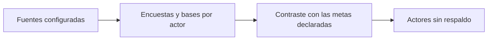

# Lectura de fuentes de acreditación

> Resume, dentro del modelo operativo, lo que la sección Fuentes dejó configurado, para comprobar que las metas se apoyan en algo real.

## Objetivo

Esta pestaña no configura nada: **lee**. Existe para cerrar el bucle entre lo que se declara aquí y lo que existe en Fuentes, porque una meta declarada sobre un actor sin base vinculada es una meta sin denominador, y eso no se detecta mirando la meta.

Es el último control antes de aceptar el modelo operativo como válido.

## Antes de empezar

- Haber declarado metas en Metas y modalidades de acreditación.
- Haber configurado Fuentes de acreditación al menos una vez.
- Tener presente cuántos actores debería tener el estudio: la comprobación se hace contra ese número, que la aplicación no conoce.

## Mapa de la pantalla

## Elementos de la pantalla

| Elemento | Para qué sirve | Qué cambia o produce |
|---|---|---|
| Resumen de encuestas | Cuenta las encuestas de plataforma que alimentan el modelo | Indica si hay respuestas para los actores declarados |
| Resumen de bases | Cuenta las bases de Sheets vinculadas | Indica cuántos actores tienen denominador |
| Lectura por actor | Cruza cada actor con lo que Fuentes le dejó configurado | Localiza al actor con meta pero sin respaldo |
| Estado del paquete | Resume si lo configurado alcanza para sostener el modelo | Es el veredicto de la comprobación |

## Cómo interpretar lo que ves

Esta pestaña muestra cifras que también aparecen en Estado de fuentes de acreditación, y la coincidencia es deliberada: son la misma realidad vista desde el modelo. Si difieren, es que el corte se generó antes de un cambio de configuración.

Lo que hay que leer aquí no es el total, sino la **correspondencia**: cuántos actores tienen meta declarada y cuántos de ésos tienen encuesta y base. La diferencia entre esos dos números es el trabajo pendiente, y es información que ninguna de las dos pestañas de al lado da por sí sola.

Un resumen completo no garantiza que las metas sean correctas: garantiza que son calculables.

## Cómo se usa

1. Compara el número de actores con meta declarada contra el número de actores con base vinculada.
2. Localiza cualquier actor que tenga meta y no tenga respaldo. Anótalo antes de seguir.
3. Comprueba que las cifras coincidan con las de Estado de fuentes de acreditación. Si no coinciden, regenera el corte.
4. Vuelve a Fuentes a completar lo que falte, en lugar de ajustar la meta para que cuadre.

## Ejemplo guiado

**Situación inicial.** Se declararon metas para los cuatro actores del estudio y el equipo da el modelo operativo por cerrado.

**Acciones.** Se abre esta pestaña y el resumen muestra cuatro actores con meta pero tres bases vinculadas. La lectura por actor identifica cuál se quedó sin base. En vez de bajar su meta para que el porcentaje se vea razonable, se vuelve a Bases de acreditación y se vincula la hoja que faltaba.

**Resultado observable.** El resumen pasa a mostrar cuatro y cuatro. La meta de ese actor deja de ser incalculable y su avance aparece con denominador en Avance de acreditación. El modelo operativo queda cerrado sobre fuentes reales.

## Resultado y siguiente paso

- Queda comprobado que cada meta declarada tiene respaldo, o identificado exactamente cuál no lo tiene.
- Con el modelo cerrado, continúa en Consultas de acreditación para revisar los casos, o en Avance de acreditación para leer el estado.

## Estados, alertas y límites

- Un actor con meta y sin base no produce un cero: produce un porcentaje sin denominador.
- Esta pestaña **no configura**. Todo lo que aquí falte se corrige en Fuentes de acreditación.
- Las cifras corresponden al corte generado. Un cambio reciente en Fuentes no aparece hasta regenerar.
- El resumen no juzga si la hoja vinculada es la correcta, sólo si existe.

## Si algo no coincide

Si estas cifras difieren de las de Estado de fuentes de acreditación, la causa habitual es configuración cambiada sin regenerar el corte. Si un actor aparece sin respaldo y sabes que su base está vinculada, comprueba que el nombre del actor esté escrito igual en la encuesta y en la base: el vínculo se apoya en ese texto.

## Ubicación en la jerarquía

- Padre: [[Modelo operativo de acreditación]].
