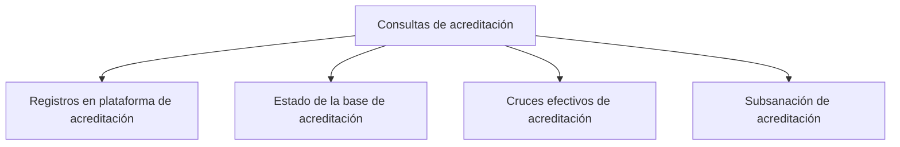

# Consultas de acreditación

> Revisa caso por caso quién respondió, si cruzó con el universo y por qué un registro cuenta o no cuenta.

## Propósito de esta guía

Ésta es la sección que sostiene la cifra. Las demás resumen; aquí se ve el detalle que permite responder la única pregunta que un comité acreditador hace de verdad: *¿por qué entró este caso y por qué no entró aquel?*

El cruce entre las respuestas y el universo declarado ocurre aquí, registro a registro. Por eso Consultas no es una sección de uso ocasional: es donde el avance deja de ser un número y se convierte en evidencia.

## Antes de recorrer este nivel

- El corte debe conservar la reconciliación caso por caso. Si el proyecto se abrió desde un `.pulso` guardado, hay que volver a sincronizar para regenerarla; las cuatro pestañas aparecen vacías hasta entonces.
- Ten claro el universo de cada actor. Todo lo que se juzga aquí es contra esa lista.
- Conviene llegar con una pregunta concreta —un actor con brecha, un total que no cuadra—, porque el volumen de filas es alto y la sección premia entrar filtrando.

## Mapa de navegación

## Guía de destinos

| Destino | Cuándo entrar | Qué hacer allí | Qué deja listo |
|---|---|---|---|
| [[Registros en plataforma de acreditación]] | Para partir de las respuestas y ver qué pasó con cada una | Filtrar por actor, canal, fecha, fuente, recopilador, estado o resultado del cruce | La respuesta identificada, con su estado y su cruce |
| [[Estado de la base de acreditación]] | Para partir del universo y ver a quién le falta responder | Recorrer las personas de la base y su avance final | El listado de pendientes por actor |
| [[Cruces efectivos de acreditación]] | Para auditar por qué una respuesta se ligó a un caso | Revisar la razón del cruce y la evidencia que lo sostiene | La justificación de cada vínculo respuesta–caso |
| [[Subsanación de acreditación]] | Cuando un caso necesita una decisión explícita | Registrar la decisión sobre casos que no cruzan o quedan ambiguos | Una decisión auditada, no un ajuste silencioso |

## Recorrido recomendado

1. **Registros en plataforma** cuando la duda nace de una respuesta: llegó pero no suma.
2. **Estado de la base** cuando la duda nace del universo: alguien debía responder y no aparece.
3. **Cruces efectivos** cuando la duda es el vínculo: la respuesta y el caso existen, pero ¿se ligaron bien?
4. **Subsanación** cuando la revisión exige decidir, y esa decisión debe quedar registrada.

Las dos primeras pestañas son las dos entradas naturales, y son simétricas: una parte de las respuestas, la otra del universo. Elegir la equivocada hace que la revisión dé vueltas.

## Cómo interpretar avance y estados

Aquí conviven dos ejes que suelen confundirse. El **estado de la respuesta** dice si está completa, parcial, rechazada o si no hay respuesta. El **cruce** dice si esa respuesta se pudo ligar a alguien del universo declarado. Una respuesta completa que no cruza no es efectiva; una persona del universo sin respuesta no es un fallo del cruce.

El **avance final** de un caso es el resultado de aplicar las cuatro compuertas del modo —completa, consentimiento, cruce y deduplicación—, no el estado de su respuesta.

Cuando una tabla recorta filas, usa el total declarado en el encabezado y no cuentes lo visible.

## Resultado de este nivel

Al terminar, cada caso del universo tiene una historia legible: respondió y cuenta, respondió y no cuenta con motivo, o no respondió. Ese conjunto es lo que hace defendible el avance y lo que Procesamiento necesita para recibir la base.

## Ubicación en la jerarquía

- Padre: [[Acreditación]].
