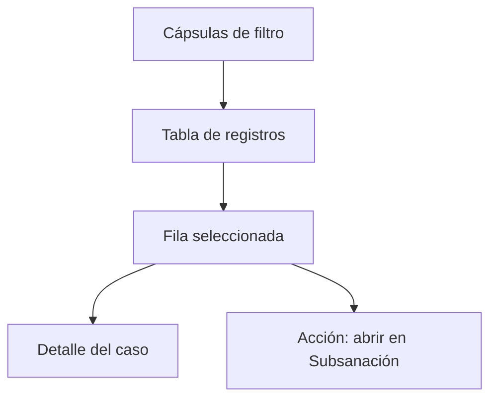

# Registros en plataforma de acreditación

> Recorre las respuestas recibidas una por una y comprueba, para cada una, si cruzó con el universo y qué acción admite.

## Objetivo

Ésta es la entrada por el lado de la **respuesta**. Sirve para la pregunta *"esta persona respondió, ¿por qué no aparece en el avance?"*. La tabla ordena las respuestas por última actualización y expone, en la misma fila, el estado de la respuesta y el resultado de su cruce contra la base: las dos cosas que deciden si cuenta.

## Antes de empezar

- El corte debe conservar la reconciliación caso por caso; si no, la tabla aparece vacía y hay que volver a sincronizar.
- Ten a mano el dato con el que vas a buscar: actor, canal, fecha, o el nombre de la persona.
- Si la duda nace del universo y no de una respuesta concreta, la pestaña adecuada es Estado de la base de acreditación.

## Mapa de la pantalla

## Elementos de la pantalla

| Elemento | Para qué sirve | Qué cambia o produce |
|---|---|---|
| Cápsulas de filtro | Acotan por actor, canal, fecha, fuente, recopilador, estado de respuesta y resultado del cruce; cada opción muestra cuántas filas tiene | Reducen la tabla a lo que estás investigando |
| Limpiar filtros | Devuelve la tabla completa | Evita confundir un filtro olvidado con una ausencia de datos |
| Columna **Actor / caso** | Nombre de la persona, su actor y su llave de caso | Identifica el registro; es el botón que abre el detalle |
| Columna **Respuesta** | Estado de la respuesta y su identificador de plataforma | Distingue completa, parcial, rechazo o sin respuesta |
| Columna **Fecha y hora** | Momento de la respuesta, con su detalle | Sitúa el registro en el campo y permite comparar con el ritmo diario |
| Columna **Canal / fuente** | Vía de llegada, fuente y recopilador | Explica por dónde entró la respuesta |
| Columna **Cruce** | Resultado del cruce contra la base, y el registro de base con el que cruzó | Es lo que decide si la respuesta puede contar |
| Columna **Acción** | Ofrece abrir el caso en Subsanación cuando admite decisión; si no, explica por qué no | Enlaza la revisión con el registro de la decisión |

## Cómo interpretar lo que ves

**Estado de respuesta** y **cruce** son independientes. Una respuesta *completa* con cruce fallido no cuenta; una respuesta *parcial* que cruza tampoco, pero por otro motivo. Leer sólo una de las dos columnas es el error más frecuente en esta pantalla.

En la columna de cruce, *sin base* significa que la respuesta no encontró a nadie en el universo declarado. Antes de tratarlo como un problema del encuestado, comprueba que el actor de esa respuesta tenga su base vinculada: una hoja faltante produce exactamente este síntoma en masa.

La tabla muestra hasta un número acotado de filas. El total real está en el encabezado; no cuentes lo visible.

## Cómo se usa

1. Filtra por el actor o el canal que estás investigando. Fíjate en el conteo de cada cápsula: ya te dice dónde está el volumen.
2. Localiza las filas cuyo cruce haya fallado y observa si comparten algo —el mismo recopilador, el mismo día, el mismo actor—. Un patrón apunta a configuración; casos sueltos apuntan a datos.
3. Abre una fila para ver el detalle del caso y su rastro de llaves.
4. Si el caso admite decisión, usa la acción de la fila para abrirlo en Subsanación en vez de resolverlo por fuera.
5. Limpia los filtros antes de sacar conclusiones sobre totales.

## Ejemplo guiado

**Situación inicial.** Un coordinador afirma que cinco docentes respondieron por enlace, pero el avance de docentes no se movió.

**Acciones.** Se filtra por actor *Docentes* y canal *Enlace*. Aparecen las cinco respuestas, todas con estado *completa*, y las cinco con el cruce fallido y *Sin base* en la columna de cruce. El patrón —las cinco iguales— apunta a configuración, no a los encuestados. Se comprueba en Fuentes que la base de docentes esté vinculada.

**Resultado observable.** La base de docentes apuntaba a la pestaña de otro actor. Corregida la vinculación y regenerado el corte, las cinco filas pasan a cruzar y el avance de docentes sube en cinco. Ninguna respuesta nueva entró: lo que cambió fue el universo contra el que se comparaban.

## Resultado y siguiente paso

- Queda identificado, respuesta por respuesta, qué llegó y qué de eso puede contar.
- Si el problema es el vínculo entre respuesta y caso, continúa en Cruces efectivos de acreditación. Si exige una decisión, en Subsanación de acreditación.

## Estados, alertas y límites

- Tabla vacía con todos los filtros en *Todos*: el corte no conserva la reconciliación. Vuelve a sincronizar para regenerarla.
- Un cruce fallido no es un rechazo del encuestado; es que su respuesta no encontró correspondencia en el universo declarado.
- Esta pantalla **no modifica** respuestas ni bases. Sólo permite abrir el caso donde la decisión sí se registra.
- El orden por última actualización no es el orden de llegada al campo: una respuesta reabierta sube en la lista.

## Si algo no coincide

Si muchas respuestas de un mismo actor fallan el cruce, revisa su base de universo antes que los datos. Si las que fallan comparten recopilador, revisa si ese recopilador está incluido y con qué actor. Si el total de esta tabla difiere del total de Avance, comprueba que ambos correspondan al mismo corte: esta pestaña muestra el estado reconciliado, y Avance el del corte generado.

## Ubicación en la jerarquía

- Padre: [[Consultas de acreditación]].
