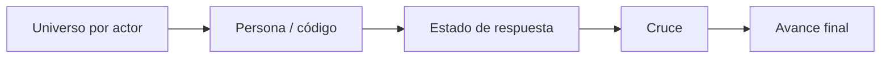

# Estado de la base de acreditación

> Recorre el universo declarado persona por persona y comprueba en qué quedó cada una.

## Objetivo

Ésta es la entrada por el lado del **universo**, simétrica a la de registros. Sirve para la pregunta *"¿a quién le falta responder?"*, que es la que produce las listas de seguimiento del equipo de campo. Cada fila es una persona de la base, no una respuesta: por eso aquí sí aparecen los que nunca contestaron, que en la pestaña de registros no existen.

## Antes de empezar

- El corte debe conservar la reconciliación caso por caso.
- Ten claro sobre qué actor trabajas: el universo es por actor, y mezclarlos hace ilegible la lista.
- Si la duda nace de una respuesta concreta y no del universo, la pestaña adecuada es Registros en plataforma de acreditación.

## Mapa de la pantalla

## Elementos de la pantalla

| Elemento | Para qué sirve | Qué cambia o produce |
|---|---|---|
| Columna **Persona / código** | Identifica al integrante del universo con su código | Es la unidad de la tabla: una persona, haya respondido o no |
| Columna **Actor** | Indica a qué actor pertenece esa persona | Permite separar universos que se ven juntos |
| Columna **Estado respuesta** | Dice si esa persona tiene respuesta y en qué estado | Distingue *sin respuesta* de *respuesta que no cuenta* |
| Columna **Última respuesta** | Fecha de la respuesta más reciente de esa persona | Sitúa el caso y detecta reintentos |
| Columna **Cruce** | Muestra cómo se ligó su respuesta al registro de base | Explica el vínculo cuando existe |
| Columna **Avance final** | Resultado de aplicar las cuatro compuertas a ese caso | Es la respuesta definitiva a si esa persona cuenta |

## Cómo interpretar lo que ves

**Sin respuesta** y **avance final negativo** no son lo mismo, y la diferencia decide qué hace el equipo: la primera es alguien a quien hay que volver a contactar; la segunda es alguien que ya respondió pero cuya respuesta no superó alguna compuerta, y eso rara vez se arregla insistiendo.

El **avance final** es la columna que manda. Las tres anteriores explican cómo se llegó a ella; ninguna la sustituye. Una persona con respuesta completa puede tener avance final negativo si su respuesta quedó duplicada y perdió frente a otra más larga.

El total de filas de esta tabla es el tamaño del universo trabajado del actor. Compáralo con lo declarado en Bases de acreditación: si difiere, el problema está en el rango o en la pestaña vinculada, no aquí.

## Cómo se usa

1. Acota a un actor. Trabajar con un universo a la vez es lo que hace la lista utilizable.
2. Ordena o recorre buscando las filas **sin respuesta**: ésa es la lista de seguimiento que el equipo puede accionar.
3. Separa aparte las filas con respuesta pero avance final negativo. Ésas no son seguimiento, son revisión.
4. Para entender un caso concreto, mira su cruce y su última respuesta antes de concluir.
5. Contrasta el total con el universo declarado del actor.

## Ejemplo guiado

**Situación inicial.** Un actor tiene el mínimo cubierto, pero el cliente pidió barrer todo su universo y nadie sabe a cuántas personas falta contactar.

**Acciones.** Se abre esta pestaña acotada a ese actor. El total de filas coincide con su universo declarado. Se recorren las filas y se separan dos grupos: las que están **sin respuesta** y las que tienen respuesta con avance final negativo.

**Resultado observable.** Queda una lista corta de personas sin respuesta —la que el equipo puede trabajar con una nueva ola de contacto— y una lista aparte de casos que ya respondieron y no cuentan, que se revisan en Cruces efectivos o se llevan a Subsanación. La brecha deja de ser un porcentaje y pasa a ser dos listas con nombres.

## Resultado y siguiente paso

- Queda separado lo que se resuelve contactando de lo que se resuelve revisando.
- Para auditar por qué un caso con respuesta no cuenta, continúa en Cruces efectivos de acreditación.

## Estados, alertas y límites

- **Sin respuesta**: la persona está en el universo y no hay respuesta suya. No es un fallo del cruce.
- Un avance final negativo con respuesta presente indica que falló alguna de las cuatro compuertas: completitud, consentimiento, cruce o deduplicación.
- Esta tabla refleja el universo **trabajado**, no la población real del actor. La cobertura sobre la población se calcula fuera de la aplicación.
- La pantalla no permite editar la base ni marcar personas: las decisiones se registran en Subsanación.

## Si algo no coincide

Si el total de filas no coincide con el universo que declaraste, revisa el rango y la pestaña vinculada en Bases de acreditación. Si casi todo el actor aparece sin respuesta pese a haber recibido respuestas, es señal de que su universo apunta a la hoja equivocada: las respuestas existen, pero no encuentran a nadie con quien cruzar.

## Ubicación en la jerarquía

- Padre: [[Consultas de acreditación]].
