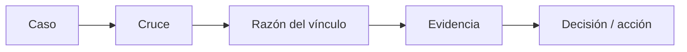

# Cruces efectivos de acreditación

> Audita por qué cada respuesta quedó ligada a un caso del universo, con la razón del vínculo y la evidencia que lo sostiene.

## Objetivo

Las dos pestañas anteriores muestran el **resultado** del cruce; ésta muestra su **fundamento**. Es la pantalla que se abre cuando alguien pregunta *"¿y cómo saben que esa respuesta es de esa persona?"*.

Importa porque el vínculo no siempre se apoya en un código: cuando la fuente no declara un identificador de persona, el cruce recae en llaves más frágiles como el nombre o el correo. Un vínculo por código y otro por nombre no merecen la misma confianza, y aquí es donde se distinguen.

## Antes de empezar

- El corte debe conservar la reconciliación caso por caso.
- Conviene llegar con un caso concreto en la mano, tomado de Registros en plataforma o de Estado de la base.
- Ayuda saber si las fuentes del estudio declaran un código de persona: eso determina qué tan sólidos serán los cruces que verás.

## Mapa de la pantalla

## Elementos de la pantalla

| Elemento | Para qué sirve | Qué cambia o produce |
|---|---|---|
| Columna **Caso** | Identifica el caso del universo implicado | Ancla la fila a una persona concreta |
| Columna **Cruce** | Muestra el resultado del vínculo | Distingue cruzado de no cruzado |
| Columna **Razón** | Explica por qué se ligó: qué llave hizo la correspondencia | Es lo que permite juzgar la solidez del vínculo |
| Columna **Evidencia** | Aporta el dato concreto que sostiene esa razón | Convierte la afirmación en algo verificable |
| Columna **Decisión / acción** | Ofrece la acción disponible sobre ese cruce | Enlaza con el registro de la decisión en Subsanación |

## Cómo interpretar lo que ves

La razón del cruce es una escala de confianza, no una etiqueta binaria. Un cruce por código declarado es sólido. Un cruce por nombre o por correo es plausible y puede fallar con homónimos, tildes, apellidos invertidos o correos compartidos. Si el estudio necesita defenderse ante un comité, los cruces débiles son los que hay que poder explicar uno por uno, y son también los primeros candidatos a revisión.

La ausencia de cruce tiene dos lecturas muy distintas: que la persona no esté en el universo declarado, o que esté pero con los datos escritos de otra forma. La evidencia de la fila es lo que las separa.

## Cómo se usa

1. Llega con un caso concreto o filtra el conjunto que estás auditando.
2. Lee primero la **razón**: te dice qué tan fuerte es el vínculo antes de mirar nada más.
3. Contrasta la **evidencia** con lo que sabes del caso. Es el paso que convierte la revisión en auditoría.
4. Concentra el esfuerzo en los vínculos débiles y en los no cruzados; los cruces por código rara vez necesitan revisión.
5. Cuando un caso exija una decisión, ábrelo en Subsanación desde la columna de acción.

## Ejemplo guiado

**Situación inicial.** El total de efectivas de un actor parece alto para el número de personas que el equipo recuerda haber contactado, y se sospecha de vínculos mal hechos.

**Acciones.** Se abre esta pestaña acotada a ese actor y se recorren las razones de cruce. La mayoría se apoya en el nombre, no en un código: la fuente de ese actor no declara identificador de persona. Se revisa la evidencia de las filas con nombres frecuentes y aparecen dos casos ligados a personas distintas con el mismo nombre y apellido.

**Resultado observable.** Los dos vínculos dudosos quedan identificados con su evidencia y se llevan a Subsanación para decidirlos de forma explícita. El resto de los cruces por nombre queda revisado y sostenido. La cifra del actor deja de ser una afirmación y pasa a tener respaldo caso por caso.

## Resultado y siguiente paso

- Cada vínculo queda auditado, con su razón y su evidencia disponibles para el expediente.
- Los casos que exigen decisión continúan en Subsanación de acreditación.

## Estados, alertas y límites

- Un cruce por nombre o correo es más frágil que uno por código. La pantalla lo declara; no lo corrige.
- Un caso sin cruce puede ser una persona ausente del universo o una diferencia de escritura. La evidencia distingue una cosa de la otra.
- Esta pantalla **audita**, no reasigna: cambiar un vínculo se hace declarando mejor las fuentes o registrando la decisión en Subsanación.
- Si el universo se modifica, los cruces se rehacen al regenerar el corte, y las razones pueden cambiar.

## Si algo no coincide

Si demasiados cruces se apoyan en nombre, comprueba si la fuente del actor puede declarar un código de persona: es la corrección de fondo. Si un caso que debería cruzar no lo hace, contrasta la evidencia con la base: la causa habitual es una diferencia de escritura, no una ausencia. Si un vínculo es claramente erróneo, no lo corrijas por fuera; regístralo en Subsanación para que la decisión quede auditada.

## Ubicación en la jerarquía

- Padre: [[Consultas de acreditación]].
