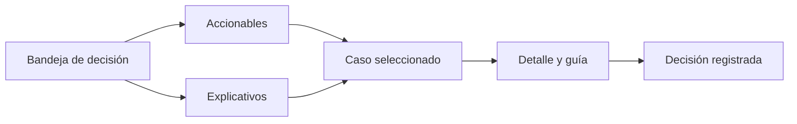

# Subsanación de acreditación

> Bandeja de decisión: cada caso sin cruce termina incluido con salvedad o explicado, y la decisión queda registrada.

## Objetivo

Un expediente de acreditación no se defiende diciendo que los casos raros se resolvieron; se defiende mostrando **qué se decidió sobre cada uno y por qué**. Esta pestaña existe para que esas decisiones no ocurran en una hoja aparte ni en la cabeza de quien revisó.

La regla de cierre está escrita en la propia pantalla: trabajar primero las respuestas completas o parciales que no cruzaron, y que cada caso termine **incluido con salvedad** o **explicado**. No hay una tercera salida, y dejar un caso sin decidir es dejar un hueco en el expediente.

## Antes de empezar

- El corte debe conservar la reconciliación caso por caso.
- Conviene haber pasado por Cruces efectivos: la evidencia del vínculo es lo que sostiene una decisión razonada.
- Ten claro el criterio del estudio para admitir una salvedad. La aplicación registra la decisión; el criterio lo pone el equipo.

## Mapa de la pantalla

## Elementos de la pantalla

| Elemento | Para qué sirve | Qué cambia o produce |
|---|---|---|
| Encabezado *Bandeja de decisión* | Cuenta los casos que esperan revisión y recuerda la regla de cierre | Dimensiona el trabajo pendiente |
| Resumen del flujo | Muestra cuántos casos son accionables, cuántos explicativos y cuántos ya llevan decisión manual | Permite ver el progreso de la revisión sin recorrer la lista |
| Grupo **Accionables** | Casos sobre los que cabe tomar una decisión ahora | Es por donde se empieza |
| Grupo **Explicativos** | Casos que no admiten decisión pero necesitan quedar explicados | Cierra el expediente sin forzar decisiones falsas |
| Fila de caso | Muestra el nombre, el actor, la estrategia de llave usada y su evidencia principal, y la acción que admite | Selecciona el caso para el panel de detalle |
| Panel de detalle con guía | Presenta el caso completo y orienta la decisión | Es donde la decisión se registra |

## Cómo interpretar lo que ves

**Accionable** y **explicativo** no son grados de gravedad: son tipos de caso distintos. Un accionable admite que alguien decida incluirlo con salvedad; un explicativo requiere dejar constancia de por qué quedó fuera. Confundirlos lleva a forzar decisiones sobre casos que sólo necesitaban explicación.

Cada fila muestra la estrategia de llave y su evidencia. Ése es el dato que justifica la decisión: incluir con salvedad un caso cuya única evidencia es un nombre frecuente no es lo mismo que incluir uno con código coincidente y un dato de contacto que confirma.

El contador de decisiones manuales indica cuánto del expediente descansa en criterio humano. No es negativo —en acreditación es esperable—, pero es un número que conviene poder explicar.

## Cómo se usa

1. Empieza por **Accionables**, y dentro de ellos por las respuestas completas o parciales que no cruzaron: son las que más pesan en la cifra.
2. Selecciona un caso y lee su detalle junto con la estrategia de llave y la evidencia.
3. Decide: incluir con salvedad cuando la evidencia lo sostiene, o dejarlo explicado cuando no.
4. Pasa a **Explicativos** y asegúrate de que ninguno queda sin constancia.
5. Revisa el contador del flujo antes de dar la revisión por cerrada: si quedan accionables, el expediente todavía tiene huecos.

## Ejemplo guiado

**Situación inicial.** Tras revisar los cruces, quedan doce casos de un actor con respuesta completa que no cruzó con el universo.

**Acciones.** En la bandeja aparecen nueve como **accionables** y tres como **explicativos**. Se abren los nueve uno a uno: siete tienen evidencia de correo coincidente con la base y se incluyen con salvedad, dejando anotada la razón; dos se apoyan sólo en un nombre frecuente y no se incluyen, quedando explicados. Los tres explicativos corresponden a personas que no pertenecen al universo declarado y se dejan con su constancia.

**Resultado observable.** El contador de accionables baja a cero y el de decisiones manuales sube a nueve. El avance del actor incorpora los siete casos incluidos, y los cinco restantes quedan documentados con motivo. Ante una pregunta del comité sobre cualquiera de los doce, hay una respuesta escrita.

## Resultado y siguiente paso

- Cada caso dudoso queda incluido con salvedad o explicado, con su decisión registrada.
- Con la bandeja en cero, el avance de Avance de acreditación puede leerse como cifra defendible.

## Estados, alertas y límites

- **Sin no cruces**: no hay casos pendientes con los filtros activos. Comprueba los filtros antes de leerlo como bandeja vacía.
- Una decisión aquí es un registro, no un recálculo silencioso: queda asociada al caso y es auditable.
- La pantalla no corrige la causa de fondo. Si los no cruces vienen de una base mal vinculada o de fuentes sin código de persona, subsanar caso por caso trata el síntoma; la corrección está en Fuentes.
- Los grupos muestran un número acotado de filas. El total está en el encabezado.

## Si algo no coincide

Si la bandeja tiene demasiados casos, sospecha de configuración antes que de datos: decenas de no cruces del mismo actor suelen significar una base equivocada, no decenas de personas ambiguas. Si un caso reaparece tras haber sido decidido, comprueba que el corte se regeneró después de la decisión. Si la bandeja aparece vacía y esperabas casos, verifica que el corte conserve la reconciliación.

## Ubicación en la jerarquía

- Padre: [[Consultas de acreditación]].
