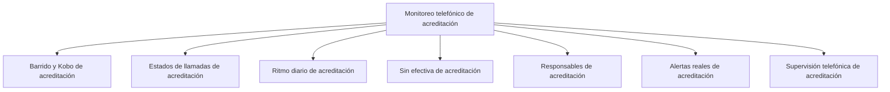

# Monitoreo telefónico de acreditación

> Controla el barrido telefónico que alimenta parte de las efectivas: quién llamó, con qué resultado, a qué ritmo y con qué calidad.

## Propósito de esta guía

Cuando un operativo de acreditación incluye llamadas, aparece una asimetría que hay que tener clara desde el principio: **el barrido registra los intentos, pero las efectivas las manda la plataforma**. La hoja de barrido dice a quién se llamó y qué pasó; la encuesta dice quién respondió de verdad. Son dos fuentes distintas que se mantienen separadas a propósito, y confundirlas produce dos avances que no coinciden.

Esta sección controla la operación de llamadas con ese contrato en mente.

## Antes de recorrer este nivel

- La hoja de barrido debe estar vinculada en Bases de acreditación; sin ella esta sección no tiene insumo.
- Debe haber al menos una encuesta activa que aporte las efectivas.
- Conviene conocer el equipo de llamadas y su asignación: buena parte de la sección se lee por responsable.

## Mapa de navegación

## Guía de destinos

| Destino | Cuándo entrar | Qué hacer allí | Qué deja listo |
|---|---|---|---|
| [[Barrido y Kobo de acreditación]] | Para leer el estado general de la operación | Revisar el barrido por estado de llamada frente a las efectivas de plataforma | La foto de la operación con sus dos fuentes separadas |
| [[Estados de llamadas de acreditación]] | Cuando aparece un estado nuevo o antes de interpretar los colores del barrido | Confirmar la agrupación operativa conservando el valor original | Estados trazables para ritmo, incidencia y alertas |
| [[Ritmo diario de acreditación]] | Para saber si el operativo avanza al paso necesario | Revisar la producción por día | La tendencia y su proyección |
| [[Sin efectiva de acreditación]] | Para trabajar lo que aún no cierra | Revisar los casos contactados sin efectiva y los que exigen insistencia | La lista accionable del equipo de llamadas |
| [[Responsables de acreditación]] | Para repartir o corregir carga | Revisar el desempeño y la carga por responsable | El diagnóstico del equipo |
| [[Alertas reales de acreditación]] | Cuando algo parece inconsistente | Revisar las alertas de enlace, duración, contradicción entre fuentes y asignación | Los casos que exigen intervención |
| [[Supervisión telefónica de acreditación]] | Para el control de calidad | Revisar la muestra de supervisión y su consistencia | La evidencia de control del operativo |

## Recorrido recomendado

1. **Barrido y Kobo** primero, para situar la operación completa.
2. **Estados** después, para confirmar qué significa cada valor del barrido.
3. **Ritmo diario**, que responde si se llegará a tiempo.
4. **Sin efectiva** y **Responsables**, que son las dos pestañas accionables: qué falta y quién lo trabaja.
5. **Alertas reales** cuando algo no cuadre.
6. **Supervisión telefónica** como control de calidad, no como último paso decorativo.

## Cómo interpretar avance y estados

Los estados de llamada vienen de una hoja que escribe el cliente, con su propio vocabulario. La aplicación los agrupa en **familias operativas estables** —efectivo, sin contacto, número inválido, rechazo, otro estado y sin barrer— y conserva el valor original como detalle para la trazabilidad. Un estado que no encaja en ninguna familia conocida no se disfraza: queda en *otro estado* con su texto crudo, porque reetiquetar en silencio es lo que rompe la defensa de un expediente.

El orden de lectura de las familias no es alfabético: empieza por lo que suma y termina por lo que aún no se trabajó. **Sin barrer** es la familia que dice cuánto queda por hacer, y no debe leerse como un resultado.

Recuerda la asimetría de la sección: un caso puede figurar como efectivo en el barrido y no tener encuesta efectiva. Eso no es un error de nadie, es la diferencia entre haber contactado y haber conseguido una respuesta que pasa las cuatro compuertas.

## Resultado de este nivel

Al terminar, la operación telefónica queda descrita con sus dos fuentes separadas y conciliadas: cuántos intentos hubo y con qué resultado, cuántas efectivas produjeron, qué queda por barrer y qué casos exigen intervención.

## Ubicación en la jerarquía

- Padre: [[Acreditación]].
