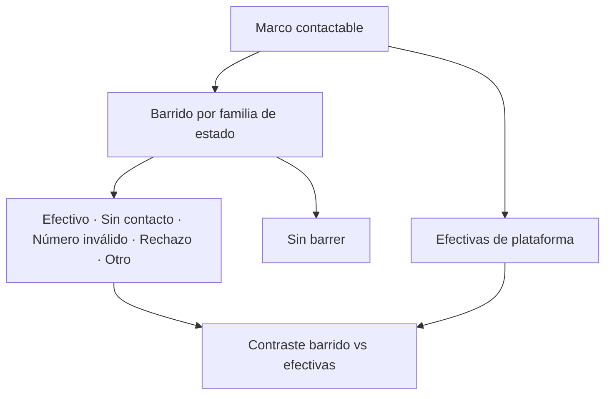

# Barrido y Kobo de acreditación

> Foto general de la operación telefónica: cuánto se barrió, con qué resultados y cuántas efectivas produjo la plataforma.

## Objetivo

Es la pestaña de entrada de la sección. Responde tres preguntas de un vistazo: cuánto del marco contactable se ha trabajado, cómo se reparten los resultados de las llamadas, y cuántas respuestas efectivas hay realmente.

Las dos primeras las contesta la hoja de barrido; la tercera, la plataforma. Mantenerlas visibles a la vez es el punto de esta pantalla.

## Antes de empezar

- La base telefónica y la hoja de barrido deben estar vinculadas, y debe haber al menos una encuesta activa.
- Conviene saber cuál es el marco contactable declarado: es el denominador de todo lo que verás.
- Ten presente que barrido y efectivas cuentan cosas distintas; llegar esperando que coincidan lleva a diagnosticar mal.

## Mapa de la pantalla

## Elementos de la pantalla

| Elemento | Para qué sirve | Qué cambia o produce |
|---|---|---|
| Base telefónica | Declara el tamaño del marco contactable | Es el denominador de la operación |
| Distribución por familia de estado | Agrupa los estados crudos del cliente en familias operativas y muestra su peso | Permite leer resultados sin depender del vocabulario de la hoja |
| **Sin barrer** | Cuenta los casos del marco que aún no se trabajaron | Es la cifra de trabajo pendiente, no un resultado |
| Efectivas de plataforma | Muestra las respuestas efectivas que la encuesta aportó | Es la cifra que cuenta para el avance |
| Detalle del estado crudo | Conserva el texto original de la hoja bajo cada familia | Sostiene la trazabilidad ante una pregunta del comité |

## Cómo interpretar lo que ves

Las familias tienen un orden de lectura deliberado: primero lo que suma, al final lo que no se ha trabajado. Leerlas como una lista plana confunde un resultado con una tarea pendiente.

**Efectivo** en el barrido no es lo mismo que **efectiva** en la plataforma. El barrido dice que la llamada logró contacto; la efectiva exige además que la respuesta esté completa, tenga consentimiento, cruce con el universo y sobreviva la deduplicación. Que la primera cifra supere a la segunda es normal; que la segunda supere a la primera indica que llegaron respuestas por otra vía o que el barrido está desactualizado.

**Otro estado** agrupa lo que no encaja en ninguna familia conocida. No es un cajón de sastre despreciable: si concentra mucho volumen, significa que la hoja del cliente usa un vocabulario que conviene revisar con él.

## Cómo se usa

1. Lee primero la base telefónica: es el denominador de todo lo demás.
2. Mira **sin barrer** antes que los resultados: te dice cuánto del marco ni siquiera se ha intentado.
3. Recorre las familias en su orden y observa dónde se concentra el volumen. Mucho *número inválido* apunta a calidad de la base; mucho *sin contacto*, a horarios o insistencia.
4. Compara con las efectivas de plataforma y explica la diferencia en lugar de igualarlas.
5. Si algo no cuadra, baja al detalle del estado crudo antes de sacar conclusiones.

## Ejemplo guiado

**Situación inicial.** El coordinador reporta que el equipo lleva días llamando sin parar, pero el avance del estudio apenas se mueve.

**Acciones.** Se abre esta pestaña. La base telefónica es del tamaño esperado y **sin barrer** es pequeño, así que el equipo efectivamente trabajó el marco. Al recorrer las familias, el volumen se concentra en *número inválido* y no en *sin contacto*. Las efectivas de plataforma son bajas y consistentes con esa distribución.

**Resultado observable.** El diagnóstico deja de ser *el equipo no llama lo suficiente* y pasa a ser *la base tiene números incorrectos*. La acción que sigue no es insistir más, sino revisar la calidad de los teléfonos del marco. El detalle del estado crudo permite mostrarle al cliente con sus propias etiquetas qué proporción de su base no es contactable.

## Resultado y siguiente paso

- Queda establecido cuánto se barrió, con qué resultados y cuántas efectivas produjo.
- Continúa en Ritmo diario de acreditación para saber si ese resultado alcanza en el tiempo disponible.

## Estados, alertas y límites

- **Sin barrer** es trabajo pendiente, no un resultado negativo.
- **Efectivo** del barrido y **efectiva** de plataforma son conceptos distintos y no deben compararse como si midieran lo mismo.
- Un estado desconocido queda en *otro estado* con su texto original; la aplicación no lo reasigna a una familia parecida.
- Esta pestaña describe; no reasigna casos ni corrige la hoja de barrido.

## Si algo no coincide

Si las efectivas superan a los contactos efectivos del barrido, comprueba la frescura de la hoja: suele estar desactualizada respecto de la plataforma. Si *otro estado* concentra mucho volumen, revisa el vocabulario de la hoja con el cliente. Si la base telefónica no coincide con el marco que declaraste, la causa está en Bases de acreditación, no aquí.

## Ubicación en la jerarquía

- Padre: [[Monitoreo telefónico de acreditación]].
