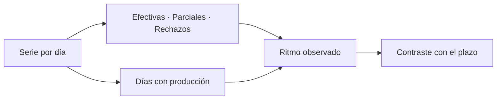

# Ritmo diario de acreditación

> Muestra la producción telefónica día a día para saber si el operativo llegará a tiempo con el paso actual.

## Objetivo

Las demás pestañas dicen dónde está el operativo; ésta dice **hacia dónde va**. Es la que permite decidir a tiempo si hay que reforzar el equipo, ampliar la ventana de campo o renegociar el objetivo, en lugar de descubrirlo la última semana.

## Antes de empezar

- El corte debe traer respuestas fechadas; sin fechas no hay serie diaria.
- Conviene tener presente la ventana de campo declarada en Cronograma de acreditación: el ritmo sólo se juzga contra un plazo.
- Ten a mano el objetivo vigente del actor o del estudio: la pregunta de esta pantalla es *¿alcanza?*, y sin objetivo no tiene respuesta.

## Mapa de la pantalla

## Elementos de la pantalla

| Elemento | Para qué sirve | Qué cambia o produce |
|---|---|---|
| Serie diaria | Presenta la producción por día del periodo | Es la base de toda lectura de ritmo |
| Desglose por resultado | Separa efectivas, parciales y rechazos en cada día | Distingue un día flojo de un día con muchos rechazos |
| Series por estado | Muestra la evolución de cada familia de estado de llamada | Revela si el problema cambió de naturaleza con el tiempo |
| Días con producción | Cuenta los días que efectivamente trajeron respuestas | Es el divisor honesto del promedio diario |
| Etiquetas del eje | Sitúan cada punto en su fecha | Permiten relacionar picos y caídas con hechos del operativo |

## Cómo interpretar lo que ves

El promedio diario depende de qué divisor uses, y la diferencia no es menor: repartir el total entre todos los días del calendario da un número más bajo que repartirlo entre los días que realmente tuvieron producción. El primero describe el rendimiento del periodo; el segundo, la capacidad del equipo cuando trabaja. Para proyectar si se llega, importa el segundo; para explicarle al cliente por qué se tardó, importa el primero.

Cuando la serie muestra un tramo recortado, comprueba cuántos días quedan fuera antes de leer la forma de la curva: una curva que entra a pantalla ya alta no es una meseta, es un tramo que empieza tarde.

Un día sin respuestas no es necesariamente un día sin trabajo: puede ser un día de llamadas sin efectivas. Contrástalo con las series por estado antes de concluir que el equipo paró.

## Cómo se usa

1. Sitúa la serie en la ventana de campo: comprueba que el inicio del gráfico coincide con el inicio real del operativo.
2. Lee el nivel actual de producción y compáralo con los días que quedan de plazo.
3. Usa los días con producción, no los días de calendario, para estimar la capacidad del equipo.
4. Cuando veas una caída, mira el desglose por resultado y las series por estado: distinguen menos llamadas de peores resultados.
5. Lleva la conclusión a una acción concreta —reforzar, ampliar plazo o renegociar objetivo— antes de que el plazo se agote.

## Ejemplo guiado

**Situación inicial.** Faltan dos semanas de campo y el coordinador quiere saber si el actor grande llegará a su mínimo.

**Acciones.** Se abre esta pestaña y se lee la producción de las últimas semanas. Los días con producción son bastantes menos que los de calendario, así que el promedio útil se calcula sobre los primeros. Con ese ritmo y los días hábiles que quedan, la proyección se compara con lo que falta según Metas y modalidades.

**Resultado observable.** La proyección queda por debajo de lo necesario. La decisión no se toma la última semana: se refuerza el equipo de llamadas y se vuelve a esta pestaña a los pocos días para comprobar si el ritmo subió. El desglose por resultado confirma que el problema era volumen de llamadas y no una caída en la tasa de éxito.

## Resultado y siguiente paso

- Queda una lectura del ritmo y una proyección sobre el plazo disponible.
- Si el ritmo no alcanza, continúa en Responsables de acreditación para ver dónde está la capacidad, o en Sin efectiva de acreditación para trabajar lo pendiente.

## Estados, alertas y límites

- Sin respuestas fechadas no hay serie. No es un cero: es ausencia de evidencia temporal.
- Un promedio calculado sobre días de calendario y otro sobre días con producción son ambos correctos y responden preguntas distintas. Declara cuál usas al reportarlo.
- La serie describe lo ocurrido; la proyección es tuya. La pantalla no promete una fecha de cierre.
- Si la vista recorta días, el total sigue siendo el completo: no sumes lo visible.

## Si algo no coincide

Si el gráfico arranca más tarde que el campo real, comprueba el periodo del corte y el recorte de la vista antes de concluir que el operativo empezó tarde. Si el total de la serie no coincide con las efectivas de Barrido y Kobo, verifica que ambas correspondan al mismo corte. Si hay días vacíos en medio, contrástalos con las series por estado: un día de llamadas sin efectivas se ve igual que un día sin trabajo, y no lo es.

## Ubicación en la jerarquía

- Padre: [[Monitoreo telefónico de acreditación]].
