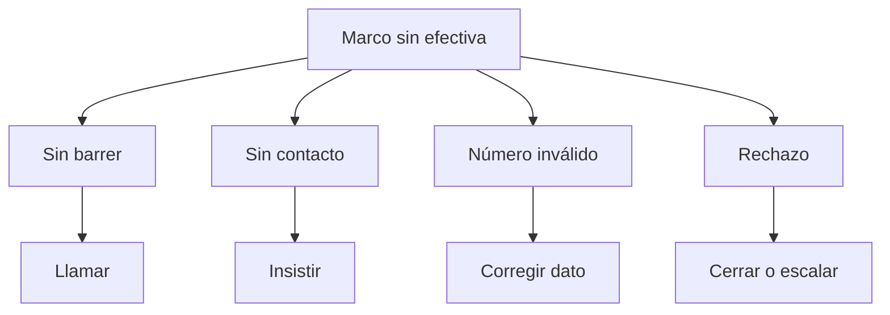

# Sin efectiva de acreditación

> Reúne los casos del marco que aún no produjeron una respuesta efectiva y los separa según qué habría que hacer con cada uno.

## Objetivo

Ésta es la pestaña accionable de la sección: la que se convierte en el trabajo del día siguiente para el equipo de llamadas. Su valor está en no tratar igual a casos que exigen cosas distintas: no es lo mismo alguien a quien no se ha llamado, alguien a quien se llamó y no contestó, alguien con el número equivocado y alguien que rechazó.

Mezclarlos produce listas largas e inútiles; separarlos produce tareas concretas.

## Antes de empezar

- La hoja de barrido debe estar vinculada y razonablemente fresca; una hoja vieja genera trabajo repetido.
- Conviene saber cuántos intentos acordó el estudio antes de dar un caso por agotado.
- Ten claro el objetivo del actor: con objetivo de barrido, esta lista es el trabajo que falta; con mínimo ya alcanzado, es opcional.

## Mapa de la pantalla

## Elementos de la pantalla

| Elemento | Para qué sirve | Qué cambia o produce |
|---|---|---|
| Total sin efectiva | Cuenta los casos del marco que todavía no tienen respuesta efectiva | Dimensiona el trabajo pendiente |
| Agrupación por familia de estado | Separa los casos según el resultado de su última llamada | Convierte un total en tareas distintas |
| Casos sin barrer | Aísla los que nunca se intentaron | Es la primera tarea, y la más barata |
| Casos con insistencia pendiente | Señala los contactados sin cerrar que admiten otro intento | Evita abandonar casos recuperables |
| Detalle por caso | Muestra el registro con su estado crudo y su responsable | Permite pasar de la lista a la acción individual |

## Cómo interpretar lo que ves

**Sin barrer** y **sin contacto** se parecen en la lista y no se parecen en nada en el trabajo: al primero nunca se le llamó, al segundo sí y no contestó. Empezar por los sin barrer es casi siempre lo más rentable, porque su tasa de éxito es la del marco completo y no la de un caso que ya falló.

**Número inválido** no se resuelve insistiendo: se resuelve corrigiendo el dato o aceptando que ese caso no es contactable. Confundirlo con *sin contacto* hace que el equipo queme intentos en números que no existen.

**Rechazo** es un resultado, no una tarea pendiente. Volver a llamar a quien ya rechazó rara vez ayuda y puede ser contraproducente con el cliente.

Un caso que aparece aquí puede tener respuesta en plataforma sin ser efectiva: incompleta, sin consentimiento o duplicada. Antes de mandarlo a llamar otra vez, conviene comprobar en Consultas si el problema es de contacto o de compuerta.

## Cómo se usa

1. Lee el total y quédate con la proporción que representa del marco, no sólo con el número.
2. Trabaja primero **sin barrer**: es trabajo nuevo con la mejor tasa esperada.
3. Pasa a los que admiten insistencia, respetando el número de intentos acordado.
4. Separa **número inválido** para corrección de datos, no para más llamadas.
5. Cierra los rechazos en lugar de dejarlos rotando en la lista.
6. Si un caso reaparece pese a tener respuesta, revísalo en Consultas de acreditación antes de reasignarlo.

## Ejemplo guiado

**Situación inicial.** El equipo de llamadas recibe cada mañana una lista larga de pendientes y la trabaja de arriba abajo, con resultados cada vez peores.

**Acciones.** Se abre esta pestaña y se mira la agrupación en vez del total. Buena parte de los pendientes son *número inválido*, que el equipo llevaba días reintentando, y hay un grupo de casos **sin barrer** que nunca se había tocado. Se reordena el trabajo: primero los sin barrer, los inválidos salen de la lista de llamadas y van a corrección de datos, y los rechazos se cierran.

**Resultado observable.** La lista de llamadas del día siguiente es más corta y su tasa de éxito sube, porque el equipo deja de gastar intentos en números que no existen. Los inválidos dejan de contarse como trabajo pendiente de llamadas y pasan a ser un problema de calidad de la base, que es lo que son.

## Resultado y siguiente paso

- Queda una lista de trabajo separada por tipo de acción, no un total indistinto.
- Continúa en Responsables de acreditación para repartir esa lista, o en Alertas reales de acreditación si algún caso parece inconsistente.

## Estados, alertas y límites

- **Sin barrer** es trabajo nuevo; **sin contacto** es reintento; **número inválido** es corrección de dato; **rechazo** es cierre. Cuatro acciones distintas.
- La lista refleja el corte. Los intentos hechos después de la última sincronización no aparecen todavía.
- Esta pestaña no registra intentos ni cambia estados: eso ocurre en la hoja de barrido del operativo.
- Un caso con respuesta no efectiva aparece aquí aunque el encuestado sí haya contestado. La causa está en las compuertas, no en el contacto.

## Si algo no coincide

Si el equipo asegura haber llamado a casos que figuran sin barrer, comprueba la frescura de la hoja antes que la disciplina del equipo. Si un caso reaparece día tras día pese a haber respondido, revísalo en Consultas: probablemente su respuesta no supera alguna compuerta. Si el total no cuadra con el marco menos las efectivas, verifica que ambos vengan del mismo corte.

## Ubicación en la jerarquía

- Padre: [[Monitoreo telefónico de acreditación]].
