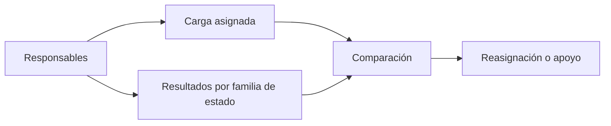

# Responsables de acreditación

> Compara carga y resultados por responsable para repartir mejor el trabajo y detectar quién necesita apoyo.

## Objetivo

El ritmo de la operación telefónica no es homogéneo: depende de cuánto se le asignó a cada persona y de qué resultados obtiene. Esta pestaña separa esas dos cosas —**carga** y **desempeño**— porque se confunden con facilidad y llevan a decisiones opuestas.

Alguien con pocos resultados puede tener poca carga, no bajo rendimiento. Distinguirlo es la diferencia entre reasignar trabajo y corregir a alguien que no lo necesita.

## Antes de empezar

- La hoja de barrido debe traer el responsable de cada caso. Sin esa columna, la pestaña no puede agrupar.
- Conviene saber la dedicación real de cada persona: comparar a alguien a tiempo completo con alguien a tiempo parcial sin decirlo produce lecturas injustas.
- Ten presente el volumen pendiente de Sin efectiva de acreditación: es lo que hay que repartir.

## Mapa de la pantalla

## Elementos de la pantalla

| Elemento | Para qué sirve | Qué cambia o produce |
|---|---|---|
| Lista de responsables | Presenta a cada persona del equipo de llamadas | Es la unidad de comparación |
| Carga asignada | Cuántos casos tiene cada responsable | Explica el volumen antes de juzgar resultados |
| Resultados por familia | Cómo se reparten sus llamadas entre efectivo, sin contacto, número inválido y rechazo | Muestra el perfil de resultados de cada persona |
| Casos pendientes por responsable | Cuánto le queda por trabajar | Es lo que se puede redistribuir |
| Detalle por responsable | Permite bajar a los casos concretos de esa persona | Convierte la comparación en acción |

## Cómo interpretar lo que ves

Lee siempre carga y resultados juntos. Un responsable con muchas efectivas puede simplemente tener más casos asignados; uno con pocas puede tener una carga pequeña o una tanda de números inválidos que no es culpa suya.

El perfil de resultados dice más que el total. Dos personas con la misma cantidad de efectivas pero una con mucho *sin contacto* y otra con mucho *rechazo* están haciendo cosas distintas: la primera puede necesitar cambiar horarios de llamada, la segunda puede necesitar revisar cómo presenta el estudio.

Cuando la distribución de números inválidos es muy desigual entre personas, el problema suele estar en cómo se repartió la base, no en quién llama.

## Cómo se usa

1. Ordena mentalmente por carga antes de mirar resultados. Sin ese paso, la comparación engaña.
2. Identifica a quién le queda más pendiente y contrástalo con su ritmo.
3. Mira el perfil de resultados de quien tenga cifras atípicas antes de sacar conclusiones sobre su desempeño.
4. Redistribuye el pendiente hacia quien tenga capacidad, en lugar de pedir más esfuerzo a quien ya está saturado.
5. Baja al detalle cuando necesites revisar casos concretos de una persona.

## Ejemplo guiado

**Situación inicial.** Una persona del equipo aparece con la mitad de efectivas que el resto y el coordinador plantea darle retroalimentación sobre su desempeño.

**Acciones.** Se abre esta pestaña y se mira primero su carga: tiene bastantes menos casos asignados que el resto. Su perfil de resultados, en proporción, es comparable al de los demás. Al revisar su pendiente, queda claro que ya casi agotó lo que le tocó.

**Resultado observable.** La conversación cambia de dirección: no hay problema de desempeño, hay un reparto desigual. Se le asignan casos del pendiente acumulado en Sin efectiva, y su producción sube sin ninguna intervención sobre su forma de trabajar. El diagnóstico correcto se obtuvo mirando carga antes que resultados.

## Resultado y siguiente paso

- Queda un diagnóstico del equipo que separa carga de desempeño, y una idea clara de cómo redistribuir.
- Continúa en Sin efectiva de acreditación para tomar el pendiente que se va a repartir, o en Supervisión telefónica de acreditación para el control de calidad.

## Estados, alertas y límites

- Sin columna de responsable en la hoja de barrido, la pestaña no puede agrupar. No es un equipo sin asignar: es un dato ausente.
- La aplicación no conoce la dedicación de cada persona. Un responsable a tiempo parcial se ve igual que uno a tiempo completo.
- Esta pestaña no reasigna casos: la asignación vive en la hoja de barrido del operativo.
- Los resultados corresponden al corte; el trabajo posterior a la última sincronización no aparece.

## Si algo no coincide

Si alguien no aparece en la lista, comprueba que la hoja de barrido registre su nombre de forma consistente: una variación de escritura crea un responsable aparte. Si los totales por responsable no suman el total del barrido, busca casos sin responsable asignado. Si una persona muestra un perfil de resultados muy distinto al resto, revisa qué parte de la base le tocó antes de atribuirlo a su trabajo.

## Ubicación en la jerarquía

- Padre: [[Monitoreo telefónico de acreditación]].
