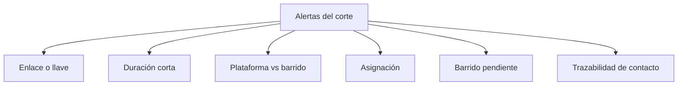

# Alertas reales de acreditación

> Agrupa las señales de calidad de la operación telefónica en familias con una acción clara cada una.

## Objetivo

Una lista larga de alertas sin clasificar se ignora a los dos días. Esta pestaña las agrupa en familias, y cada familia tiene una revisión concreta asociada: no todas las alertas se atienden igual ni tienen la misma gravedad para el expediente.

## Antes de empezar

- Conviene venir de Barrido y Kobo con una idea del volumen de la operación: una alerta sobre pocos casos y otra sobre muchos no merecen el mismo esfuerzo.
- Ten a mano el criterio del estudio sobre duración mínima aceptable de una encuesta.
- Para las alertas de contradicción entre fuentes ayuda saber cuándo se sincronizó cada una.

## Mapa de la pantalla

## Elementos de la pantalla

| Familia de alerta | Qué señala | Qué revisar |
|---|---|---|
| **Enlace o llave** | El enlace, código o llave puede apuntar a otra persona, o no cruza con el universo | Si la respuesta corresponde de verdad a la persona y al enlace esperados |
| **Duración corta** | Encuestas extremadamente breves, del orden de pocos minutos | Duración, saltos y consistencia antes de defender esa efectiva |
| **Plataforma vs barrido** | Las dos fuentes se contradicen sobre el mismo caso: efectiva en una y no en la otra | Conciliar el estado de plataforma contra la base de barrido |
| **Asignación** | Casos sin responsable o con trazabilidad insuficiente | Confirmar el responsable antes de evaluar producción o supervisión |
| **Barrido pendiente** | Cobertura del barrido incompleta | Resolver la cobertura antes de hacer control de calidad |
| **Trazabilidad de contacto** | Reintentos, no contesta o rechazos cuya evidencia no cuadra | Contrastar llamada, resultado y evidencia de contacto |
| Otra alerta | Señal que no encaja en las familias anteriores | El detalle del reporte canónico |

## Cómo interpretar lo que ves

Las familias tienen consecuencias muy distintas para el expediente. **Enlace o llave** y **duración corta** cuestionan la validez de una efectiva concreta: son las que un comité puede impugnar. **Plataforma vs barrido** cuestiona la coherencia del reporte, no la validez del caso. **Barrido pendiente** y **asignación** son problemas de operación, no de datos.

Ese orden importa cuando el tiempo es escaso: primero lo que puede tumbar una efectiva, después lo que hace que dos pantallas no coincidan, al final lo que ordena la operación.

Una alerta no es un veredicto. Señala un caso que merece mirarse; la decisión de si cuenta o no se registra en Subsanación de acreditación, no aquí.

El volumen de una familia dice de qué tipo es el problema: muchas alertas de una misma clase casi siempre indican una causa sistemática —una configuración, una hoja, un procedimiento— y no muchos casos independientes.

## Cómo se usa

1. Mira primero el reparto por familia, no la lista completa. La forma del reparto es el diagnóstico.
2. Atiende **enlace o llave** y **duración corta** antes que las demás: son las que afectan a la validez.
3. Para **plataforma vs barrido**, comprueba la frescura de ambas fuentes antes de tratarlo como contradicción real.
4. Resuelve **barrido pendiente** y **asignación** antes de hacer supervisión: controlar la calidad de un barrido incompleto no tiene sentido.
5. Lleva a Subsanación los casos que exijan una decisión, en vez de resolverlos por fuera.

## Ejemplo guiado

**Situación inicial.** El reporte muestra un número alto de alertas y el equipo no sabe por dónde empezar.

**Acciones.** Se mira el reparto por familia y casi todas caen en **plataforma vs barrido**. Antes de tratarlas como contradicciones, se comprueban las fechas de sincronización de las dos fuentes: la hoja de barrido lleva varios días sin actualizarse mientras la plataforma sigue recibiendo respuestas. Se sincroniza y se vuelve.

**Resultado observable.** La mayoría de esas alertas desaparece: no eran contradicciones, era desfase. Quedan unas pocas reales, junto con un grupo pequeño de **duración corta** que sí exige revisión caso por caso. El trabajo pasa de cientos de alertas indistintas a una lista corta y accionable.

## Resultado y siguiente paso

- Queda separado lo que amenaza la validez de una efectiva, lo que descoordina el reporte y lo que ordena la operación.
- Los casos que exigen decisión continúan en Subsanación de acreditación; los de operación, en Responsables o Sin efectiva.

## Estados, alertas y límites

- Una alerta señala, no decide. La decisión se registra en Subsanación.
- **Plataforma vs barrido** puede ser desfase de sincronización y no una contradicción real. Comprueba fechas antes de investigar.
- Un volumen alto de una sola familia apunta a causa sistemática, no a muchos casos independientes.
- Las alertas corresponden al corte; lo ocurrido después de la última sincronización no está evaluado.

## Si algo no coincide

Si casi todas las alertas son de contradicción entre fuentes, sincroniza antes de revisar caso por caso. Si aparecen muchas de enlace o llave, revisa si las fuentes de ese actor declaran un código de persona: el cruce por nombre genera exactamente ese patrón. Si una alerta persiste tras corregir la causa, comprueba que el corte se regeneró después de la corrección.

## Ubicación en la jerarquía

- Padre: [[Monitoreo telefónico de acreditación]].
