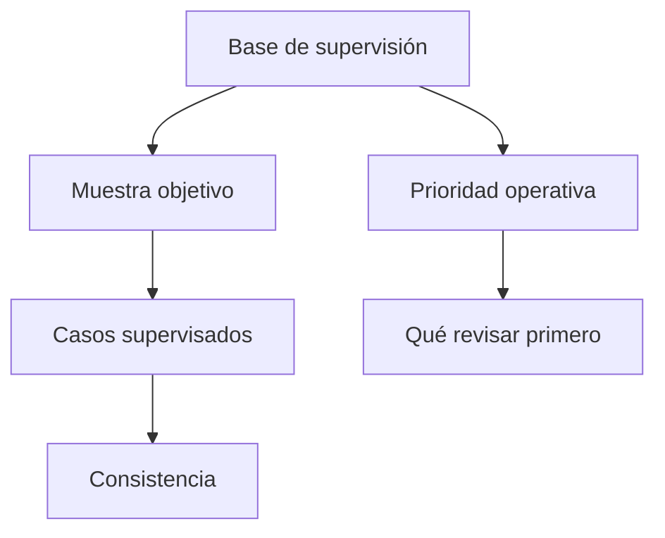

# Supervisión telefónica de acreditación

> Define y sigue la muestra de control de la operación telefónica, y ordena qué revisar primero.

## Objetivo

Un operativo telefónico se defiende mostrando que se supervisó, no afirmando que se hizo bien. Esta pestaña produce dos cosas: la **muestra de supervisión** —qué casos hay que volver a contactar para verificar— y una **prioridad operativa** que ordena los focos de revisión por urgencia.

Es control de calidad, y conviene tratarlo como parte del operativo y no como un trámite final.

## Antes de empezar

- El barrido debe estar razonablemente completo. Supervisar sobre una cobertura incompleta mide poco: si hay alertas de barrido pendiente, resuélvelas primero.
- Conviene tener claro el criterio de supervisión acordado con el cliente, si lo hay.
- Ten a mano el equipo de responsables: la muestra suele repartirse por persona.

## Mapa de la pantalla

## Elementos de la pantalla

| Elemento | Para qué sirve | Qué cambia o produce |
|---|---|---|
| Resumen de supervisión | Presenta el estado general del control con su nivel de riesgo | Es el titular de la pestaña |
| Base de supervisión | Declara sobre cuántos casos se calcula la muestra | Es el denominador del control |
| Muestra objetivo | Propone cuántos casos hay que supervisar, en torno a un tercio de las efectivas | Define el tamaño del trabajo de control |
| Casos supervisados | Cuenta lo efectivamente revisado | Mide el avance del control |
| Consistencia | Compara lo supervisado con lo declarado originalmente | Es el resultado del control |
| **Prioridad operativa** | Agrupa los focos de revisión ordenados por urgencia, con su conteo de casos | Dice por dónde empezar cuando el tiempo no alcanza |
| Exportación de la base de supervisión | Descarga el listado de control | Permite trabajar la supervisión fuera de la aplicación |

## Cómo interpretar lo que ves

Comprueba siempre **sobre qué base** se calculó la muestra. Una muestra de supervisión debe salir de las efectivas conseguidas, no del total de filas del corte: si el denominador es el corte completo, el tamaño propuesto será mayor de lo que corresponde y el porcentaje de avance del control, engañosamente bajo.

La **prioridad operativa** no es un resumen de alertas: es una ordenación. Cuando aparece vacía significa que no hay alertas activas de llamadas, responsables ni barrido, lo cual es una buena noticia y no una pantalla rota.

Un sello de consistencia no vale nada si el barrido está en cero: quiere decir que no hay nada que contradecir, no que todo esté bien. Léelo junto con la cobertura del barrido.

## Cómo se usa

1. Verifica el denominador de la muestra antes que su tamaño.
2. Lee la **prioridad operativa** y empieza por el foco de mayor urgencia, no por el de más casos.
3. Compara la muestra objetivo con los casos ya supervisados para saber cuánto control queda.
4. Exporta la base de supervisión si el equipo va a trabajarla fuera de la aplicación.
5. Revisa la consistencia sólo cuando la cobertura del barrido lo justifique.

## Ejemplo guiado

**Situación inicial.** El coordinador quiere cerrar el expediente y ve un sello de consistencia favorable, con la supervisión aparentemente resuelta.

**Acciones.** Antes de aceptarlo, se comprueba la base sobre la que se calculó la muestra y se contrasta con las efectivas reportadas en Barrido y Kobo. Se revisa también la cobertura del barrido y la prioridad operativa, que señala un foco de barrido pendiente con casos sin trabajar.

**Resultado observable.** El sello favorable se explicaba porque casi no había barrido con el que contrastar. Se completa la cobertura pendiente, se recalcula la muestra sobre las efectivas reales y la supervisión pasa a hacerse sobre una base que sí representa la operación. El expediente queda con evidencia de control, no con un sello vacío.

## Resultado y siguiente paso

- Queda definida la muestra de control, cuánto se supervisó y qué focos siguen abiertos.
- Con la supervisión resuelta, continúa en Avance de acreditación para leer y exportar el corte.

## Estados, alertas y límites

- **Sin prioridades telefónicas**: no hay alertas activas de llamadas, responsables ni barrido. Es un buen resultado, no un fallo.
- Un sello de consistencia sobre un barrido vacío no acredita calidad: no había con qué contrastar.
- La muestra objetivo es una propuesta calculada, no una regla metodológica. El criterio acordado con el cliente manda.
- La pestaña no ejecuta la supervisión ni registra sus resultados caso por caso: define el control y su alcance.

## Si algo no coincide

Si la muestra objetivo parece demasiado grande, comprueba que se calcule sobre las efectivas y no sobre el total de filas del corte. Si la base de supervisión no coincide con la base telefónica de otras pestañas, verifica que ambas vengan del mismo corte. Si la consistencia sale favorable con el barrido casi vacío, no lo tomes como control superado: completa la cobertura antes.

## Ubicación en la jerarquía

- Padre: [[Monitoreo telefónico de acreditación]].
