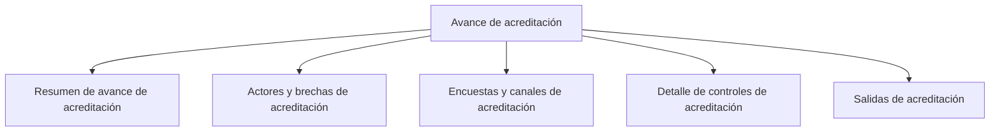

# Avance de acreditación

> Lee el estado del estudio por actor y por canal, y produce las salidas del corte con su procedencia.

## Propósito de esta guía

Es la sección de lectura y entrega. Todo lo que aquí se muestra depende de decisiones tomadas antes: qué fuentes alimentan el corte, qué objetivo tiene cada actor, qué casos se decidieron en Consultas. Avance no calcula criterios: los aplica.

Por eso la regla de uso es doble. En el día a día se entra por aquí y se baja a la sección que explique una anomalía. Al configurar, se llega aquí al final, cuando lo anterior ya es correcto.

## Antes de recorrer este nivel

- El paquete de fuentes debe estar completo y fresco.
- Cada actor debe tener objetivo declarado; si están en sugerido, lo que leas será un supuesto.
- Idealmente la bandeja de Subsanación debe estar en cero: los casos sin decidir son huecos en la cifra que vas a reportar.

## Mapa de navegación

## Guía de destinos

| Destino | Cuándo entrar | Qué hacer allí | Qué deja listo |
|---|---|---|---|
| [[Resumen de avance de acreditación]] | Para la lectura general del corte | Revisar el embudo de efectividad y los totales | La foto del estudio con sus mermas explicadas |
| [[Actores y brechas de acreditación]] | Para saber quién va corto y cuánto | Comparar cada actor contra su objetivo | La brecha por actor, con su lectura correcta |
| [[Encuestas y canales de acreditación]] | Para saber por dónde está entrando la producción | Revisar el aporte de cada encuesta y cada vía | El rendimiento por canal |
| [[Detalle de controles de acreditación]] | Para revisar composición y representatividad | Revisar los controles y las variables declaradas | La comprobación de que el logro está bien repartido |
| [[Salidas de acreditación]] | Para entregar | Generar el reporte del corte | El artefacto con su fecha y procedencia |

## Recorrido recomendado

1. **Resumen** para situarte, empezando por el embudo y no por el total.
2. **Actores y brechas** para saber dónde falta trabajo, leyendo cada actor contra su propio objetivo.
3. **Encuestas y canales** cuando la pregunta sea por dónde reforzar.
4. **Detalle de controles** antes de entregar: un actor con su meta cumplida pero concentrada en un segmento es el hallazgo que hunde un expediente.
5. **Salidas** al final, cuando lo anterior ya cuadra.

## Cómo interpretar avance y estados

Tres cifras describen el corte y no son intercambiables: los registros que trajo el **snapshot**, los que resultan **procesables** porque cruzan la base, y los que son **efectivos** y cuentan como avance. La distancia entre ellas son casos descartados por compuerta, y esa merma es información que hay que poder explicar, no ruido que convenga esconder.

El porcentaje de un actor depende de su objetivo: contra el mínimo puede superar el 100 %, contra el universo nunca. Comparar dos actores con objetivos distintos usando sólo el porcentaje es el error más común de esta sección.

Cuando una tabla pagine o recorte, usa el total declarado y conserva los filtros al abrir el detalle.

## Resultado de este nivel

Al terminar, el estudio tiene una lectura con procedencia: cuántos casos entraron, cuántos se descartaron y por qué, cómo se reparte el logro entre actores y canales, y un artefacto de salida que conserva la fecha y el origen del corte.

## Ubicación en la jerarquía

- Padre: [[Acreditación]].
