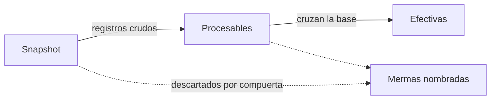

# Resumen de avance de acreditación

> Lectura general del corte a través del embudo que va de los registros crudos a las efectivas, con las mermas nombradas.

## Objetivo

El número de efectivas por sí solo no se puede defender. Esta pestaña lo presenta como el final de un recorrido: cuántos registros trajo el corte, cuántos sobrevivieron al cruce con la base y cuántos son efectivos. Lo que se pierde en cada paso queda nombrado, que es exactamente lo que un comité pide explicar.

Es la pantalla por la que conviene entrar cada día, y también la primera que conviene mirar antes de exportar.

## Antes de empezar

- El paquete de fuentes debe estar completo y sincronizado; si no, el embudo describe un corte viejo.
- Conviene tener presente el objetivo de cada actor: el total general no dice si el estudio va bien, sólo cuánto lleva.

## Mapa de la pantalla

## Elementos de la pantalla

| Elemento | Para qué sirve | Qué cambia o produce |
|---|---|---|
| **Embudo de efectividad del corte** | Presenta los tres estados del corte en secuencia | Es la lectura central de la pestaña |
| **Snapshot** | Registros crudos que trajo el corte | Es el punto de partida, no un logro |
| **Procesables** | Los que cruzan la base declarada | Separan lo atribuible de lo que no lo es |
| **Efectivas** | Los que cuentan como avance | Es la cifra que se reporta |
| **Casos descartados por compuerta** | Nombra qué se perdió en cada paso y cuánto | Convierte la merma en explicación |
| Pasos navegables del embudo | Cada tramo lleva a la vista que lo explica | Permite auditar sin perder el contexto |
| Totales del corte | Resumen de efectivas, parciales y rechazos | Complementan el embudo con la composición de respuestas |

## Cómo interpretar lo que ves

Lee el embudo de izquierda a derecha y desconfía del atajo de mirar sólo la última cifra. Un snapshot grande con pocas efectivas no es mal trabajo de campo: casi siempre significa que el snapshot trae registros que nunca pertenecieron al universo declarado. Esa distinción es la diferencia entre un problema de producción y uno de configuración.

**Procesables** no es un logro intermedio que haya que maximizar: es una consecuencia de qué universo declaraste. Si crece porque ampliaste la base, el denominador de todo el estudio cambió.

Las mermas están nombradas por compuerta a propósito. Cuando alguien pregunta por qué no cuentan todas las respuestas recibidas, la respuesta está aquí y no hay que reconstruirla.

El embudo sólo aparece cuando el corte tiene snapshot y las tres cifras son calculables. Su ausencia no es un cero: es que el corte no puede describirse todavía.

## Cómo se usa

1. Lee el embudo completo antes que cualquier otra cifra de la sección.
2. Mira el tamaño relativo de cada merma. Una merma dominante te dice dónde investigar.
3. Usa los pasos del embudo para saltar a la vista que explica cada tramo, en lugar de buscarla a mano.
4. Contrasta los totales de respuestas con lo que el equipo reporta haber recibido.
5. Baja a Actores y brechas para saber si el logro está bien repartido; el total general no lo dice.

## Ejemplo guiado

**Situación inicial.** El total de efectivas parece bajo frente al volumen de respuestas que el equipo reporta haber recibido, y se sospecha de un problema del motor de cálculo.

**Acciones.** Se lee el embudo. El snapshot es grande, los procesables son bastante menos y las efectivas quedan cerca de los procesables. La merma dominante está en el primer tramo, no en el segundo: la mayoría de los registros no cruza la base declarada. Se usa ese tramo para saltar al detalle y comprobar de qué actor provienen.

**Resultado observable.** El diagnóstico deja de apuntar al cálculo de efectivas —que se comporta bien, porque casi todo lo procesable termina efectivo— y pasa a apuntar al universo declarado: el snapshot arrastra registros ajenos al estudio. La corrección está en Fuentes, no en el motor. El embudo permitió distinguirlo sin abrir una sola tabla.

## Resultado y siguiente paso

- Queda una lectura del corte con sus mermas explicadas y su procedencia.
- Continúa en Actores y brechas de acreditación para repartir esa lectura por actor.

## Estados, alertas y límites

- Sin snapshot o con cifras incalculables, el embudo no se muestra. No es un cero.
- **Snapshot** no es producción: es lo que el corte trajo, incluyendo lo que no pertenece al estudio.
- El total general no dice si el estudio va bien. Un total holgado puede convivir con un actor muy corto.
- La composición de respuestas —efectivas, parciales, rechazos— describe la calidad de lo recibido, no el cumplimiento del objetivo.

## Si algo no coincide

Si las efectivas parecen bajas, mira **dónde** está la merma antes de dudar del cálculo: en el primer tramo es configuración del universo, en el segundo son las compuertas. Si el snapshot es mucho mayor de lo esperado, revisa qué recopiladores están incluidos y si alguna fuente ajena entró al corte. Si el embudo no aparece, comprueba que haya snapshot y que el paquete de fuentes esté completo.

## Ubicación en la jerarquía

- Padre: [[Avance de acreditación]].
