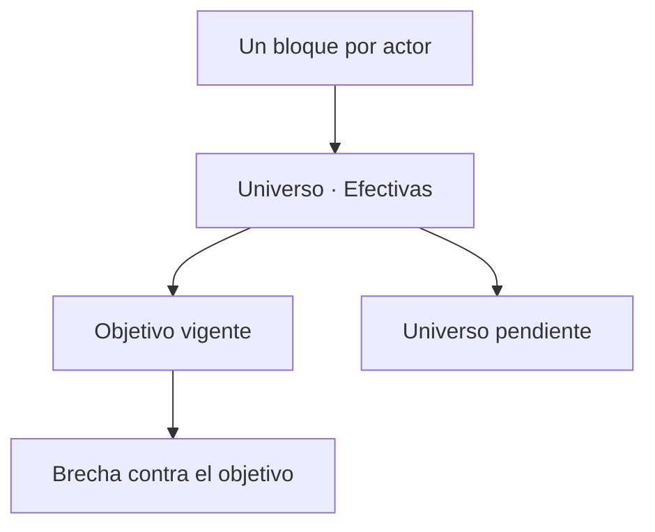

# Actores y brechas de acreditación

> Compara cada actor contra su propio objetivo y muestra cuánto le falta, sin promediar realidades distintas.

## Objetivo

El total del estudio esconde el reparto, y en acreditación el reparto **es** el resultado: un actor rezagado no se compensa con otro que sobrecumplió. Esta pestaña presenta a cada actor con su universo, sus efectivas y su brecha, medida contra el objetivo que se declaró para él.

## Antes de empezar

- Cada actor debe tener su objetivo declarado en Metas y modalidades. Si están en sugerido, lo que verás es un supuesto de la aplicación, no el acuerdo.
- Conviene traer del Resumen la lectura del embudo: una brecha puede venir de falta de producción o de registros que no cruzan.

## Mapa de la pantalla

## Elementos de la pantalla

| Elemento | Para qué sirve | Qué cambia o produce |
|---|---|---|
| Bloque por actor | Presenta a cada actor por separado con sus cifras | Evita el promedio que borra las diferencias |
| **Universo** | Tamaño de la base trabajada de ese actor | Es su denominador de barrido |
| **Efectivas** | Respuestas que superaron las cuatro compuertas | Es su logro real |
| Objetivo vigente | Indica si ese actor se mide contra mínimo o contra barrido | Determina cómo leer su porcentaje |
| Brecha | Cuánto falta para el objetivo vigente | Es la cifra accionable |
| Universo pendiente | Cuánto queda del universo, independientemente del objetivo | Muestra el trabajo que existe aunque el mínimo esté cubierto |
| **Avance universo** | Porcentaje sobre el universo del actor | Es la lectura comparable entre actores |

## Cómo interpretar lo que ves

Un actor puede mostrar el mínimo superado y tener universo pendiente: son dos lecturas correctas a la vez y ninguna anula a la otra. La aplicación calcula ambas siempre, aunque destaque la del objetivo vigente. Si el acuerdo con el cliente era barrer, la cifra que importa es el universo pendiente, no el porcentaje sobre el mínimo.

**Avance universo** es la única columna comparable entre actores, porque todos comparten el mismo tipo de denominador. Los porcentajes contra mínimos distintos no son comparables entre sí: uno al 165 % y otro al 98 % no dicen cuál va mejor.

Conviene mirar el tamaño del universo junto al avance. Un actor cuyo universo se cubrió casi por completo es en la práctica un censo, y a un censo no se le reporta margen de error. Esa distinción cambia el lenguaje del informe y la aplicación no la marca por ti.

## Cómo se usa

1. Comprueba primero que ningún actor esté en objetivo sugerido.
2. Ordena tu lectura por **avance universo**, no por el porcentaje contra el objetivo.
3. Para cada actor rezagado, mira si la brecha es de producción o de casos que no cruzan; el embudo del Resumen lo distingue.
4. Anota qué actores quedaron cerca del censo: lo necesitarás al redactar el informe.
5. Lleva la brecha a una acción: más contacto en Sin efectiva, o revisión en Consultas si los casos existen y no cuentan.

## Ejemplo guiado

**Situación inicial.** El estudio muestra un total holgado y el equipo propone cerrar el campo.

**Acciones.** Se abre esta pestaña y se lee actor por actor. Tres actores tienen universos pequeños y avance universo muy alto, pero no completo: a cada uno le faltan unas pocas personas para barrerlo. El cuarto, con un universo grande, superó su mínimo con holgura y tiene bastante universo pendiente. El acuerdo era barrer los tres pequeños.

**Resultado observable.** Cerrar el campo habría dejado tres universos sin completar por muy poco, que es justo lo que un comité señala. Se destina una última ola de contacto a esos tres actores, cuya brecha se cuenta con los dedos de una mano, y el cuarto se cierra en su mínimo tal como se acordó. La decisión salió de leer cada actor contra su objetivo, no del total.

## Resultado y siguiente paso

- Queda la brecha por actor con su lectura correcta y el trabajo pendiente identificado.
- Continúa en Encuestas y canales de acreditación para decidir por dónde cubrir esa brecha, o en Detalle de controles para comprobar cómo está repartido el logro dentro de cada actor.

## Estados, alertas y límites

- **Objetivo sugerido**: el actor no tiene objetivo declarado y la lectura es un supuesto por tamaño de universo.
- Un porcentaje superior al 100 % indica medición contra un mínimo ya superado, no un error.
- **Sin universo declarado**: ese actor no tiene denominador y su avance no es calculable.
- La pestaña no distingue censo de muestra. Lo deduces del tamaño del universo frente a las efectivas.
- El universo es la base trabajada, no la población real del actor.

## Si algo no coincide

Si un actor aparece cerrado y el equipo sabe que falta trabajo, revisa su objetivo en Metas y modalidades: casi siempre está en mínimo cuando el acuerdo era barrer. Si sus efectivas son menores de lo esperado, mira si el problema es cruce —en Consultas— o producción —en el ritmo diario—. Si el universo no coincide con la hoja que vinculaste, la causa está en Bases de acreditación.

## Ubicación en la jerarquía

- Padre: [[Avance de acreditación]].
