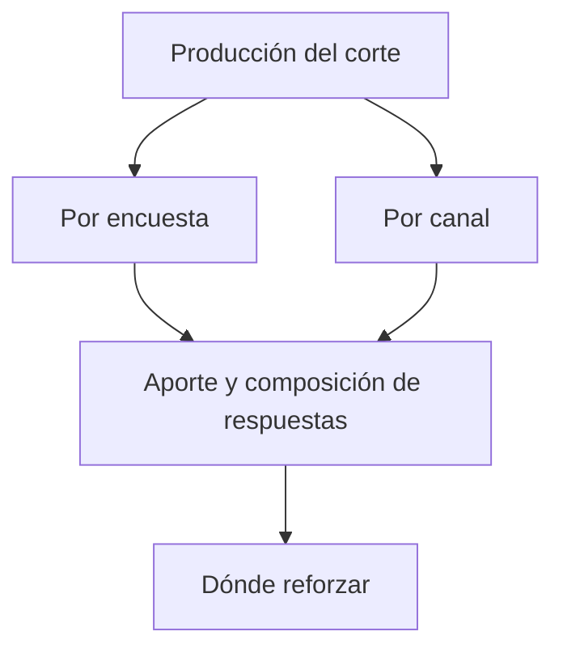

# Encuestas y canales de acreditación

> Muestra por dónde está entrando la producción: qué encuesta y qué vía de contacto aporta cada respuesta.

## Objetivo

Cuando hay una brecha que cubrir, la pregunta siguiente es **por dónde reforzar**. Esta pestaña reparte la producción entre las encuestas del estudio y las vías por las que se difundieron —correo, ficha QR, enlace, Kobo, teléfono—, que es lo que permite decidir dónde invertir el esfuerzo restante.

## Antes de empezar

- Las encuestas deben tener actor y canal declarados en Plataforma de acreditación; sin eso, su aporte no se puede atribuir.
- Los recopiladores deben estar clasificados: la vía real de una respuesta es su recopilador, no la encuesta.
- Conviene traer de Actores y brechas qué actor necesita refuerzo.

## Mapa de la pantalla

## Elementos de la pantalla

| Elemento | Para qué sirve | Qué cambia o produce |
|---|---|---|
| Aporte por encuesta | Cuántas respuestas aportó cada encuesta del estudio | Identifica qué instrumento está produciendo |
| Aporte por canal | Cómo se reparte la producción entre correo, ficha QR, enlace, Kobo y teléfono | Es la base de la decisión de refuerzo |
| Composición de respuestas | Efectivas, parciales y rechazos dentro de cada bloque | Distingue volumen de calidad |
| Recopiladores incluidos | Cuántas vías cuentan dentro de cada encuesta | Explica el aporte cuando una encuesta se difundió por varias vías |
| Evolución por encuesta | Cuándo entró la producción de cada una | Sitúa el aporte en el tiempo |

## Cómo interpretar lo que ves

Volumen y rendimiento no son lo mismo. Un canal puede aportar muchas respuestas y tener una proporción alta de parciales; otro puede aportar pocas y ser casi todo efectivas. Para decidir dónde reforzar importa el segundo, salvo que el cuello de botella sea el alcance.

El reparto por canal depende de lo declarado, no de la realidad física del envío: si un recopilador quedó con el canal equivocado, su producción aparecerá en la columna que no le toca. Cuando un canal muestra cifras raras, la primera sospecha es la clasificación, no el comportamiento de la gente.

Un canal con cero no siempre está fallando: puede no haberse usado todavía, o sus recopiladores pueden estar excluidos. Compruébalo antes de descartarlo como vía.

## Cómo se usa

1. Localiza el actor que necesita refuerzo y mira qué encuestas y canales le están aportando.
2. Compara la composición de respuestas de cada vía, no sólo su volumen.
3. Descarta como candidatos los canales cuyas cifras se expliquen por clasificación y no por rendimiento.
4. Elige la vía a reforzar y coordínala con el equipo; si es telefónica, el trabajo se organiza en la sección de monitoreo telefónico.
5. Vuelve tras la nueva ola para comprobar si el aporte cambió.

## Ejemplo guiado

**Situación inicial.** Un actor tiene brecha y el equipo propone reforzar el envío por correo porque es el canal que más respuestas ha traído.

**Acciones.** Se abre esta pestaña y se compara la composición. El correo aporta el mayor volumen, pero con una proporción alta de respuestas parciales. El enlace personalizado aporta menos respuestas y casi todas efectivas. Se comprueba en Recopiladores que ambas vías estén bien clasificadas.

**Resultado observable.** El refuerzo se dirige al enlace personalizado en vez de al correo: con el mismo esfuerzo produce más efectivas, que es lo que cierra la brecha. La decisión salió de mirar la composición y no el volumen, y quedó justificada con las cifras del propio corte.

## Resultado y siguiente paso

- Queda identificada la vía con mejor rendimiento para cubrir la brecha.
- Continúa en Detalle de controles de acreditación antes de entregar, o vuelve a Fuentes si detectaste una clasificación equivocada.

## Estados, alertas y límites

- El reparto por canal refleja lo **declarado**. Una clasificación equivocada mueve producción de columna sin avisar.
- Un canal en cero puede no haberse usado o tener sus recopiladores excluidos.
- Las respuestas de encuestas sin actor declarado no se atribuyen a ningún actor, aunque sí aparezcan en el total.
- Esta pestaña describe el aporte; no envía, no programa y no activa vías.

## Si algo no coincide

Si un canal muestra cifras que no encajan con lo que el equipo hizo, revisa la clasificación de sus recopiladores antes que su rendimiento. Si el total por encuestas no coincide con el total del corte, busca encuestas sin actor declarado. Si una encuesta que se aplicó no aparece, comprueba que esté activa y sincronizada en Estado de fuentes.

## Ubicación en la jerarquía

- Padre: [[Avance de acreditación]].
