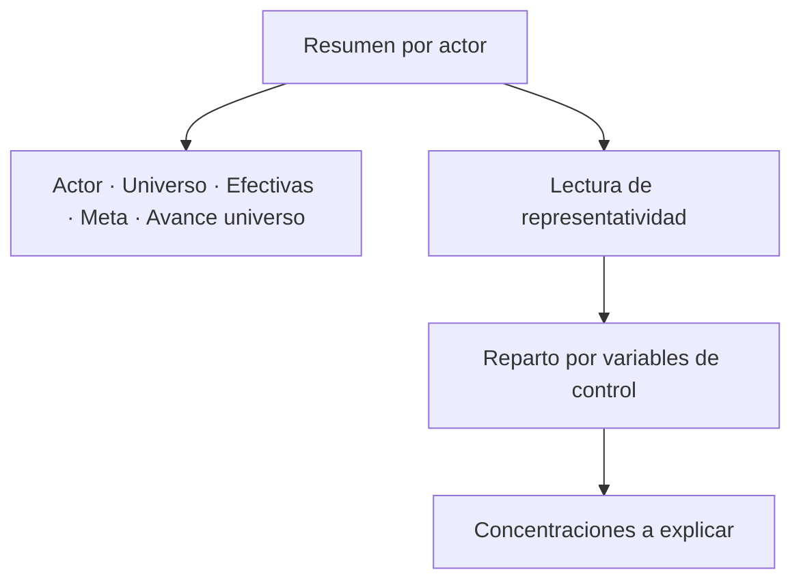

# Detalle de controles de acreditación

> Revisa cómo está repartido el logro dentro de cada actor, con la tabla publicable y la lectura de representatividad.

## Objetivo

Un actor puede tener su objetivo cumplido y aun así estar mal cubierto: si todas sus respuestas vienen de un mismo segmento —un área, una categoría, un turno—, el número es correcto y el expediente es frágil. Ése es el hallazgo que un comité usa para cuestionar un estudio, y esta pestaña existe para detectarlo antes que ellos.

Aquí también vive la tabla de resumen por actor que se publica en el reporte.

## Antes de empezar

- Conviene llegar con las brechas ya leídas en Actores y brechas.
- Para que la lectura de representatividad diga algo, el estudio debe tener **variables de control declaradas**. Si no las hay, la pantalla lo dirá.
- Ten claro qué segmentaciones le importan al cliente: son las que hay que poder defender.

## Mapa de la pantalla

## Elementos de la pantalla

| Elemento | Para qué sirve | Qué cambia o produce |
|---|---|---|
| **Resumen por actor** | Tabla con actor, universo, efectivas, meta y avance universo | Es la tabla publicable del reporte |
| Columna **Meta** | Muestra el mínimo declarado de cada actor | Queda vacía si no se declaró; no se inventa |
| Columna **Avance universo** | Porcentaje sobre el universo del actor | Es la columna comparable entre actores |
| **Lectura de representatividad** | Analiza cómo se reparten las efectivas según las variables de control | Detecta concentraciones que el total esconde |
| Aviso de variables no detectadas | Indica que el estudio no declaró variables de control | Explica por qué la lectura está vacía |
| Controles del corte | Comprobaciones aplicadas sobre los casos | Sostienen la validez de lo reportado |

## Cómo interpretar lo que ves

La aplicación **no inventa columnas que ninguna fila trae**. Si la columna de meta aparece vacía, no es un fallo de la tabla: es que no se declaró un mínimo para esos actores en Metas y modalidades. Rellenarla a mano en el reporte sería inventar un acuerdo.

**Sin variables de control detectadas** significa que nadie declaró qué segmentaciones importan, no que el estudio esté equilibrado. Es la ausencia de una comprobación, no su resultado favorable. Un proyecto puede traer columnas perfectamente utilizables —área, dedicación, categoría— sin que se hayan declarado como variables de control, y en ese caso la lectura queda muda pese a haber datos.

Cuando la lectura sí funciona, lo que hay que buscar no es la distribución perfecta sino la **concentración inexplicable**: un segmento que aporta casi todo el logro, o uno con universo relevante y casi ninguna respuesta.

## Cómo se usa

1. Revisa la tabla de resumen por actor y comprueba que las columnas que vas a publicar tengan contenido.
2. Si la columna de meta está vacía y el estudio sí acordó mínimos, vuelve a declararlos antes de exportar.
3. Lee la representatividad por actor, no en conjunto: la concentración se produce dentro de cada actor.
4. Anota las concentraciones que tendrás que explicar en el informe.
5. Si no hay variables de control declaradas y el proyecto tiene columnas que servirían, decláralas antes de dar el expediente por cerrado.

## Ejemplo guiado

**Situación inicial.** Un actor cumplió su mínimo y el equipo lo da por cerrado. La lectura de representatividad muestra el aviso de que no hay variables de control detectadas.

**Acciones.** Se comprueba que el proyecto sí trae columnas útiles para segmentar a ese actor. Se declaran como variables de control y se regenera el corte. La lectura pasa a mostrar el reparto de las efectivas entre esos segmentos.

**Resultado observable.** El logro está muy concentrado en un solo segmento, mientras otro con presencia relevante en el universo apenas aparece. La meta seguía cumplida, pero el expediente no era defendible tal cual. Se dirige la última ola de contacto al segmento ausente y el informe puede explicar la composición con datos en vez de omitirla.

## Resultado y siguiente paso

- Queda la tabla publicable revisada y la composición del logro comprobada dentro de cada actor.
- Continúa en Salidas de acreditación para generar el reporte.

## Estados, alertas y límites

- **Sin variables de control detectadas**: no se declararon segmentaciones. Es una comprobación ausente, no un resultado favorable.
- Una columna vacía en la tabla refleja un dato no declarado; la aplicación no lo inventa.
- La representatividad se lee por actor. Un promedio entre actores oculta justamente lo que esta pestaña busca.
- La pestaña no pondera ni corrige la composición: la describe. La ponderación, cuando corresponde, vive en Procesamiento.

## Si algo no coincide

Si la columna de meta está vacía, revisa Metas y modalidades antes que la tabla. Si la lectura de representatividad no aparece pese a haber datos segmentables, comprueba si esas variables están declaradas como variables de control. Si el avance universo de la tabla no coincide con el de Actores y brechas, verifica que ambas vistas correspondan al mismo corte.

## Ubicación en la jerarquía

- Padre: [[Avance de acreditación]].
