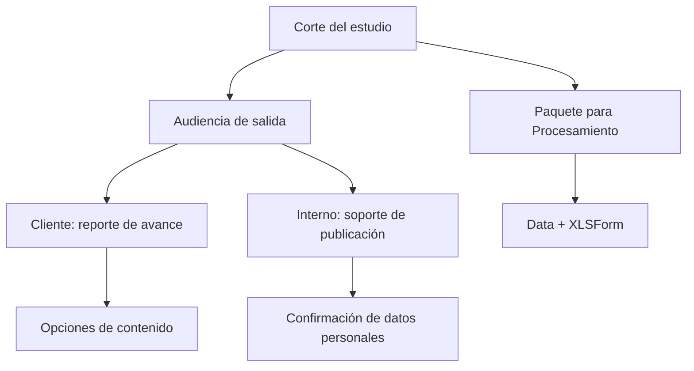

# Salidas de acreditación

> Genera las entregas del corte —reporte para el cliente, soporte interno y el paquete que pasa a Procesamiento— con su procedencia intacta.

## Objetivo

Es donde el corte deja de ser una pantalla y se convierte en algo que sale de la aplicación. La decisión que gobierna esta pestaña no es técnica sino de **audiencia**: un reporte para el cliente y un soporte interno no llevan la misma información, y confundirlos es cómo se filtran datos personales o detalles internos que nadie pidió.

## Antes de empezar

- El corte debe ser el que quieres entregar: las salidas congelan lo que hay, no lo recalculan.
- La bandeja de Subsanación debería estar en cero; cada caso sin decidir es un hueco en lo que estás por firmar.
- Ten claro a quién va cada archivo antes de generarlo.

## Mapa de la pantalla

## Elementos de la pantalla

| Elemento | Para qué sirve | Qué cambia o produce |
|---|---|---|
| **Corte del estudio** | Declara qué corte se va a exportar | Es la procedencia que viajará en el archivo |
| **Audiencia de salida** | Distingue lo que va al cliente de lo interno | Decide qué contenido admite cada archivo |
| **Incluir metas** | Añade o retira los mínimos del reporte | Los mínimos son internos: se incluyen sólo si el acuerdo lo pide |
| **Título del PDF** | Nombra el documento entregable | Aparece en el archivo final |
| **Orden por apellido** y **Detalle por responsable** | Ajustan la organización del reporte de producción | Cambian cómo se lee la entrega operativa |
| Confirmación de datos personales | Exige declarar explícitamente que una salida interna puede incluirlos | Evita que un archivo con datos personales salga por descuido |
| **Spreadsheet destino** | Indica dónde se publica cuando la salida va a Google Sheets | Define el destino de publicación |
| **Paquete manual para Procesamiento** | Prepara data y XLSForm para continuar el pipeline | Es el puente hacia el módulo de Procesamiento |
| Estado de preparación | Indica si el corte reúne lo necesario para cada salida | Bloquea entregas que saldrían incompletas |

## Cómo interpretar lo que ves

**Incluir metas** merece una decisión consciente en cada entrega. El mínimo es un instrumento interno con el que el equipo se cubre; publicarlo ante un cliente que esperaba barrido convierte un acuerdo interno en una promesa que nadie hizo. Por eso es opcional y no viene activado por defecto.

La confirmación de datos personales no es un trámite: es la única barrera entre una exportación interna y un archivo con nombres, correos y teléfonos circulando fuera. Márcala sólo cuando de verdad corresponda a la audiencia declarada.

Generar una salida **no publica nada por sí solo** salvo que elijas explícitamente publicar en una hoja de destino. Un archivo generado vive local hasta que alguien lo envía.

El estado de preparación mide si el corte alcanza para la salida elegida, no si las cifras son correctas. Una salida lista sobre un corte con Subsanación pendiente se genera igual.

## Cómo se usa

1. Confirma que el corte visible es el que quieres entregar, con su fecha.
2. Elige la **audiencia** antes que cualquier otra opción: condiciona todo lo demás.
3. Decide si **incluir metas** según lo acordado con el cliente para este entregable.
4. Pon el título del documento y ajusta el orden y el detalle si es una entrega operativa.
5. Para salidas internas con datos personales, marca la confirmación de forma consciente.
6. Genera, y comprueba el archivo resultante antes de enviarlo: la vista previa no sustituye la revisión del entregable final.
7. Si el estudio continúa en Procesamiento, prepara el paquete de data y XLSForm desde aquí.

## Ejemplo guiado

**Situación inicial.** Hay que entregar el avance semanal al cliente, y el mismo día pasar la base al equipo de procesamiento.

**Acciones.** Se comprueba la fecha del corte. Para el cliente se elige audiencia externa, se deja **incluir metas** sin marcar —el acuerdo era barrer los universos, no alcanzar mínimos—, se pone el título del documento y se genera el reporte. Después, para el equipo interno, se prepara el paquete de data y XLSForm.

**Resultado observable.** El cliente recibe un documento que informa cobertura sobre universo, sin exhibir mínimos internos que no formaban parte del acuerdo. El equipo de procesamiento recibe el paquete con data e instrumento del mismo corte. Los dos archivos conservan la misma fecha y procedencia, así que cualquier diferencia posterior se puede rastrear.

## Resultado y siguiente paso

- Quedan generados los entregables del corte con su fecha y procedencia.
- Con el paquete preparado, el estudio continúa en Procesamiento; con el reporte generado, la entrega al cliente puede cursarse.

## Estados, alertas y límites

- Las salidas **congelan** el corte visible. Cambiar la configuración después no actualiza un archivo ya generado.
- Los mínimos son internos: inclúyelos sólo si el acuerdo con el cliente lo contempla.
- Generar no envía. La publicación en una hoja de destino es la única acción que saca contenido de la aplicación, y es explícita.
- El estado de preparación evalúa suficiencia, no exactitud. Un corte con Subsanación pendiente se exporta igual.
- Los secretos y credenciales nunca viajan en los paquetes generados.

## Si algo no coincide

Si el reporte muestra cifras distintas de las que viste en pantalla, comprueba que ambos correspondan al mismo corte y no a uno regenerado en medio. Si una salida aparece bloqueada, el estado de preparación indica qué falta. Si el paquete para Procesamiento no incluye lo esperado, revisa que data e instrumento pertenezcan al corte vigente antes de rehacerlo.

## Ubicación en la jerarquía

- Padre: [[Avance de acreditación]].
