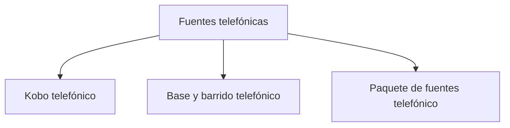

# Fuentes telefónicas

> Declara las tres piezas del operativo —universo contactable, barrido y plataforma— manteniéndolas separadas a propósito.

## Propósito de esta guía

El modo Telefónico se apoya en un paquete de exactamente tres piezas, y cada una responde una pregunta distinta:

| Pieza | Qué aporta | Pregunta que responde |
|---|---|---|
| **Universo** | La base de contactos y sus segmentos | ¿A quiénes había que llamar? |
| **Barrido** | Responsables, intentos y estados de cada llamada | ¿Qué pasó en cada intento? |
| **Plataforma** | Las encuestas efectivamente levantadas | ¿Quién respondió de verdad? |

Que se mantengan separadas no es una limitación técnica: es el diseño. Fusionarlas haría imposible detectar la diferencia entre lo que el equipo registró y lo que la plataforma acredita, que es la señal operativa más valiosa del modo.

## Antes de recorrer este nivel

- La conexión con Google Sheets y con la plataforma de encuestas debe estar configurada.
- Ten identificadas las hojas de universo y de barrido. Suelen ser dos pestañas distintas, y a veces dos libros.
- La hoja de barrido debe traer el responsable de cada caso: buena parte del modo se lee por persona.

## Mapa de navegación

## Guía de destinos

| Destino | Cuándo entrar | Qué hacer allí | Qué deja listo |
|---|---|---|---|
| [[Kobo telefónico]] | Al vincular la encuesta que acredita las respuestas | Enlazar el formulario de plataforma del operativo | La fuente que manda las efectivas |
| [[Base y barrido telefónico]] | Al declarar a quién se llama y qué se registra | Vincular las hojas de universo y de barrido | El marco contactable y el registro de intentos |
| [[Paquete de fuentes telefónico]] | Antes de leer cualquier cifra y tras cada sincronización | Comprobar que las tres piezas estén listas y frescas | La certeza de que el corte se apoya en el paquete completo |

## Recorrido recomendado

1. **Base y barrido telefónico** primero: sin marco contactable no hay operativo que monitorear.
2. **Kobo telefónico** después, para vincular lo que acreditará las respuestas.
3. **Paquete de fuentes telefónico** al cerrar y cada día: es la comprobación de frescura.

## Cómo interpretar avance y estados

Esta sección mide **integridad del paquete**, no avance de campo. Una pieza activa significa que la aplicación la leerá; su fecha de sincronización dice si lo leído es reciente, y esa fecha es por pieza.

Las tres piezas tienen frecuencias de actualización distintas por naturaleza: el universo cambia poco, el barrido cambia cada día que el equipo trabaja, y la plataforma cambia con cada respuesta. Un desfase entre barrido y plataforma es la causa más común de alertas de descuadre que en realidad no lo son.

## Resultado de este nivel

Al terminar, el operativo tiene su marco contactable, su registro de intentos y su fuente de acreditación declarados por separado y sincronizados, que es la condición para que el resto del modo pueda conciliarlos.

## Ubicación en la jerarquía

- Padre: [[Telefónico]].
