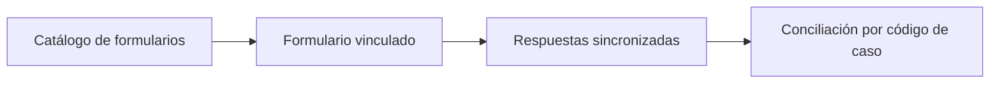

# Kobo telefónico

> Vincula el formulario de plataforma con el que se levantan las entrevistas: la fuente que acredita las efectivas.

## Objetivo

De las tres piezas del operativo, ésta es la que **manda las efectivas**. La hoja de barrido registra lo que el encuestador anotó; la plataforma guarda la encuesta que realmente se levantó. Cuando ambas discrepan, la plataforma es la que acredita.

Vincularla bien es también lo que permite conciliar cada respuesta con su caso mediante el código de caso, y detectar cuando un encuestador abrió el enlace equivocado.

## Antes de empezar

- El formulario debe existir en la plataforma y estar recibiendo respuestas.
- Debes saber qué campo del formulario porta el **código de caso**: es la llave con la que cada respuesta se conciliará contra la base.
- Si el operativo usa enlaces personalizados por caso, ten presente que el código viaja también en el enlace.

## Mapa de la pantalla

## Elementos de la pantalla

| Elemento | Para qué sirve | Qué cambia o produce |
|---|---|---|
| Catálogo de formularios | Lista los formularios disponibles en la plataforma conectada | Permite elegir el del operativo |
| Formulario vinculado | Muestra el que quedó declarado como fuente de respuestas | Es la fuente que acredita efectivas |
| Conteo de respuestas | Cuántas respuestas trajo la última sincronización | Indica que la fuente está viva |
| Marca de sincronización | Cuándo se leyó por última vez | Dice si lo que ves es de hoy |

## Cómo interpretar lo que ves

El conteo de respuestas de esta pantalla es **todo lo que la plataforma entregó**, no las efectivas del estudio. Una respuesta se vuelve efectiva después de pasar las comprobaciones del corte; comparar este conteo con el avance produce la impresión errónea de que se están perdiendo casos.

La plataforma manda las efectivas, pero eso no significa que todo lo que llegue cuente: significa que nada cuenta si no está aquí.

Si el operativo usa enlaces personalizados, el código de caso llega por dos vías —el enlace y lo que el encuestador escribe— y esas dos vías pueden no coincidir. Esa discrepancia se investiga en Conciliación CodPulso telefónica, no aquí.

## Cómo se usa

1. Abre el catálogo y vincula el formulario del operativo. Vincula sólo el que corresponde a este estudio.
2. Sincroniza y comprueba que el conteo de respuestas sea coherente con lo que el equipo reporta.
3. Verifica la marca de sincronización antes de leer cualquier cifra en el resto del modo.
4. Vuelve aquí si se crea un formulario nuevo a mitad de campo: no se vincula solo.

## Ejemplo guiado

**Situación inicial.** El equipo lleva dos días levantando entrevistas y el avance del estudio no se mueve.

**Acciones.** Se abre esta pestaña y el formulario aparece vinculado, pero la marca de sincronización es de hace tres días. Se ejecuta la sincronización y se comprueba el conteo de respuestas.

**Resultado observable.** El conteo sube en la cantidad que el equipo reportó haber levantado, y el avance del modo se actualiza. El problema no era de producción ni de conciliación: la fuente que acredita las efectivas estaba desactualizada, y todas las pantallas posteriores describían un corte viejo.

## Resultado y siguiente paso

- El operativo tiene declarada su fuente de acreditación y sincronizada.
- Continúa en Base y barrido telefónico para declarar a quién se llama y dónde se registra cada intento.

## Estados, alertas y límites

- El conteo de respuestas no es el avance: incluye todo lo que la plataforma entregó.
- Vincular no sincroniza. Las respuestas entran con la siguiente sincronización.
- Sin código de caso en el formulario, la conciliación contra la base no puede apoyarse en una llave fuerte.
- Esta pantalla no edita el formulario: el instrumento se trabaja en el Editor de formularios.

## Si algo no coincide

Si el avance no se mueve pese al trabajo del equipo, comprueba la marca de sincronización antes que cualquier otra cosa. Si el conteo es mucho mayor que las efectivas, no asumas pérdida de casos: revisa el descuadre en Conciliación CodPulso telefónica. Si faltan respuestas que el equipo asegura haber enviado, verifica que se hayan levantado en el formulario vinculado y no en otro.

## Ubicación en la jerarquía

- Padre: [[Fuentes telefónicas]].
