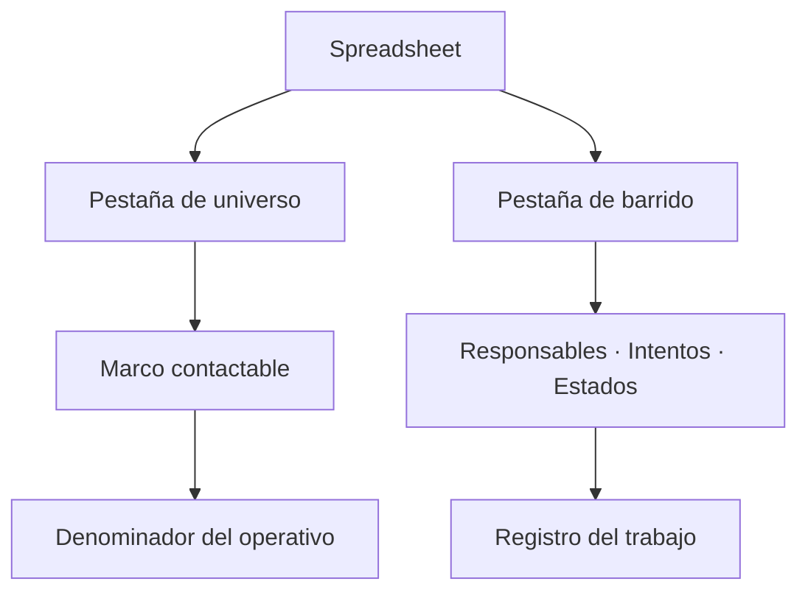

# Base y barrido telefónico

> Vincula las dos hojas del operativo: la del universo contactable y la del barrido donde se registra cada intento.

## Objetivo

Estas dos hojas se parecen y hacen cosas opuestas. El **universo** dice a quién había que llamar: es el marco, y su tamaño es el denominador del operativo. El **barrido** dice qué pasó en cada intento: quién llamó, cuántas veces y con qué resultado.

Confundirlas al vincular produce un modo entero mal calibrado, porque el denominador y el registro de trabajo quedan intercambiados.

## Antes de empezar

- Ten la URL del libro y sepa qué pestaña es cada cosa.
- La hoja de barrido debe traer el **responsable** de cada caso; sin esa columna, las lecturas por persona —que son las que sirven para corregir— no se pueden construir.
- Conviene que ambas compartan el código de caso: es la llave que las une entre sí y con la plataforma.

## Mapa de la pantalla

## Elementos de la pantalla

| Elemento | Para qué sirve | Qué cambia o produce |
|---|---|---|
| Vinculación de **universo** | Declara la hoja con la base de contactos y sus segmentos | Fija el marco contactable y el denominador |
| Vinculación de **barrido** | Declara la hoja con responsables, intentos y estados | Alimenta las lecturas por persona y por estado |
| Selector de spreadsheet y pestaña | Indica dónde vive cada hoja | Permite elegir de una lista en vez de escribir el nombre |
| Rango | Acota el área leída de cada pestaña | Evita arrastrar encabezados o notas al pie |
| Estado de vinculación por pieza | Indica si cada hoja está declarada | Señala qué falta del paquete |
| Marca de sincronización por hoja | Cuándo se leyó cada una | Explica desfases entre piezas |

## Cómo interpretar lo que ves

El tamaño del universo es el denominador de todo el modo. Si arrastra filas vacías o duplicadas, el operativo parecerá más grande de lo que es y la reserva quedará inflada.

El barrido se actualiza cada día que el equipo trabaja; el universo, casi nunca. Por eso sus marcas de sincronización suelen diferir, y eso es normal. Lo que no es normal es un barrido con días de retraso mientras la plataforma sigue recibiendo respuestas: ése es el origen habitual de los descuadres.

Una hoja de barrido sin columna de responsable se vincula igual, pero deja mudas las pestañas que diagnostican al equipo. La aplicación no puede inventar esa atribución.

## Cómo se usa

1. Vincula primero el **universo** y comprueba que el número de contactos coincida con el marco que el estudio declaró.
2. Vincula el **barrido** y confirma que trae responsable, estado e intentos.
3. Ajusta el **rango** de cada hoja sólo si arrastran filas que no son datos.
4. Sincroniza y comprueba las marcas de ambas piezas.
5. Vuelve aquí cuando el equipo cambie la estructura de la hoja: una columna renombrada deja de leerse.

## Ejemplo guiado

**Situación inicial.** El operativo muestra un universo bastante mayor que el marco acordado, y la reserva parece enorme.

**Acciones.** Se abre esta pestaña y se revisa la vinculación del universo. El rango está vacío y la pestaña incluye filas finales de notas y totales que se están leyendo como contactos. Se acota el rango al área de datos y se sincroniza.

**Resultado observable.** El universo baja al tamaño real del marco. La reserva deja de estar inflada y el porcentaje de cumplimiento sube, porque el denominador dejó de incluir filas que nunca fueron personas. Ninguna llamada cambió: cambió lo que la aplicación creía que era la base.

## Resultado y siguiente paso

- El operativo tiene marco contactable y registro de intentos declarados por separado.
- Continúa en Paquete de fuentes telefónico para comprobar que las tres piezas están listas.

## Estados, alertas y límites

- Universo y barrido son **roles distintos**. Intercambiarlos descalibra el modo entero.
- Sin columna de responsable en el barrido, las lecturas por persona quedan vacías.
- Vincular no lee: los registros entran con la siguiente sincronización.
- El universo es la base de contactos trabajada, no la población del estudio.
- Cambiar la hoja de universo con el campo abierto reescribe el denominador; las cifras previas dejan de ser comparables.

## Si algo no coincide

Si el universo es mayor de lo esperado, revisa el rango antes que los datos: suele arrastrar filas de cierre. Si las pestañas de equipo aparecen vacías, comprueba que el barrido traiga responsable con escritura consistente. Si los estados no se reconocen, verifica que la columna de estado siga llamándose igual que cuando se vinculó.

## Ubicación en la jerarquía

- Padre: [[Fuentes telefónicas]].
