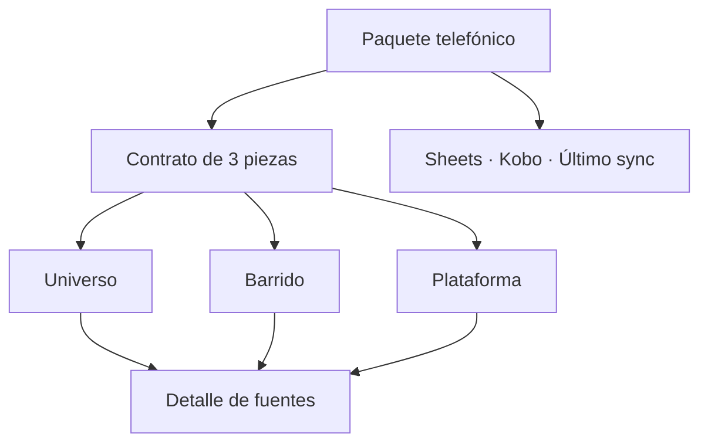

# Paquete de fuentes telefónico

> Comprueba que las tres piezas del operativo estén listas y actualizadas antes de leer cualquier cifra.

## Objetivo

Es la pestaña de control del paquete. Muestra las tres piezas como un contrato de tres partes —universo, barrido y plataforma— y dice cuántas están listas y cuándo se leyó cada una.

Sirve para separar dos problemas que se confunden todo el tiempo: que **falte** una pieza, y que una pieza esté **vieja**. El primero deja pantallas sin datos; el segundo las deja con datos que ya no son ciertos, que es peor porque no se nota.

## Antes de empezar

- Haber pasado por las dos pestañas anteriores al menos una vez.
- Conviene entrar aquí a diario antes que a ninguna otra pantalla del modo.

## Mapa de la pantalla

## Elementos de la pantalla

| Elemento | Para qué sirve | Qué cambia o produce |
|---|---|---|
| Titular del paquete | Declara cuántas de las tres piezas están listas | Es el marcador de completitud |
| Nota del contrato | Recuerda que base, barrido y plataforma se mantienen separados y que la plataforma manda las efectivas | Fija la regla de lectura del modo |
| **Contrato telefónico** | Presenta las tres piezas con su propósito y si están listas o pendientes | Localiza la pieza faltante |
| **Base y barrido** | Lista las hojas activas con su rol, su pestaña y su marca de sincronización | Permite ver la frescura hoja por hoja |
| **Kobo efectivo** | Lista las encuestas activas con su conteo de respuestas | Confirma que la fuente de acreditación está viva |
| **Último sync** | Fecha de la última sincronización | Es la comprobación diaria |
| **Detalle de fuentes** | Desplegable con las tablas de fuentes activas y de fuentes que el corte declaró | Permite comparar configuración contra corte |

## Cómo interpretar lo que ves

Un marcador de tres sobre tres significa que el paquete está **completo**, no que esté **fresco**. Las dos cosas se leen por separado, y la segunda es la que falla a diario.

Las dos tablas del detalle responden preguntas distintas: fuentes activas es lo configurado ahora; fuentes del corte es lo que se usó al generar. Cuando difieren, hay cambios sin regenerar.

Que el barrido tenga una marca más antigua que la plataforma es esperable a mitad de jornada; que la tenga con días de diferencia es la causa habitual de alertas de descuadre que no son descuadres reales.

## Cómo se usa

1. Lee el marcador de piezas y el **último sync**, en ese orden.
2. Si falta una pieza, ve a la pestaña que la declara.
3. Si el sync es antiguo, sincroniza antes de mirar cualquier otra pantalla del modo.
4. Compara las marcas de barrido y plataforma cuando aparezcan alertas de descuadre.
5. Abre el detalle sólo si una cifra no cuadra, y compara configuración contra corte.

## Ejemplo guiado

**Situación inicial.** Las alertas del modo muestran muchos casos de descuadre entre plataforma y barrido, y el coordinador teme que el equipo esté entrevistando sin registrar.

**Acciones.** Antes de escalar, se abre esta pestaña. El contrato muestra las tres piezas listas, pero la hoja de barrido tiene una marca de sincronización de varios días atrás mientras la encuesta se sincronizó hoy. Se sincroniza todo y se vuelve a las alertas.

**Resultado observable.** La mayoría de los descuadres desaparece: eran desfase de lectura, no trabajo sin registrar. Queda un número pequeño de casos reales, que sí son los que hay que pedirle a los responsables concretos. La conversación con el equipo se evita o se acota a lo que corresponde.

## Resultado y siguiente paso

- Queda comprobado si el paquete está completo y fresco, y qué pieza falla si no lo está.
- Con el paquete en orden, continúa en Modelo operativo telefónico o directamente en Llamadas telefónicas.

## Estados, alertas y límites

- **Faltan piezas**: el contrato no está completo. Alguna pantalla del modo quedará sin datos.
- Completo no es fresco. Son dos comprobaciones distintas y la segunda falla más.
- El paquete comprueba presencia y frescura, no exactitud: no dice si la hoja vinculada es la correcta.
- Un desfase entre barrido y plataforma dentro de la misma jornada es normal.

## Si algo no coincide

Si aparecen muchos descuadres, mira las marcas de sincronización de barrido y plataforma antes de investigar caso por caso. Si una cifra del modo no coincide con lo configurado, compara fuentes activas contra fuentes del corte en el detalle. Si una pieza figura pendiente pese a haberla vinculado, comprueba que su rol esté declarado correctamente en la pestaña de origen.

## Ubicación en la jerarquía

- Padre: [[Fuentes telefónicas]].
