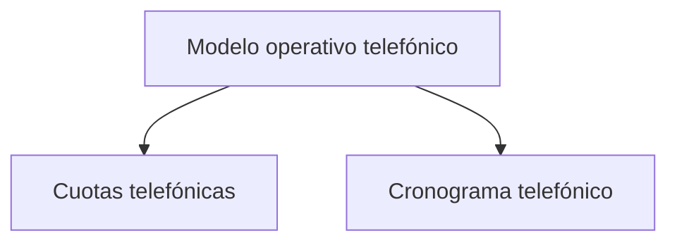

# Modelo operativo telefónico

> Declara la cuota que el operativo debe alcanzar y el periodo en que debe alcanzarla.

## Propósito de esta guía

Sin cuota declarada, el modo puede mostrar producción pero no cumplimiento: cuántas entrevistas hay, no si son suficientes. Esta sección convierte lo segundo en una pregunta respondible.

La cuota la declara el usuario y es un **mínimo**. Esa decisión gobierna cómo se leen todas las pantallas posteriores, incluida la más contraintuitiva: superar la cuota es un cierre limpio, no un exceso que haya que justificar.

## Antes de recorrer este nivel

- El universo debe estar vinculado: las cuotas por categoría se declaran sobre sus segmentos.
- Ten el acuerdo con el cliente sobre cuánto es suficiente, y si ese acuerdo es por total o por categorías.
- Ten el cronograma del operativo, aunque sea aproximado: el ritmo requerido se calcula contra los días que quedan.

## Mapa de navegación

## Guía de destinos

| Destino | Cuándo entrar | Qué hacer allí | Qué deja listo |
|---|---|---|---|
| [[Cuotas telefónicas]] | Al declarar cuánto es suficiente, y al renegociarlo | Fijar el mínimo total o por categoría y su objetivo | El criterio de cumplimiento del operativo |
| [[Cronograma telefónico]] | Al planificar el campo y al contrastar lo ejecutado | Declarar el periodo de llamadas | El plazo contra el que se mide el ritmo |

## Recorrido recomendado

1. **Cuotas telefónicas** primero: es la declaración que da sentido a todo lo demás.
2. **Cronograma telefónico** después, porque el ritmo necesario sólo se calcula si hay un plazo.

## Cómo interpretar avance y estados

El modo admite tres configuraciones y **ninguna degrada la pantalla**: cuotas por categoría, meta total sin categorías, o sin meta declarada. La forma de la vista es la misma en los tres casos; lo que cambia es el contenido. Sin meta, el modo muestra producción, ritmo, reserva y tasa de efectividad, que siguen siendo útiles.

Lo que declares aquí determina qué significa *por barrer* en el resto del modo: con el mínimo cubierto es reserva disponible, y con brecha es el recurso que decide si se llega.

## Resultado de este nivel

Al terminar, el operativo tiene un criterio de suficiencia y un plazo. A partir de ahí, Avance telefónico puede responder no sólo cuánto se lleva sino si alcanza, y con qué margen.

## Ubicación en la jerarquía

- Padre: [[Telefónico]].
