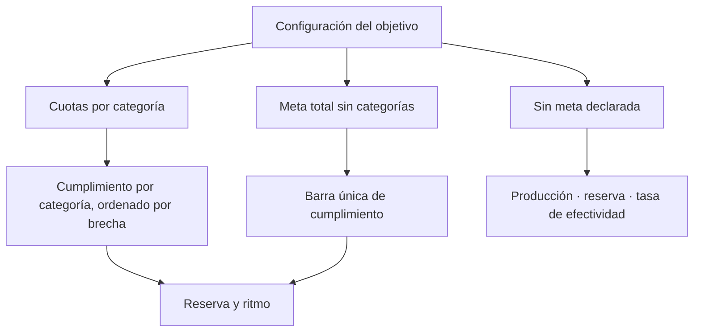

# Cuotas telefónicas

> Declara el mínimo que el operativo debe alcanzar, en total o por categoría, y cómo se lee la base que queda disponible.

## Objetivo

Aquí se declara cuánto es suficiente. La cuota es un **mínimo a alcanzar**, no un objetivo exacto ni un techo, y de esa definición salen las tres reglas que gobiernan la lectura del modo:

1. Cubrir el mínimo es un **estado terminal limpio**. Un cumplimiento por encima del 100 % no es un error ni un exceso que justificar.
2. **Lo que falta por barrer no es el titular**: es reserva. Con el mínimo cubierto, pasa a segundo plano.
3. **Cuando hay brecha, la reserva asciende** y trae la lectura que decide: cuántas faltan, cuánta base queda y si alcanza al ritmo observado.

## Antes de empezar

- El universo debe estar vinculado: las categorías salen de sus segmentos.
- Ten claro si el acuerdo es por total o por categorías, y si alguna categoría se acordó barrer entera en lugar de alcanzar un mínimo.
- Si no hay acuerdo de cuota, no inventes una: el modo funciona sin meta y muestra producción, ritmo y reserva.

## Mapa de la pantalla

## Elementos de la pantalla

| Elemento | Para qué sirve | Qué cambia o produce |
|---|---|---|
| Modo de objetivo | Declara si hay cuotas por categoría, meta total o ninguna meta | Cambia el contenido de la vista, no su forma |
| **Mínimo** por categoría | Fija el piso de cada segmento | Es la referencia de su brecha |
| **Universo** por categoría | Tamaño de la base de ese segmento | Es el denominador cuando el objetivo es barrido |
| **Logrado** | Efectivas conseguidas en ese segmento | El numerador del cumplimiento |
| **Brecha** | Cuánto falta para el mínimo | Es la cifra accionable; cero es cierre limpio |
| Objetivo declarado por categoría | Elige entre mínimo y barrido para ese segmento | Determina contra qué se mide |
| **Reserva** | Base disponible por encima del mínimo | Sólo asciende a primer plano cuando hay brecha |
| Costo por efectiva | Cuántos registros hay que consumir por cada efectiva, según lo observado | Permite estimar si la reserva alcanza |
| Base necesaria estimada | Cuánta base haría falta para cerrar la brecha al costo observado | Convierte la reserva en una respuesta de sí o no |
| Ritmo requerido | Efectivas por día necesarias para cerrar la brecha en los días restantes | Es la lectura que decide si se llega |

## Cómo interpretar lo que ves

La pregunta *¿alcanza la reserva?* no se responde comparando reserva con brecha, sino con el **costo por efectiva**. Si de cada varios registros trabajados sale una efectiva, una reserva que parece amplia puede quedarse corta. La aplicación estima ese costo con lo observado en el propio operativo y calcula cuánta base haría falta.

Cuando el mínimo está cubierto, la reserva deja de ser noticia. Leer *quedan mil por barrer* como deuda pendiente sobre un estudio que ya superó su cuota es el malentendido que esta pestaña está diseñada para evitar.

Sin meta declarada, la vista no queda vacía ni a medias: muestra producción, ritmo, reserva y tasa de efectividad. La ausencia de cuota es una configuración válida, no una configuración incompleta.

## Cómo se usa

1. Elige el modo de objetivo según el acuerdo real: cuotas, total o sin meta.
2. Declara el mínimo de cada categoría, o el total. Ordena tu revisión por brecha, no por tamaño.
3. Marca como barrido las categorías cuyo acuerdo sea cubrir el universo entero.
4. Cuando haya brecha, lee juntos reserva, costo por efectiva y base necesaria estimada.
5. Contrasta el ritmo requerido con el ritmo observado antes de decidir si hace falta reforzar.

## Ejemplo guiado

**Situación inicial.** El operativo superó su mínimo total, pero todas las pantallas muestran una cantidad grande de casos por barrer y el equipo cree que va retrasado.

**Acciones.** Se abre esta pestaña y se revisa el cumplimiento. El total está por encima del mínimo y todas las categorías superan su piso. La cifra de casos por barrer corresponde a la reserva: base disponible que nunca hizo falta trabajar, porque la cuota se alcanzó antes.

**Resultado observable.** La lectura cambia de *faltan mil llamadas* a *la meta está cubierta y queda esa base como reserva*. La decisión operativa deja de ser reforzar el equipo y pasa a ser cerrar el campo o, si el cliente quiere más cobertura, declararlo explícitamente como barrido y volver a medir contra el universo.

## Resultado y siguiente paso

- El operativo tiene criterio de suficiencia declarado y una lectura clara de su reserva.
- Continúa en Cronograma telefónico para fijar el plazo contra el que se calcula el ritmo requerido.

## Estados, alertas y límites

- Cumplimiento por encima del 100 % es cierre limpio, no anomalía.
- **Por barrer** es reserva, no deuda, mientras el mínimo esté cubierto.
- Sin meta declarada la vista sigue siendo útil; no es un estado degradado.
- El costo por efectiva es una estimación sobre lo observado: cambia con el operativo y no es una constante del estudio.
- Sin días restantes declarados no hay ritmo requerido, sólo ritmo observado.

## Si algo no coincide

Si el cumplimiento parece bajo pese al trabajo hecho, comprueba que el logrado venga de la plataforma y no del barrido: son dos cifras distintas y la que acredita es la primera. Si la reserva parece enorme, revisa el rango del universo en Base y barrido telefónico. Si el ritmo requerido no aparece, declara el periodo en Cronograma telefónico.

## Ubicación en la jerarquía

- Padre: [[Modelo operativo telefónico]].
