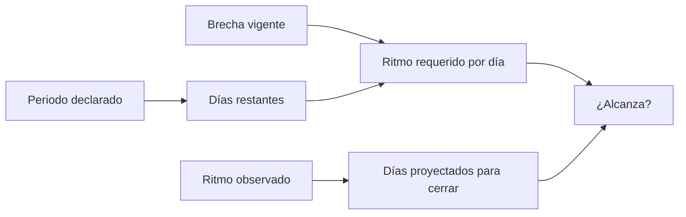

# Cronograma telefónico

> Declara el periodo de llamadas, que es lo que convierte el ritmo observado en una respuesta sobre si se llega.

## Objetivo

Un ritmo sin plazo es una curiosidad; con plazo es una decisión. Esta pestaña declara cuándo empieza y termina el campo telefónico, y con eso el modo puede calcular cuántas efectivas por día hacen falta para cerrar la brecha en los días que quedan.

El periodo también forma parte de la ficha técnica del estudio: cuándo se levantó la información es una pregunta que el cliente hace.

## Antes de empezar

- Ten el cronograma acordado del operativo, con fechas concretas.
- Conviene tener declarada la cuota: el ritmo requerido se calcula contra una brecha, y sin meta no hay brecha que cerrar.
- Ten presente qué días trabaja el equipo: no todos los días de calendario son días de llamadas.

## Mapa de la pantalla

## Elementos de la pantalla

| Elemento | Para qué sirve | Qué cambia o produce |
|---|---|---|
| Fechas de campo | Declaran inicio y fin del periodo de llamadas | Fijan el plazo del operativo |
| Semanas del operativo | Expresan la duración prevista | Sitúan el campo en el calendario del estudio |
| Días restantes | Cuántos días quedan del periodo declarado | Es el divisor del ritmo requerido |
| Ritmo requerido | Efectivas por día necesarias para cerrar la brecha a tiempo | Es la cifra que decide si hay que reforzar |
| Días proyectados | Cuánto tardaría en cerrarse la brecha al ritmo observado | Traduce el ritmo actual a una fecha |
| Contraste plan / ejecutado | Enfrenta el periodo declarado con el que muestran las respuestas | Convierte el cronograma en comprobación |

## Cómo interpretar lo que ves

Las dos cifras clave se leen juntas y en direcciones opuestas: el **ritmo requerido** parte del plazo y dice cuánto habría que producir; los **días proyectados** parten de la producción y dicen cuándo se llegaría. Si los días proyectados exceden los restantes, el operativo no cierra al paso actual, por más que el ritmo observado parezca razonable.

Cuidado con los días restantes: se cuentan sobre el periodo declarado, que incluye días en que el equipo no llama. Un ritmo requerido calculado sobre días de calendario subestima el esfuerzo diario real.

Sin brecha no hay ritmo requerido, y eso es correcto: si el mínimo está cubierto, no hay nada que cerrar a tiempo.

## Cómo se usa

1. Declara las fechas de campo con precisión; son las que fijan el plazo y las que irán en la ficha técnica.
2. Comprueba los días restantes y ajústalos mentalmente por los días no laborables del equipo.
3. Compara el ritmo requerido con el ritmo observado que muestra Diario telefónico.
4. Si los días proyectados superan a los restantes, decide con tiempo: reforzar, ampliar el periodo o renegociar la cuota.
5. Al cerrar, contrasta el periodo declarado con el ejecutado y explica la diferencia en lugar de reescribirla.

## Ejemplo guiado

**Situación inicial.** Quedan dos semanas de campo, hay brecha en una categoría y el equipo cree que con el ritmo actual basta.

**Acciones.** Se declara el periodo real de campo y se leen las dos cifras. El ritmo requerido resulta más alto que el ritmo observado de las últimas jornadas, y los días proyectados para cerrar la brecha superan a los días restantes. Se revisa además que varios de esos días restantes son fin de semana, en los que el equipo no llama.

**Resultado observable.** La conclusión se invierte: al paso actual el operativo no cierra. La decisión se toma con dos semanas de margen —reforzar el equipo— en lugar de descubrirlo el último día. El cálculo se apoyó en el plazo declarado, que antes estaba vacío.

## Resultado y siguiente paso

- El operativo tiene plazo declarado y, con él, ritmo requerido y proyección de cierre.
- Continúa en Llamadas telefónicas para gobernar el día a día, o en Avance telefónico para leer el cumplimiento.

## Estados, alertas y límites

- Sin fechas declaradas no hay días restantes ni ritmo requerido: sólo ritmo observado.
- Sin brecha no se calcula ritmo requerido, y es la lectura correcta.
- Los días restantes son de calendario: la aplicación no conoce los días no laborables del equipo.
- El periodo declarado no limita el trabajo: es una referencia contra la que se compara lo ejecutado.

## Si algo no coincide

Si el ritmo requerido parece bajo, comprueba cuántos de los días restantes son realmente días de llamadas. Si no aparece proyección, verifica que haya serie diaria de efectivas en el corte. Si el periodo ejecutado difiere del declarado, no reescribas el plan sin dejar constancia: esa diferencia es información para el informe.

## Ubicación en la jerarquía

- Padre: [[Modelo operativo telefónico]].
