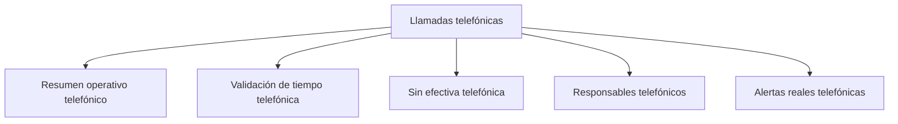

# Llamadas telefónicas

> Sección de gobierno diario del operativo: qué pasó en las llamadas, quién las hizo y qué exige intervención hoy.

## Propósito de esta guía

Es la sección que se abre todos los días mientras el campo está en marcha. Las demás declaran o resumen; ésta permite actuar: detecta si el problema está en la base o en el equipo, quién está entrevistando sin registrar, qué casos siguen abiertos y qué señales de calidad hay que atender antes de que se vuelvan un problema del expediente.

## Antes de recorrer este nivel

- El paquete de tres piezas debe estar completo y **fresco**. La mayoría de las anomalías que se ven aquí desaparecen tras sincronizar.
- La hoja de barrido debe traer responsable: sin esa columna, dos de las cinco pestañas quedan mudas.
- Conviene traer del modelo operativo si hay brecha: cambia qué mirar primero.

## Mapa de navegación

## Guía de destinos

| Destino | Cuándo entrar | Qué hacer allí | Qué deja listo |
|---|---|---|---|
| [[Resumen operativo telefónico]] | Cada día, como primera lectura | Leer la matriz de estados en sus dos direcciones | El diagnóstico de si falla la base o el equipo |
| [[Validación de tiempo telefónica]] | Antes de dar por buenas las efectivas | Revisar duraciones anómalas | Las entrevistas que hay que poder defender |
| [[Sin efectiva telefónica]] | Para armar el trabajo del día | Separar los pendientes según qué acción exigen | La lista accionable del equipo |
| [[Responsables telefónicos]] | Para repartir carga y detectar registro pendiente | Comparar carga, resultados y descuadre por persona | A quién pedirle qué |
| [[Alertas reales telefónicas]] | Cuando algo parece inconsistente | Revisar las señales agrupadas por familia | Los casos que exigen intervención |

## Recorrido recomendado

1. **Resumen operativo** primero: la matriz de estados sitúa todo lo demás.
2. **Responsables** cuando la matriz señale diferencias entre personas.
3. **Sin efectiva** para convertir lo pendiente en trabajo del día.
4. **Validación de tiempo** y **Alertas reales** como control de calidad, antes de que el campo cierre.

## Cómo interpretar avance y estados

La lectura fundamental de esta sección es que **los estados telefónicos se leen en cruz**. Hacia abajo, la concentración de números que no existen, incorrectos o suspendidos en un tramo de la base dice que la base está mala ahí —no que el equipo trabaje mal—. Hacia el lado, un responsable con rechazo muy por encima de la mediana del equipo apunta a trato o guion, y uno con *no contesta* muy alto apunta a franja horaria equivocada.

Ninguna de las dos lecturas funciona sin la otra en la misma pieza, y por eso la matriz por encuestador es el corazón de la sección.

La segunda lectura clave: la diferencia entre lo que registra la plataforma y lo que registra el barrido es una **señal temprana**, no un dato de cierre. Significa que alguien está entrevistando sin registrar el estado, y se corrige pidiéndoselo a esa persona concreta.

## Resultado de este nivel

Al terminar la revisión diaria queda claro dónde está el problema —base o equipo—, quién tiene trabajo sin registrar, qué casos siguen abiertos y qué señales de calidad hay que atender.

## Ubicación en la jerarquía

- Padre: [[Telefónico]].
