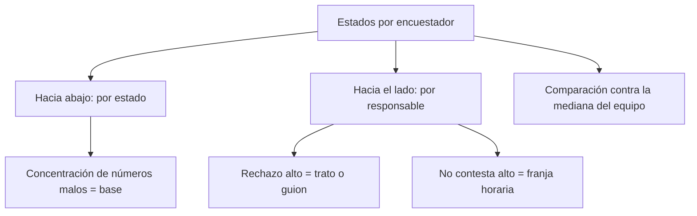

# Resumen operativo telefónico

> Presenta la matriz de estados por encuestador, que se lee en dos direcciones: hacia abajo diagnostica la base, hacia el lado diagnostica al equipo.

## Objetivo

Es la lectura más rica del campo telefónico y la primera que conviene abrir cada día. Un mismo cuadro responde dos preguntas que suelen confundirse: *¿la base que nos dieron sirve?* y *¿el equipo está trabajando bien?*

Confundirlas tiene consecuencias caras: pedirle más esfuerzo a un equipo que está llamando a números que no existen, o revisar una base que está bien cuando el problema es la franja horaria de las llamadas.

## Antes de empezar

- La hoja de barrido debe traer estado y responsable por caso.
- Conviene que el barrido esté sincronizado hoy: la matriz describe el último corte leído.
- Ten presente el tamaño del equipo: la comparación entre personas necesita un mínimo de casos para ser justa.

## Mapa de la pantalla

## Elementos de la pantalla

| Elemento | Para qué sirve | Qué cambia o produce |
|---|---|---|
| **Estados por encuestador** | Matriz de estado por responsable con el conteo de casos | Es la pieza central: permite las dos lecturas a la vez |
| Totales por estado | Distribución general del operativo | Es la lectura de calidad de la base |
| Fila por responsable | Cómo se reparten los estados de cada persona | Es la lectura de desempeño |
| Mediana del equipo | Referencia contra la que se compara cada responsable | Evita juzgar por impresión |
| Umbral mínimo de casos | Excluye de la comparación a quien tiene pocos casos | Impide conclusiones sobre muestras diminutas |
| Aviso de estados no disponibles | Indica que el corte no trae la distribución desagregada | Explica una matriz vacía |

## Cómo interpretar lo que ves

Lee **hacia abajo** primero: si los estados de número inexistente, incorrecto o suspendido se concentran en un tramo de la base, el problema es la base y ninguna insistencia lo arregla. Es el hallazgo que hay que llevarle al cliente que entregó los contactos.

Lee **hacia el lado** después: compara cada responsable con la mediana del equipo, no con el mejor. Un rechazo muy por encima de la mediana apunta al trato o al guion; un *no contesta* muy alto apunta a la franja horaria en que esa persona llama. Son diagnósticos distintos con correcciones distintas.

La mediana se calcula sólo sobre responsables con un mínimo de casos. Alguien con muy pocas llamadas no aparece comparado, y eso es deliberado: una tasa sobre cinco llamadas no dice nada.

Si la matriz está vacía, el corte no trae la distribución desagregada. No significa que no haya trabajo: significa que el barrido no está aportando estado y responsable juntos.

## Cómo se usa

1. Empieza por los totales por estado: son la lectura de la base.
2. Si un estado de número inválido domina, revisa en qué tramo del universo se concentra antes de hablar con el equipo.
3. Pasa a las filas por responsable y compara contra la mediana.
4. Para cada desviación, identifica cuál de los dos diagnósticos aplica —trato o franja horaria— antes de intervenir.
5. Ignora las filas por debajo del umbral de casos: no son comparables.

## Ejemplo guiado

**Situación inicial.** La producción del operativo cayó y el coordinador quiere saber si es un problema del equipo.

**Acciones.** Se abre esta pestaña. Los totales por estado muestran una proporción alta de *no contesta*, no de números inválidos, así que la base no es el problema. Al leer hacia el lado, dos responsables concentran ese estado muy por encima de la mediana, mientras el resto está en línea.

**Resultado observable.** El diagnóstico se acota a dos personas y a una causa concreta: la franja horaria en que están llamando. Se ajusta su horario en vez de pedirle más esfuerzo a todo el equipo, y sin tocar la base, que estaba bien. La corrección se dirigió a quien correspondía porque la matriz permitió separar las dos lecturas.

## Resultado y siguiente paso

- Queda establecido si el problema está en la base o en el equipo, y en quién.
- Continúa en Responsables telefónicos para ver carga y descuadre por persona, o en Sin efectiva telefónica para armar el trabajo del día.

## Estados, alertas y límites

- **Sin estados por encuestador**: el corte no trae la distribución desagregada. La matriz no puede construirse.
- La comparación excluye a responsables con pocos casos, por diseño.
- La matriz describe el barrido, no la plataforma: es el registro del equipo, no la acreditación de las respuestas.
- La pestaña diagnostica; no reasigna casos ni cambia estados.

## Si algo no coincide

Si la matriz está vacía, comprueba que el barrido traiga estado y responsable, y que esté sincronizado. Si un responsable aparece con cifras extremas, mira antes su volumen: puede estar por debajo del umbral y no ser comparable. Si los totales por estado no coinciden con el marco, revisa el rango del universo en Base y barrido telefónico.

## Ubicación en la jerarquía

- Padre: [[Llamadas telefónicas]].
