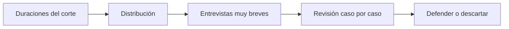

# Validación de tiempo telefónica

> Revisa la duración de las entrevistas levantadas para separar las que se pueden defender de las que hay que mirar de cerca.

## Objetivo

La duración es el control de calidad más barato de una encuesta telefónica: una entrevista que debía tomar veinte minutos y tomó tres no puede haberse aplicado completa. Esta pestaña expone esas duraciones para que la revisión ocurra **mientras el campo está abierto**, cuando todavía se puede recuperar el caso, y no al cerrar el estudio.

## Antes de empezar

- La plataforma debe traer la duración de cada respuesta; es un dato de la encuesta, no del barrido.
- Ten claro cuánto debería durar el instrumento aplicado por teléfono. Sin esa referencia, una duración corta no se puede juzgar.
- Recuerda que un cuestionario con muchos saltos produce duraciones legítimamente cortas en algunos perfiles.

## Mapa de la pantalla

## Elementos de la pantalla

| Elemento | Para qué sirve | Qué cambia o produce |
|---|---|---|
| Distribución de duraciones | Muestra cómo se reparten los tiempos de las entrevistas | Sitúa qué es normal en este operativo |
| Casos de duración corta | Aísla las entrevistas extremadamente breves, del orden de pocos minutos | Es la lista de revisión |
| Detalle por caso | Muestra la entrevista concreta con su duración y su responsable | Permite pasar de la señal a la verificación |
| Corte por responsable | Reparte las duraciones anómalas entre personas | Distingue un caso suelto de un patrón |

## Cómo interpretar lo que ves

Una duración corta es una **señal, no un veredicto**. Hay razones legítimas: un cuestionario con saltos que deja fuera módulos enteros para ciertos perfiles, o una persona que respondió con agilidad. Lo que hay que comprobar es la consistencia: si el caso recorrió los módulos que le tocaban.

Lo que convierte una señal en un problema es el **patrón**. Casos breves repartidos entre todo el equipo apuntan al instrumento; casos breves concentrados en una persona apuntan a esa persona. La misma cifra, dos conclusiones distintas.

La referencia de qué es corto la pone el instrumento, no la aplicación. Un umbral de pocos minutos es razonable para una encuesta de veinte, y absurdo para una de cinco.

## Cómo se usa

1. Mira primero la distribución para saber qué es normal en este operativo.
2. Abre los casos de duración corta y comprueba si se concentran en alguien.
3. Revisa uno o dos casos en detalle: qué módulos recorrieron y si la brevedad se explica por saltos.
4. Decide por caso: defender la efectiva o llevarla a revisión.
5. Si hay patrón por persona, trátalo en Responsables telefónicos, no caso por caso.

## Ejemplo guiado

**Situación inicial.** El control de calidad detecta varias entrevistas muy breves y se plantea invalidarlas todas.

**Acciones.** Se abre esta pestaña y se mira el reparto. Los casos breves se distribuyen entre casi todo el equipo, no en una persona. Al revisar dos en detalle, ambos corresponden a perfiles que el cuestionario enruta directo al cierre por un filtro inicial.

**Resultado observable.** No hay problema de campo: hay un tramo del instrumento que es legítimamente corto para ese perfil. Las efectivas se sostienen, y queda documentado por qué, que es justo lo que hay que poder responder si alguien pregunta. Invalidarlas habría descartado casos válidos.

## Resultado y siguiente paso

- Queda revisado qué entrevistas breves se sostienen y cuáles no.
- Si el patrón apunta a una persona, continúa en Responsables telefónicos; si apunta a casos concretos, en Salvedades telefónicas.

## Estados, alertas y límites

- Una duración corta es una señal que exige comprobación, no una invalidación automática.
- Sin duración en las respuestas de la plataforma, la pestaña no tiene insumo.
- El umbral de lo que es corto depende del instrumento; la aplicación no lo conoce.
- La pestaña no invalida casos: las decisiones se registran en Salvedades telefónicas.

## Si algo no coincide

Si casi todas las entrevistas parecen cortas, comprueba la duración esperada del instrumento antes de sospechar del equipo. Si las breves se concentran en una persona, revisa su patrón completo en el resumen operativo antes de intervenir. Si no aparecen duraciones, verifica que la plataforma esté entregando ese campo.

## Ubicación en la jerarquía

- Padre: [[Llamadas telefónicas]].
