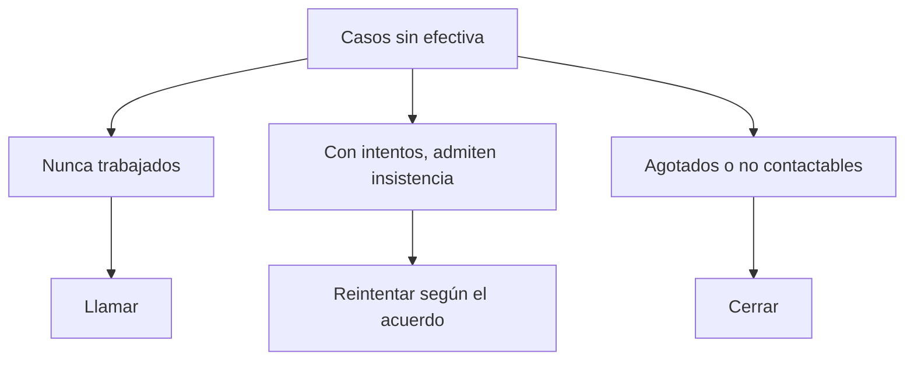

# Sin efectiva telefónica

> Reúne los casos que aún no produjeron entrevista y los separa entre los que admiten insistencia y los que no.

## Objetivo

Es la pestaña que se convierte en el trabajo del día. Su valor está en distinguir dos cosas que una lista plana confunde: el caso al que **todavía se puede llamar** y el caso que ya está agotado. Insistir sobre lo segundo consume el tiempo del equipo sin producir efectivas.

## Antes de empezar

- El barrido debe estar sincronizado: una hoja vieja devuelve trabajo ya hecho.
- Ten claro cuántos intentos acordó el estudio antes de dar un caso por agotado.
- Conviene saber si hay brecha: si el mínimo está cubierto, esta lista es reserva y no urgencia.

## Mapa de la pantalla

## Elementos de la pantalla

| Elemento | Para qué sirve | Qué cambia o produce |
|---|---|---|
| Total sin efectiva | Cuenta los casos del marco que aún no produjeron entrevista | Dimensiona lo pendiente |
| Casos sin trabajar | Aísla los que nunca se intentaron | Es la reserva disponible y el trabajo más rentable |
| Casos con insistencia pendiente | Señala los intentados que admiten otra llamada | Evita abandonar casos recuperables |
| Intentos por caso | Cuántas veces se llamó a cada uno | Es lo que decide si el caso sigue vivo |
| Casos no contactables | Números inválidos y equivalentes | Salen del circuito de llamadas |
| Responsable asignado | Quién tiene cada caso | Permite repartir el trabajo del día |

## Cómo interpretar lo que ves

Con el mínimo cubierto, esta lista es **reserva**: base disponible que no hizo falta trabajar. Leerla como deuda pendiente sobre un operativo que ya cumplió su cuota es el malentendido más caro del modo. Con brecha, en cambio, es el recurso que decide si se llega, y hay que cruzarla con el costo por efectiva que muestra Cuotas telefónicas.

Los casos **sin trabajar** son los más rentables: su probabilidad de éxito es la del marco completo, no la de un caso que ya falló varias veces. Empezar por ellos rinde más que insistir.

El número de intentos es la frontera entre insistir y cerrar, y esa frontera la pone el acuerdo del estudio, no la aplicación. Sin ese criterio explícito, el equipo insiste de forma desigual y el esfuerzo se reparte mal.

## Cómo se usa

1. Comprueba primero si hay brecha: determina si esta lista es urgencia o reserva.
2. Trabaja primero los casos **sin trabajar**.
3. Filtra los que admiten insistencia según los intentos acordados y repártelos por responsable.
4. Saca del circuito los no contactables: no se resuelven llamando.
5. Si un caso reaparece pese a tener entrevista levantada, revísalo en Conciliación CodPulso telefónica antes de reasignarlo.

## Ejemplo guiado

**Situación inicial.** El equipo trabaja cada día una lista larga de pendientes y la producción diaria cae progresivamente.

**Acciones.** Se abre esta pestaña y se mira la composición en vez del total. Una parte importante son casos con varios intentos acumulados, y hay un grupo de casos **sin trabajar** que nunca entró en la rotación diaria. Se reordena: primero los sin trabajar, y los que superan los intentos acordados salen de la lista.

**Resultado observable.** La lista del día siguiente es más corta y produce más efectivas, porque el equipo deja de gastar llamadas en casos agotados. La caída de producción se explicaba por la composición de la lista, no por el rendimiento del equipo.

## Resultado y siguiente paso

- Queda separado lo que se resuelve llamando de lo que ya no.
- Continúa en Responsables telefónicos para repartir esa lista según carga real.

## Estados, alertas y límites

- Con el mínimo cubierto, esta lista es reserva, no deuda.
- Un caso no contactable no se resuelve insistiendo: es calidad de la base.
- La lista refleja el corte; los intentos posteriores a la última sincronización no aparecen.
- La pestaña no registra intentos ni cambia estados: eso ocurre en la hoja de barrido.
- Un caso con entrevista levantada puede aparecer aquí si su registro no cruzó; la causa es de conciliación, no de contacto.

## Si algo no coincide

Si el equipo asegura haber trabajado casos que figuran sin trabajar, comprueba la frescura del barrido. Si un caso reaparece día tras día pese a tener entrevista, revísalo en Conciliación CodPulso telefónica: puede ser un enlace equivocado. Si el total no cuadra con el marco menos las efectivas, verifica que ambos vengan del mismo corte.

## Ubicación en la jerarquía

- Padre: [[Llamadas telefónicas]].
