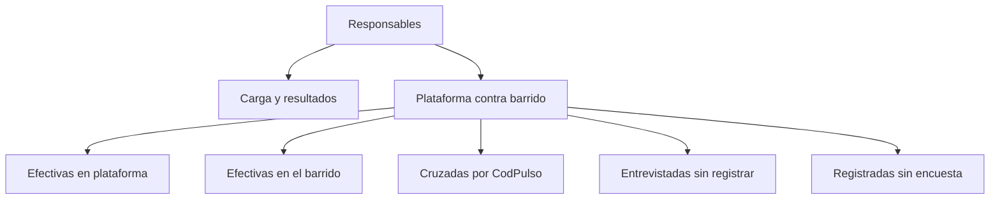

# Responsables telefónicos

> Compara al equipo por carga y resultados, y muestra quién tiene entrevistas levantadas sin registrar en la hoja.

## Objetivo

Esta pestaña hace dos cosas que sólo tienen sentido por persona.

La primera es la clásica: comparar **carga** y **resultados**, que se confunden y llevan a decisiones opuestas.

La segunda es la más valiosa del modo: cruzar lo que la plataforma acredita contra lo que la hoja de barrido declara, **por responsable**. Cuando alguien tiene entrevistas levantadas sin estado registrado, esa diferencia no se corrige hablándole al equipo: se corrige pidiéndosela a quien tiene los casos sin marcar.

## Antes de empezar

- La hoja de barrido debe traer el responsable de cada caso.
- Ambas piezas —barrido y plataforma— deben estar sincronizadas. Un desfase produce descuadres que no existen.
- Conviene traer del resumen operativo si ya se detectó una desviación por persona.

## Mapa de la pantalla

## Elementos de la pantalla

| Elemento | Para qué sirve | Qué cambia o produce |
|---|---|---|
| Carga por responsable | Cuántos casos tiene asignados cada persona | Explica el volumen antes de juzgar resultados |
| Resultados por responsable | Cómo se reparten sus llamadas entre estados | Muestra su perfil de trabajo |
| **Plataforma contra barrido** | Cruza ambas fuentes persona por persona | Es la detección temprana del modo |
| **Efectivas en plataforma** | Entrevistas acreditadas de esa persona | Es la cifra que cuenta |
| **Efectivas en el barrido** | Lo que esa persona declaró en la hoja | Es lo que registró |
| **Cruzadas por CodPulso** | Casos donde ambas fuentes coinciden | Es el trabajo consistente |
| **Entrevistadas sin registrar** | Tiene la encuesta pero no marcó el estado | El caso a pedirle a esa persona |
| **Registradas sin encuesta** | Marcó el estado pero no hay encuesta | Exige revisión: puede ser enlace equivocado |

## Cómo interpretar lo que ves

**Entrevistadas sin registrar** es la señal operativa temprana del modo. No es un fraude ni un error de la aplicación: normalmente significa que alguien está trabajando y dejando el registro para después. Detectarlo a tiempo evita que el reporte de producción subrepresente el avance real, a veces por bastante.

**Registradas sin encuesta** es la señal inversa y merece más cuidado: alguien marcó una efectiva que la plataforma no respalda. Puede ser un registro adelantado, o puede ser un enlace equivocado, en cuyo caso la encuesta existe pero quedó atribuida a otro caso. Esa distinción se resuelve en Conciliación CodPulso telefónica.

Lee siempre carga antes que resultados. Una persona con pocas efectivas puede tener pocos casos, no bajo rendimiento; y una con muchos descuadres puede simplemente tener mucho volumen.

## Cómo se usa

1. Comprueba que barrido y plataforma estén sincronizados; si no, los descuadres son ficticios.
2. Lee carga y resultados juntos para el diagnóstico de desempeño.
3. Ve al cruce plataforma contra barrido y localiza a quién tiene **entrevistadas sin registrar**.
4. Pídele a esa persona concreta que complete el registro, en lugar de comunicar al equipo entero.
5. Investiga aparte los casos **registrados sin encuesta**: pueden ser enlaces equivocados.

## Ejemplo guiado

**Situación inicial.** El reporte de producción muestra una cifra muy inferior a la que el equipo dice haber levantado, y hay dudas sobre si el reporte está mal.

**Acciones.** Se comprueba que ambas piezas estén sincronizadas y se abre el cruce por responsable. La plataforma acredita bastantes más efectivas que las declaradas en el barrido, y la diferencia se concentra en unas pocas personas con muchos casos **entrevistados sin registrar**.

**Resultado observable.** El reporte no estaba mal: estaba leyendo el barrido, que iba retrasado. Se le pide a esas personas concretas que completen el registro, y el reporte de producción sube al nivel real sin que se levante ni una entrevista nueva. La corrección se dirigió a cuatro personas en vez de a todo el equipo.

## Resultado y siguiente paso

- Queda un diagnóstico del equipo y una lista concreta de a quién pedirle qué.
- Los casos registrados sin encuesta continúan en Conciliación CodPulso telefónica.

## Estados, alertas y límites

- Sin columna de responsable, el cruce por persona no puede construirse.
- Un desfase de sincronización entre barrido y plataforma genera descuadres que no son reales.
- **Entrevistadas sin registrar** es trabajo hecho sin anotar; **registradas sin encuesta** exige investigación.
- La aplicación no conoce la dedicación de cada persona: tiempo completo y parcial se ven igual.
- La pestaña diagnostica; la asignación vive en la hoja de barrido.

## Si algo no coincide

Si aparecen muchos descuadres de golpe, revisa las marcas de sincronización antes de hablar con nadie. Si una persona no aparece, comprueba que su nombre esté escrito de forma consistente en el barrido. Si alguien tiene muchas registradas sin encuesta, revisa si son enlaces equivocados antes de tratarlo como registro indebido.

## Ubicación en la jerarquía

- Padre: [[Llamadas telefónicas]].
