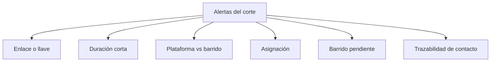

# Alertas reales telefónicas

> Agrupa las señales de calidad del operativo en familias, cada una con su revisión propia.

## Objetivo

Una lista larga de alertas indistintas se ignora. Esta pestaña las agrupa por familia para que cada una lleve a una acción concreta, y para que el volumen de cada grupo sirva de diagnóstico: muchas alertas de la misma clase casi siempre significan una causa sistemática, no muchos problemas independientes.

## Antes de empezar

- Comprueba que barrido y plataforma estén sincronizados. Buena parte de las alertas de descuadre desaparece al hacerlo.
- Ten a mano la duración esperada del instrumento para juzgar las alertas de tiempo.
- Conviene conocer el volumen del operativo: una alerta sobre pocos casos y otra sobre muchos no merecen el mismo esfuerzo.

## Mapa de la pantalla

## Elementos de la pantalla

| Familia de alerta | Qué señala | Qué revisar |
|---|---|---|
| **Enlace o llave** | El enlace, código o llave puede apuntar a otra persona o no cruza con el universo | Si la respuesta corresponde de verdad a la persona y al enlace esperados |
| **Duración corta** | Entrevistas extremadamente breves | Duración, saltos y consistencia antes de defender la efectiva |
| **Plataforma vs barrido** | Las dos fuentes se contradicen sobre el mismo caso | Conciliar el estado de plataforma contra la hoja de barrido |
| **Asignación** | Casos sin responsable o con trazabilidad insuficiente | Confirmar el responsable antes de evaluar producción o supervisión |
| **Barrido pendiente** | Cobertura del barrido incompleta | Resolver la cobertura antes del control de calidad |
| **Trazabilidad de contacto** | Reintentos, no contesta o rechazos cuya evidencia no cuadra | Contrastar llamada, resultado y evidencia de contacto |

## Cómo interpretar lo que ves

Las familias tienen consecuencias distintas y por eso conviene atenderlas en orden. **Enlace o llave** y **duración corta** cuestionan la validez de una entrevista concreta: son las que pueden costar casos. **Plataforma vs barrido** cuestiona la coherencia del reporte, no la validez del caso. **Asignación** y **barrido pendiente** son problemas de operación.

Dentro de **enlace o llave** hay dos situaciones que no deben confundirse: una diferencia de **formato** del código —el mismo código escrito con o sin separador— es cosmética y no cambia a quién pertenece la respuesta. Un código que **no cruza o cruza contra otro caso** es crítico: significa que la entrevista puede estar atribuida a la persona equivocada. Cuando una familia acumula mucho volumen, casi siempre es lo primero; lo segundo suele ser un puñado de casos y es lo que hay que encontrar entre ellos.

Una alerta señala, no decide. La decisión sobre un caso se registra en Salvedades telefónicas.

## Cómo se usa

1. Mira el reparto por familia antes que la lista: la forma del reparto es el diagnóstico.
2. Descarta primero lo que sea desfase de sincronización.
3. Dentro de enlace o llave, separa las diferencias de formato de los códigos que realmente no cruzan.
4. Atiende validez —enlace y duración— antes que coherencia del reporte.
5. Resuelve barrido pendiente y asignación antes de hacer control de calidad.

## Ejemplo guiado

**Situación inicial.** El corte muestra un número muy alto de alertas de enlace o llave y el equipo teme que muchas entrevistas estén mal atribuidas.

**Acciones.** Se revisa el contenido del grupo. La inmensa mayoría son diferencias de escritura del mismo código —con y sin separador—, que no cambian a qué caso pertenece la respuesta. Al filtrar esas, queda un grupo reducido de códigos que no cruzan con nadie o que cruzan contra otro caso.

**Resultado observable.** El problema real se acota a unos pocos casos, que sí son enlaces equivocados y se llevan a conciliación. La alarma inicial era ruido de formato. Sin la distinción, el equipo habría revisado cientos de casos para encontrar unos pocos.

## Resultado y siguiente paso

- Queda separado lo que amenaza la validez de una entrevista, lo que descoordina el reporte y lo que ordena la operación.
- Los casos de enlace continúan en Conciliación CodPulso telefónica; los que exigen decisión, en Salvedades telefónicas.

## Estados, alertas y límites

- Una alerta señala; la decisión se registra en Salvedades telefónicas.
- **Plataforma vs barrido** puede ser desfase de sincronización y no una contradicción real.
- En enlace o llave conviven un caso cosmético —formato del código— y uno crítico —código que no cruza o cruza mal—.
- Un volumen alto de una sola familia apunta a causa sistemática.
- Las alertas corresponden al corte; lo posterior a la última sincronización no está evaluado.

## Si algo no coincide

Si casi todas las alertas son de descuadre entre fuentes, sincroniza antes de revisar. Si el grupo de enlace o llave es enorme, filtra las diferencias de formato antes de concluir que hay un problema de atribución. Si una alerta persiste tras corregir su causa, comprueba que el corte se haya regenerado.

## Ubicación en la jerarquía

- Padre: [[Llamadas telefónicas]].
