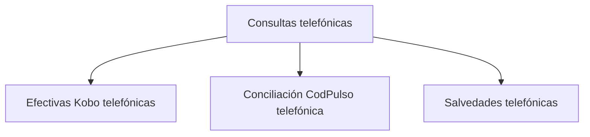

# Consultas telefónicas

> Responde por un caso concreto: qué entrevista existe, contra qué caso se concilió y qué se decidió cuando no cuadró.

## Propósito de esta guía

Las secciones anteriores gobiernan la operación en agregado. Ésta baja al caso individual, que es donde se resuelven las preguntas que el agregado no puede contestar: *¿esta entrevista es de esta persona?*, *¿por qué este caso no cuenta si sí se llamó?*

La conciliación por código de caso es su trabajo central, y es también donde se detecta el enlace equivocado.

## Antes de recorrer este nivel

- La plataforma debe estar sincronizada: aquí se parte de las entrevistas acreditadas.
- Conviene llegar con un caso concreto, tomado de las alertas o del cruce por responsable.
- Ten claro qué campo porta el código de caso, y que puede llegar por dos vías —el enlace y lo que el encuestador escribió—.

## Mapa de navegación

## Guía de destinos

| Destino | Cuándo entrar | Qué hacer allí | Qué deja listo |
|---|---|---|---|
| [[Efectivas Kobo telefónicas]] | Para ver qué entrevistas existen realmente | Revisar las respuestas acreditadas por la plataforma | El inventario de lo que cuenta |
| [[Conciliación CodPulso telefónica]] | Para saber a qué caso pertenece cada entrevista | Revisar el cruce por código y los conflictos de enlace | La atribución verificada de cada respuesta |
| [[Salvedades telefónicas]] | Cuando un caso exige una decisión | Registrar qué se decidió y por qué | La decisión auditada |

## Recorrido recomendado

1. **Efectivas Kobo** para partir de lo que existe.
2. **Conciliación CodPulso** para comprobar a quién pertenece cada entrevista.
3. **Salvedades** cuando la conciliación no resuelva sola y haga falta decidir.

## Cómo interpretar avance y estados

La regla que ordena la sección: **la plataforma acredita, el código concilia**. Una entrevista existe porque está en la plataforma; pertenece a un caso porque su código cruza con la base. Las dos condiciones son necesarias y fallan por motivos distintos.

Cuando el código que viajaba en el enlace y el que el encuestador escribió a mano no coinciden, la entrevista puede quedar atribuida a otra persona. Ese conflicto se investiga aquí y se resuelve con una decisión registrada, no con un ajuste silencioso.

## Resultado de este nivel

Al terminar, cada entrevista tiene una atribución verificable y los casos ambiguos tienen una decisión escrita, que es lo que permite defender la cifra ante una pregunta puntual.

## Ubicación en la jerarquía

- Padre: [[Telefónico]].
