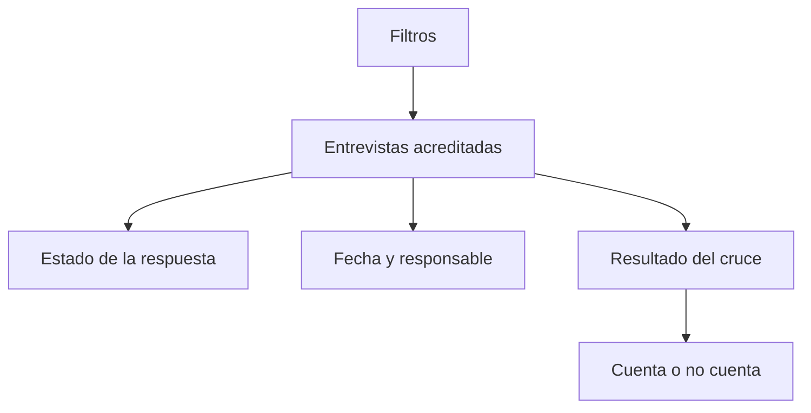

# Efectivas Kobo telefónicas

> Lista las entrevistas que la plataforma acredita, con su estado, su fecha y el resultado de su cruce.

## Objetivo

Es el inventario de lo que realmente existe. Cuando alguien discute una cifra del operativo, ésta es la pantalla que la sostiene: no lo que el equipo declaró haber hecho, sino lo que la plataforma registró.

Sirve para dos preguntas: *¿esta entrevista existe?* y, si existe pero no cuenta, *¿en qué punto se cayó?*

## Antes de empezar

- La plataforma debe estar sincronizada; el inventario es del último corte leído.
- Conviene llegar con un filtro en mente —responsable, fecha, estado—: el volumen es alto.
- Si la duda es sobre a quién pertenece una entrevista, la pestaña adecuada es Conciliación CodPulso telefónica.

## Mapa de la pantalla

## Elementos de la pantalla

| Elemento | Para qué sirve | Qué cambia o produce |
|---|---|---|
| Filtros | Acotan por responsable, fecha, estado y resultado del cruce | Reducen el inventario a lo que investigas |
| Fila de entrevista | Identifica la respuesta con su código de caso | Es la unidad de la tabla |
| Estado de la respuesta | Completa, parcial u otro estado de plataforma | Primera condición para que cuente |
| Fecha y hora | Cuándo se levantó | Sitúa la entrevista en el campo |
| Responsable | Quién la levantó | Permite cruzar con el diagnóstico de equipo |
| Resultado del cruce | Si el código concilió con un caso de la base | Segunda condición para que cuente |
| Total declarado | Cuántas filas hay en total | Es la cifra a usar cuando la tabla recorta |

## Cómo interpretar lo que ves

Estado y cruce son condiciones independientes. Una entrevista completa que no concilia no cuenta, y una que concilia pero quedó parcial tampoco: son dos motivos distintos con dos correcciones distintas.

Esta tabla es el inventario de la plataforma, no el avance del estudio. Compararla directamente con la cifra de cumplimiento produce la impresión de que se pierden casos; lo que ocurre es que el avance aplica las condiciones que aquí se ven una por una.

Cuando la tabla recorta filas, el total del encabezado es el bueno.

## Cómo se usa

1. Filtra por lo que estás investigando: un responsable, un día, un estado.
2. Comprueba el estado de la respuesta y el resultado del cruce en la misma fila.
3. Cuando varias filas fallen igual, busca qué comparten: mismo responsable, mismo día, mismo tramo de códigos.
4. Si el problema es de atribución, sigue en Conciliación CodPulso telefónica.
5. Limpia los filtros antes de sacar conclusiones sobre totales.

## Ejemplo guiado

**Situación inicial.** Un responsable asegura haber levantado varias entrevistas que no aparecen reflejadas en el avance.

**Acciones.** Se filtra el inventario por esa persona y por los días en cuestión. Las entrevistas están: la plataforma las acredita, todas con estado completa. Pero el resultado del cruce falla en todas, y comparten un tramo de códigos.

**Resultado observable.** Las entrevistas existen y el trabajo se hizo; lo que falla es la conciliación de ese tramo de códigos. El caso deja de ser un problema de producción y pasa a Conciliación CodPulso, que es donde se resuelve. Sin esta pestaña, la discusión habría seguido siendo sobre si el equipo trabajó o no.

## Resultado y siguiente paso

- Queda establecido qué entrevistas existen y en qué condición se caen las que no cuentan.
- Continúa en Conciliación CodPulso telefónica cuando el problema sea la atribución.

## Estados, alertas y límites

- El inventario es de la plataforma: no incluye llamadas sin entrevista, que viven en el barrido.
- Estado y cruce son condiciones independientes; ambas hacen falta.
- Esta tabla no es el avance: el avance aplica las condiciones que aquí se muestran por separado.
- La pestaña no edita respuestas ni reasigna casos.

## Si algo no coincide

Si una entrevista no aparece, comprueba que se haya levantado en el formulario vinculado y que la plataforma esté sincronizada. Si varias fallan el cruce a la vez, busca el patrón antes de revisarlas una por una. Si el total no coincide con el conteo de la fuente, verifica que ambos correspondan al mismo corte.

## Ubicación en la jerarquía

- Padre: [[Consultas telefónicas]].
